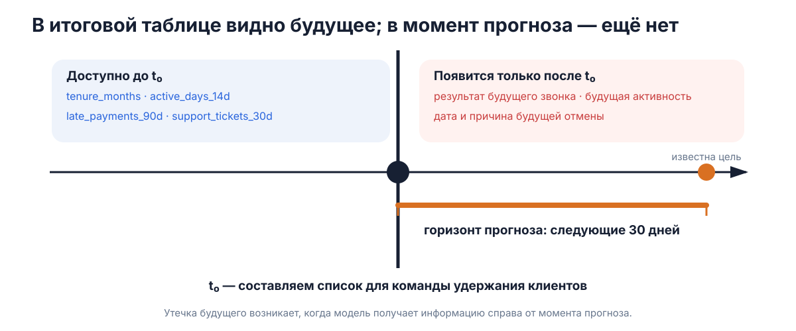
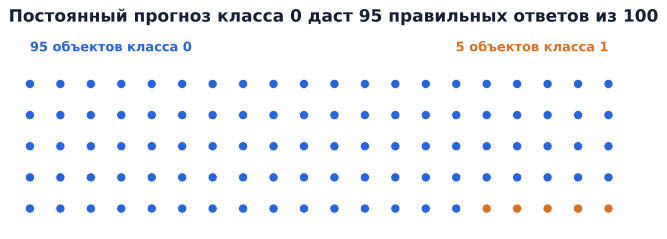
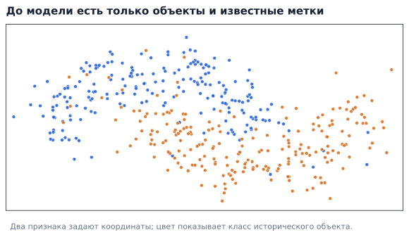
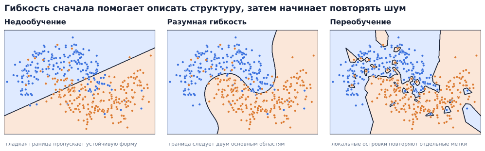
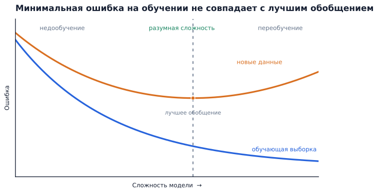
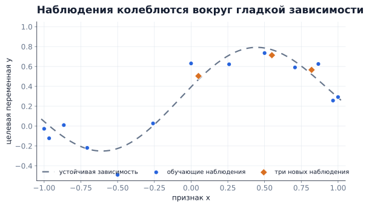
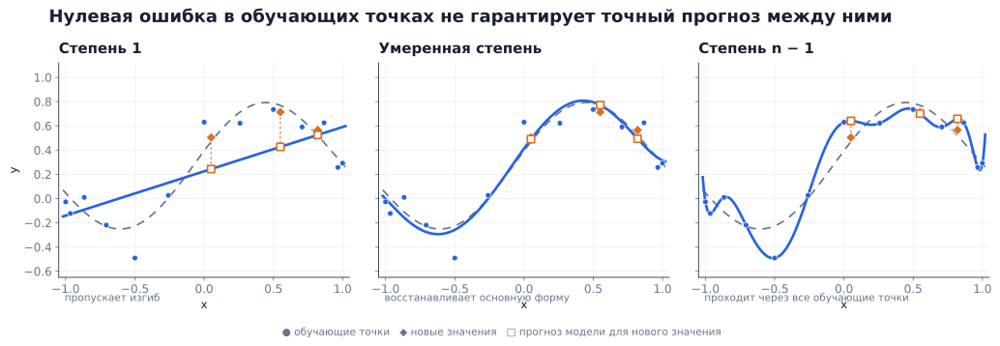
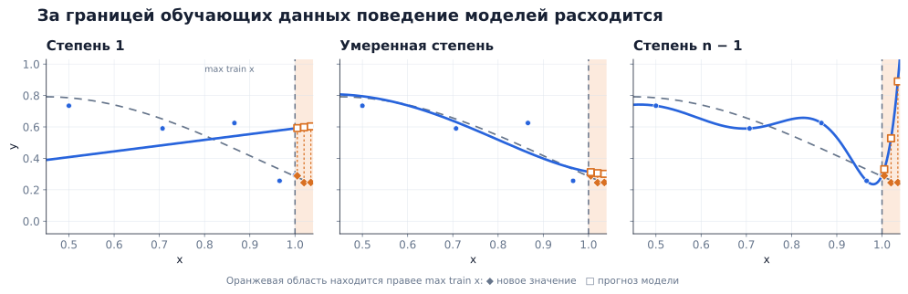

# Первый ML-эксперимент, которому можно начать доверять

Команда сервиса по подписке хочет заранее находить клиентов, которые могут
уйти. В таблице уже есть история платежей, активность, обращения в поддержку
и ещё сотни столбцов. Какой алгоритм выбрать: логистическую регрессию,
дерево или нейронную сеть?

Выбор алгоритма появится позже. Сначала нужно решить, **для кого, что и в какой
момент мы предсказываем**. Затем определить доступную информацию, способ
проверки на новых объектах и разумную точку сравнения. Ошибка в постановке
задачи сохранится при любой сложности модели.

Центральный вопрос этой лекции звучит так:

> Как из реальной задачи получить первый ML-эксперимент, результату которого
> хотя бы можно начать доверять?

Для начала достаточно рабочего определения:

> **Машинное обучение** — область, изучающая методы, которые позволяют строить
> и настраивать модели на основе данных или опыта.

В литературе границы машинного обучения проводят по-разному. Для нашего курса
важна общая конструкция: исторические данные поступают в алгоритм обучения,
после обучения мы получаем модель, а модель выдаёт прогнозы для новых объектов.

```text
исторические данные → алгоритм обучения → обученная модель

новый объект → обученная модель → прогноз
```

## 1. Современный ML и организация курса

### Несколько осей одной большой области

У машинного обучения нет единственной общепринятой границы с соседними
областями. Оно тесно связано со статистикой, эконометрикой, анализом данных и
искусственным интеллектом; значительная часть практического data science
использует методы машинного обучения. Поэтому область удобно систематизировать
сразу по нескольким независимым осям:

| Ось | Какой вопрос она задаёт | Примеры |
|---|---|---|
| Дисциплинарная перспектива | В какой традиции формулируется задача и интерпретируется результат? | статистика, эконометрика, анализ данных, машинное обучение |
| Режим обучения | Какой сигнал получает алгоритм? | обучение с учителем, обучение без учителя, обучение с подкреплением, самоконтролируемое обучение (self-supervised learning) |
| Тип задачи | Какой результат требуется? | регрессия, классификация, ранжирование, кластеризация, поиск аномалий, снижение размерности |
| Семейство моделей | Как устроено правило прогноза? | линейные модели, методы ближайших соседей, деревья, ансамбли, ядерные методы, нейронные сети |
| Прикладная область | С данными какого вида мы работаем? | компьютерное зрение, NLP и речь, рекомендательные системы, временные ряды |
| Инженерный слой | Как система живёт за пределами эксперимента? | data engineering, вычислительная инфраструктура, MLOps, мониторинг |

Эти оси отвечают на разные вопросы и пересекаются друг с другом. Классификацию
документов, например, можно одновременно описать как задачу обучения с учителем,
задачу классификации и задачу из области NLP. Решать её можно моделями разных
семейств. Рекомендательная система может включать ранжирование, нейросетевое
представление текста и большой инженерный контур. Поэтому термины вокруг ML не
складываются в одно строгое дерево: один и тот же метод, задача или прикладная
система обычно занимает сразу несколько мест на такой карте.

В обучении с учителем для исторических объектов известны правильные ответы:
цена квартиры, факт ухода клиента, категория документа. По таким примерам
настраивается правило для новых объектов. В обучении без учителя готового
ответа нет; по данным ищут группы, необычные наблюдения или более компактное
представление. В обучении с подкреплением агент получает обратную связь за
последовательность действий. Самоконтролируемое обучение формирует обучающий
сигнал из самих данных и особенно важно для текста, изображений и звука.
Генеративное моделирование описывает другую сторону задачи: модель учится
задавать или приближать распределение данных и порождать новые объекты.

Тип задачи описывает требуемый результат. Регрессия даёт числовой прогноз,
классификация выбирает категорию, ранжирование упорядочивает объекты,
кластеризация ищет группы, а поиск аномалий выделяет редкие случаи. Для одной
задачи обычно доступны разные семейства моделей. Например, табличную бинарную
классификацию можно решать линейной моделью, деревом, методом ближайших соседей,
ядерным методом — например, SVM с нелинейным ядром — или нейронной сетью. Выбор семейства зависит от данных, цены ошибок, требований к скорости и интерпретируемости.

Прикладная область добавляет собственную структуру данных. В компьютерном
зрении это пиксели и геометрия изображения, в NLP — последовательности текста,
в рекомендательных системах — взаимодействия пользователей и объектов.
Современные LLM относятся к большим нейросетевым foundation models и входят в
более широкий ландшафт AI; их создание и эксплуатация также требуют отдельного набора
теоретических и инженерных средств.

### Чем мы в этом курсе заниматься не будем

Современный ML намного шире одной учебной дисциплины. За основным маршрутом
останутся направления, каждое из которых требует отдельного курса:

- глубокое обучение;
- компьютерное зрение;
- NLP и обработка речи;
- рекомендательные системы и временные ряды;
- обучение с подкреплением;
- генеративный ИИ, foundation models, LLM и агенты;
- полный курс по причинному выводу (causal inference);
- data engineering, MLOps и промышленная эксплуатация моделей.

### На чём сосредоточимся

Наш фокус — **классическое машинное обучение, прежде всего обучение с учителем
на табличных данных**. Такой выбор даёт базовые идеи, которые возвращаются в
более сложных системах: постановку задачи, функцию потерь, оптимизацию,
обобщающую способность, корректную проверку и интерпретацию результата.
Нейронная сеть тоже обучается на данных, оптимизирует критерий и сталкивается с
переобучением. Понимание классических моделей позволяет увидеть эти механизмы
в относительно прозрачной форме.

### Где классический ML применяется на практике

Классическое машинное обучение встречается во множестве прикладных задач.
Например:

- **кредитный скоринг** — оценить риск дефолта клиента;
- **антифрод** — оценить вероятность мошеннической операции;
- **отток клиентов** — предсказать, кто может отказаться от продукта или
  сервиса;
- **прогнозирование спроса** — оценить будущие продажи или число заказов;
- **оценка стоимости** — например, предсказать цену объекта недвижимости;
- **маркетинг** — оценить вероятность отклика клиента на предложение;
- **ценообразование** — использовать прогноз спроса или вероятности покупки как
  один из элементов системы выбора цены;
- **операционные риски** — предсказывать отказ оборудования, просрочку или
  другое нежелательное событие.
- И т.д. и т.п.

Задачи различаются по предметной области, но многие из них снова приводят нас
к одной и той же схеме: есть объекты, известные о них признаки и некоторый
результат, который требуется предсказать для новых объектов.

### Понедельный маршрут курса

Курс рассчитан на 14 недель. Каждая содержательная неделя добавляет один новый
механизм или один новый элемент корректного эксперимента.

1. **Осмысленный ML-эксперимент**
   Постановка задачи • объект, признаки и целевая переменная • момент прогноза •
   train/test • бейзлайн • недообучение и переобучение

2. **Линейная регрессия**
   Задача регрессии • МНК • аналитическое решение • матричная запись •
   мультиколлинеарность • остатки

3. **Функции потерь и градиентный спуск**
   MSE и MAE • функция потерь • градиент • gradient descent • learning rate •
   масштабирование признаков

4. **Бинарная логистическая регрессия**
   Линейный score • sigmoid • вероятность • Bernoulli likelihood и log-loss •
   градиент • threshold

5. **Метрики классификации и решение**
   Ошибки первого и второго рода • precision и recall • F-мера • ROC и PR •
   выбор порога • идея калибровки

6. **Регуляризация и проверка модели**
   Ridge и Lasso • контроль сложности • validation • K-fold cross-validation •
   выбор коэффициента регуляризации

7. **kNN и многоклассовая классификация**
   Расстояние и соседи • параметр $k$ • curse of dimensionality • OvR • softmax
   • многоклассовые метрики

8. **Обучаемые преобразования, `Pipeline` и утечки данных**
   Состояние преобразований • пропуски и категориальные признаки •
   `ColumnTransformer` • `Pipeline` • fit только на разрешённых данных • leakage

9. **Решающие деревья**
   Неоднородность узла • поиск лучшего разбиения • рекурсивное построение •
   критерии остановки • глубина дерева • важность признаков

10. **Коллоквиум**
    Постановка задач • модели и их механизмы • проверка качества • ограничения
    выводов по материалу Weeks 1–9

11. **Bias–variance, bagging и Random Forest**
    Разложение ошибки • variance модели • bootstrap • усреднение • bagging •
    случайный выбор признаков • Random Forest

12. **Градиентный бустинг**
    Аддитивная модель • последовательное исправление ошибок • остатки и
    псевдоостатки • функциональный градиент • learning rate • early stopping

13. **Современный tabular ML, HPO и диагностика**
    CatBoost, XGBoost и LightGBM • поиск гиперпараметров • анализ ошибок •
    permutation importance • PDP/ALE • идея SHAP

14. **Защита проектов**
    Постановка • эксперимент • результаты • ограничения • перенос общего
    ML-подхода в новую область

### Как складывается оценка

Максимальная оценка равна 10 баллам:

- **2 домашние работы — 2 балла суммарно**;
- **проект — 3 балла**;
- **устный коллоквиум — 3 балла**;
- **активность на семинарах — 2 балла**.

Итогового экзамена нет.

#### Домашние работы

Тематика домашних работ будет уточнена позднее. 

#### Коллоквиум

Устный коллоквиум проходит на десятой неделе и охватывает первую часть курса.
Нужно уметь объяснять механизм и рассуждать на новой небольшой задаче:
сформулировать цель, выбрать уместную проверку, интерпретировать поведение
модели и обозначить границы вывода. Точный список вопросов будет выслан позднее.

#### Проекты

Проект позволяет самостоятельно разобраться в соседней области машинного
обучения, понять её центральный механизм, провести небольшой эксперимент и
примерно за 20 минут представить результат группе. Предварительные направления:

1. **PCA и k-means** — снижение размерности и кластеризация;
2. **нейронные сети** — полносвязная сеть и backpropagation;
3. **временные ряды** — прогнозирование и проверка на будущих данных;
4. **машинное обучение для текста** — Naive Bayes и TF-IDF + логистическая регрессия;
5. **A/B-тестирование** — рандомизированный эксперимент и причинный эффект;
6. **рекомендательные системы** — collaborative filtering и matrix factorization.

Подробные постановки, данные и требования к результату будут опубликованы
отдельно.

### Таким образом

- современный ML объединяет разные режимы обучения, задачи, семейства моделей,
  прикладные области и инженерные практики;
- курс сосредоточен на классическом обучении с учителем для табличных данных,
  где основные механизмы можно увидеть относительно прозрачно;
- маршрут ведёт от постановки задачи и линейных моделей к деревьям, ансамблям и
  современному tabular ML;
- оценка складывается из двух домашних работ, проекта, коллоквиума и активности
  на семинарах; итогового экзамена не планируется.

## 2. От прикладного вопроса к математической задаче

> **Кейс. Список клиентов для команды удержания.** У сервиса с ежемесячной
> подпиской десятки тысяч активных аккаунтов. Команда удержания может связаться
> с 200 клиентами в день. Каждый вечер, в момент $t_0$, требуется оценить риск
> отмены подписки в следующие 30 дней и сформировать список контактов на завтра.

Для всех строк ниже момент прогноза один: 31 января 2026 года, 23:59. Небольшой
фрагмент исторической таблицы выглядит так:

| `customer_id` | `tenure_m` | `act_d_14d` | `late_p_90d` | `supp_t_30d` | `churn_30d` |
| ------------: | ---------: | ----------: | -----------: | -----------: | ----------: |
|          1042 |          5 |           3 |            1 |            2 |           1 |
|          2718 |         28 |          12 |            0 |            0 |           0 |
|          3195 |         11 |           7 |            0 |            1 |           0 |

Названия столбцов фиксируют смысл измерений:

- `tenure_m` — сколько месяцев клиент пользуется сервисом;
- `act_d_14d` — сколько дней клиент был активен за последние 14 дней;
- `late_p_90d` — число просроченных платежей за последние 90 дней;
- `supp_t_30d` — число обращений в поддержку за последние 30 дней;
- `churn_30d` — отменил ли клиент подписку в течение следующих 30 дней.

**Объект наблюдения** — активный аккаунт в момент $t_0$. Тот же клиент через
месяц окажется другим наблюдением, потому что его состояние изменится.

**Признаки** $x=(x_1,\ldots,x_p)$ — сведения об объекте, доступные в момент
прогноза. В таблице это срок подписки, недавняя активность, платежи и обращения
в поддержку.

**Целевая переменная** $y$ — правильный ответ для исторического объекта. Здесь
$y=1$ означает отмену в следующие 30 дней, $y=0$ — продолжение подписки.

**Горизонт прогноза** — интервал будущего, к которому относится ответ. В нашем
случае он равен 30 дням.

### Модель и обучение

**Модель** задаёт правило, которое переводит признаки объекта в прогноз. **Прогноз** $\hat y$ — результат применения этого правила к конкретному объекту. В общем виде модель отображает пространство признаковых описаний в пространство возможных ответов:

$$
f:\mathcal X\longrightarrow\mathcal Y.
$$

Для churn-кейса $\mathcal Y=\{0,1\}$. Обычно заранее выбирают **семейство моделей** $\mathcal F$: множество допустимых правил $f$. После обучения из этого семейства получается конкретная **обученная модель** $\hat f$.

Исторические наблюдения образуют обучающую выборку

$$
D_{\text{train}}=\{(x_i,y_i)\}_{i=1}^{n}.
$$

**Обучение** — процесс, в котором по историческим данным выбирается или
настраивается модель для последующего применения к новым объектам. В общем
виде результат работы алгоритма обучения $A$ — модель из выбранного семейства:

$$
\hat f=A(D_{\text{train}}),
\qquad
\hat y=\hat f(x).
$$

Многие семейства удобно обозначать параметром или состоянием $\theta$:

$$
\mathcal F=\{f_\theta:\mathcal X\to\mathcal Y\mid\theta\in\Theta\},
\qquad
\hat\theta=A(D_{\text{train}}),
\qquad
\hat y=f_{\hat\theta}(x).
$$

В линейной модели $\theta$ содержит коэффициенты; дерево хранит условия разбиения; простая базовая модель может хранить самый частый класс. Запись с $\theta$ служит удобной общей схемой и не требует, чтобы у любой возможной ML-модели был конечномерный вектор параметров.

### Проще говоря

У нас есть исторические примеры, для которых уже известен правильный ответ.
**Алгоритм обучения** использует эти примеры, чтобы выбрать или настроить
конкретное правило — **обученную модель**. После обучения правильные ответы
исторических объектов модели больше не нужны для каждого нового прогноза: она
получает признаки нового объекта и по сохранённому правилу выдаёт ответ.

Поэтому полезно различать три вещи: **данные**, на которых мы учимся; **алгоритм обучения**, который по этим данным строит модель; и **саму обученную модель**, которую затем применяем к новым объектам.

### Момент прогноза и доступность информации

Итоговая база хранит события, которые происходили в разные моменты. В строке
за январь позже могут появиться дата отмены, причина ухода, результат звонка и
активность в феврале. Вечером 31 января этих значений ещё нет.

До $t_0$ доступны `tenure_m`, `act_d_14d`, `late_p_90d` и `supp_t_30d`. Справа от $t_0$ находятся будущий звонок, будущая активность и отмена подписки. Целевая переменная `churn_30d` станет известна после завершения горизонта.



Признак, содержащий сведения справа от $t_0$, создаёт **утечку будущего**
(future leakage). Если признак прямо или косвенно сообщает будущий ответ,
возникает **утечка цели** (target leakage). Такая модель получает преимущество,
которого у неё не будет при реальном применении.

Момент прогноза возникает во многих прикладных областях. В кредитном скоринге
это время решения по заявке, в антифроде — момент проверки операции, в
медицине — момент выбора обследования или лечения. Проверочный вопрос всегда
один: **было ли значение доступно именно тогда, когда требовался прогноз?**

**После фиксации момента прогноза:**

- $t_0$ задаёт границу доступной информации;
- признак разрешён, только если его значение существует в этот момент;
- сведения из будущего делают эксперимент на исторических данных нечестным;
- тот же принцип действует в скоринге, антифроде и медицине, поэтому он не
  ограничен задачами временных рядов.

### Прогноз, статистический вывод и причинный эффект

Одна таблица с данными оттока допускает несколько исследовательских вопросов. Они требуют разных методов, которые дают разные результаты.

| Вопрос | Желаемый результат | Подходящие методы |
|---|---|---|
| **Прогноз (prediction): кто уйдёт в следующие 30 дней?** | прогноз для нового клиента | предсказательная модель и проверка на отложенных наблюдениях |
| **Статистический вывод (statistical inference): какие характеристики связаны с уходом и насколько уверенно оценена связь?** | оценка связи и её неопределённости | статистическая модель, доверительные интервалы, проверка гипотез |
| **Причинный вопрос (causal question): кому звонок действительно поможет остаться?** | причинный эффект контакта | рандомизированный эксперимент или причинные методы с явными предположениями |

Предсказательная модель риска ранжирует клиентов по вероятности ухода. Высокий
риск не гарантирует высокий эффект звонка. Часть клиентов уже приняла решение,
а некоторые клиенты с умеренным риском могут хорошо реагировать на поддержку.
Для оценки эффекта требуется сравнить потенциальные исходы при наличии и
отсутствии контакта; обычные исторические корреляции такого сравнения не дают.

Статистический вывод тоже имеет собственную цель. Исследователя может
интересовать связь срока подписки с уходом в генеральной совокупности и
неопределённость оценки. Train/test-протокол особенно важен для задачи
прогноза, где требуется качество на новых объектах. В исследовании параметров
главную роль играют дизайн выборки, предположения статистической модели и
корректная оценка неопределённости.

### Таким образом

- churn-кейс превратился в задачу бинарной классификации с явно заданными
  объектом, признаками, целью, горизонтом и моментом прогноза;
- семейство $\mathcal F$ задаёт допустимые правила, а результатом применения
  алгоритма $A$ к обучающей выборке становится конкретная модель $\hat f$;
- доступность признака определяется моментом реального применения модели;
- предсказательный, статистический и причинный вопросы требуют разных
  результатов и разного дизайна исследования.

## 3. Проверка прогноза на новых объектах

### Обобщающая способность

Дальше рассматриваем именно предсказательную задачу. Нас интересует качество
прогноза для новых объектов. При анализе связей или параметров на первый план
могут выйти устройство выборки, предположения статистической модели и оценка
неопределённости; механическое разделение на train/test не заменяет эти
элементы.

Предположим, что по историческим наблюдениям уже настроена модель. Если теперь
проверить её на тех же строках, мы узнаем, насколько хорошо она описывает
знакомые примеры. При применении появятся другие аккаунты и новые состояния
прежних клиентов.

Способность сохранять качество на новых объектах называют **обобщающей
способностью** (generalization). Будущие объекты пока недоступны, поэтому часть
исторических данных временно играет их роль.

> **Модель обучаем на train. Качество прогноза оцениваем на данных, которые в
> обучении не участвовали.**


Первые восемь объектов образуют **обучающую выборку** (train): по ним
настраивается модель. Последние два образуют **тестовую выборку** (test): они
имитируют новые объекты и используются для оценки уже полученного правила.
Соотношение 80/20 выбрано только для наглядности; универсальной доли train/test
нет.

Такое разделение делает разницу наблюдаемой. Ошибка на train отвечает на
вопрос о знакомых объектах. Ошибка на test приближает интересующий нас вопрос:
как модель работает с данными, которые не участвовали в обучении?

### Как тест теряет независимость

Тестовая оценка сохраняет смысл, пока ответы теста не направляют разработку.
Рассмотрим простой цикл:

1. обучили вариант A;
2. посмотрели качество на test;
3. изменили признаки;
4. снова посмотрели тот же test;
5. повторили эти действия двадцать раз и оставили лучший вариант.

Тест ни разу не передавался непосредственно в обучение модели. Однако его
результаты влияли на решения исследователя, и постепенно разработка
приспособилась к особенностям именно этой выборки. Полученное число уже нельзя
считать полностью независимой оценкой.

Как тогда сравнивать модели? Для итеративного выбора используют отдельную
проверочную информацию — например, validation-выборку. Финальный test стараются
сохранить независимым. Подробный протокол появится позже в курсе.

### Точка отсчёта

**Значение метрики само по себе почти ничего не говорит, пока не понятно, с
чем его сравнивать.** Такую точку отсчёта называют базовым прогнозом или
baseline.

Пусть в тестовой выборке 100 объектов: 95 объектов класса 0 и 5 объектов
класса 1. Доля правильных ответов равна

$$
\mathrm{accuracy}
=\frac{\text{число правильных прогнозов}}
{\text{число всех прогнозов}}.
$$

Равновероятное случайное угадывание двух классов в среднем даст около 50%
правильных ответов. Постоянный прогноз «всегда класс 0» даст 95%. Это сильная
точка отсчёта по `accuracy`, хотя он ни разу не обнаружит редкий класс 1.



Для churn-кейса можно двигаться от простых альтернатив к более сложным:

1. случайное угадывание;
2. постоянный прогноз самого частого класса;
3. детерминированное правило предметной области, например «прогнозировать уход,
   если `act_d_14d <= 2` и `late_p_90d >= 1`»;
4. простая обучаемая модель;
5. более сложные модели, добавляемые только при измеримом выигрыше.

Каждый вариант сравнивается на одних и тех же объектах. Значение 95% получает
смысл после сопоставления с составом классов и базовыми прогнозами. Сложную
модель стоит обсуждать, когда она улучшает результат относительно понятной
простой альтернативы. Для регрессии аналогичной точкой отсчёта служит
постоянный прогноз среднего или медианы целевой переменной.

`Accuracy` используется здесь ради простой арифметики. Она не отражает
различную цену пропущенного ухода и лишнего звонка. Метрики, вероятности и
пороги решений будут центральной темой пятой недели.

### Таким образом

- обобщающая способность описывает качество прогноза для новых объектов;
- train используется для обучения, а test — для оценки на данных, которые в
  обучении не участвовали;
- повторные решения по результатам одного test постепенно лишают его
  независимости;
- baseline задаёт точку отсчёта, без которой отдельное значение метрики трудно
  интерпретировать.

## 4. Недообучение и переобучение

### Сначала посмотрим на данные

Рассмотрим стандартный синтетический набор из двух переплетённых «полумесяцев».
У каждого объекта два числовых признака, поэтому его можно показать точкой на
плоскости. Цвет обозначает известный класс исторического объекта. Небольшой
шум делает границу классов несовершенной.



По этой картинке уже видно, что прямая линия будет слишком грубой. Одновременно
видны единичные точки, цвет которых не согласуется с большинством соседей.
Хорошая модель должна передать форму двух областей и сохранить устойчивость к
таким случайным отклонениям.

### Три уровня гибкости

**Недообучение** (underfitting) возникает, когда класс моделей слишком беден
для устойчивой закономерности в данных. Модель делает много ошибок на
обучающих объектах и сохраняет высокую ошибку на новых.

**Переобучение** (overfitting) возникает при чрезмерной чувствительности к
конкретной обучающей выборке. Гибкое правило повторяет случайные отклонения и
отдельные ошибочные метки. Ошибка на обучении продолжает снижаться, качество
на новых объектах ухудшается.



В левой части гладкая линейная граница пропускает форму полумесяцев. Средняя
граница описывает две основные области. Правая создаёт множество локальных
островков вокруг отдельных точек. 

### Ошибка и сложность

Во многих семействах увеличение гибкости расширяет набор зависимостей, которые
способна представить модель. Если более гибкая версия действительно включает
в себя более простую, минимальная достижимая ошибка на обучающей выборке не
может увеличиться. На новых объектах дополнительная гибкость сначала часто
помогает описать устойчивую структуру данных. При дальнейшем усложнении модель
получает всё больше возможностей подстраиваться под случайные особенности
конкретной обучающей выборки, и качество на новых объектах может ухудшиться.



Ось сложности здесь порядковая. Для разных семейств гибкость регулируется
по-разному: например, степенью полинома или глубиной дерева. На одном конкретном
разбиении кривые могут быть неровными; рисунок показывает типичную связь между
гибкостью модели, ошибкой на обучающих данных и ошибкой на новых объектах.

#### Проще говоря

Слишком простая модель не может описать часть устойчивой закономерности. Более
гибкая модель может эту закономерность уловить. Если продолжать увеличивать
гибкость, появляются дополнительные способы подстроиться под случайные детали
именно этой выборки. Поэтому очень маленькая ошибка на обучающих данных сама по
себе ещё мало говорит о качестве будущих прогнозов.

Большой разрыв между ошибкой на обучающей выборке и ошибкой на новых данных —
**типичный признак переобучения**: модель хорошо приспособилась к обучающим
наблюдениям, но заметно хуже работает на новых.

Маленький разрыв тоже нужно читать вместе с абсолютным уровнем ошибки. Модель
может одинаково хорошо работать на обучающих и новых данных или одинаково плохо
работать на обеих выборках. Поэтому оценивают и сам уровень качества, и разрыв
между выборками, и результат относительно понятного **бейзлайна**.

Способы выбирать сложность и бороться с переобучением мы будем изучать позже.
Сейчас важна связь с обобщающей способностью: минимальная ошибка на знакомых
объектах ещё не указывает на лучшее поведение на новых.

### Регрессионный пример

Зададим гладкую зависимость

$$
g(x)=0.28+0.46\sin\bigl(\pi(x+0.08)\bigr)+0.12x
$$

и породим наблюдения по правилу

$$
y_i=g(x_i)+\varepsilon_i,
$$

где $\varepsilon_i$ — небольшой случайный шум с нулевым средним. Синие точки
используются для обучения. Три оранжевые точки находятся внутри того же
диапазона значений $x$, но не участвуют в настройке полинома и играют роль
новых наблюдений.



Сравним на этих данных полиномы трёх уровней сложности. Полином степени 1
пропускает изгиб. Модель умеренной степени восстанавливает основную форму.
Интерполяционный полином степени не выше $n-1$ проходит через все $n$ обучающих точек.



Для $n$ точек с попарно различными значениями $x$ существует единственный
интерполяционный полином степени не выше $n-1$, проходящий через все точки. Его
ошибка на обучении равна нулю (с точностью вычислений). Между наблюдениями кривая
может сильно колебаться. Вертикальные оранжевые отрезки на рисунке показывают
расхождение прогноза с тремя новыми значениями.

Линейная модель ошибается из-за недостаточной гибкости. Интерполяционная модель
подстраивается в том числе под конкретные шумовые отклонения обучающих
наблюдений. Полином умеренной степени лучше передаёт процесс порождения данных. Тот же механизм проявлялся в классификации: полезная гибкость описывает устойчивую структуру, избыточная чувствительность повторяет случайные детали выборки.

### А что будет за пределами обучающих данных?

В предыдущем примере мы проверяли модель на новых объектах, значения признака
$x$ которых всё ещё находились **внутри диапазона, представленного в обучающей
выборке**. Здесь задача состоит в восстановлении зависимости внутри области,
представленной обучающими наблюдениями.

**Экстраполяция** возникает в другой ситуации: от модели требуется прогноз для
значений признака, лежащих **за пределами всего диапазона обучающих данных**. В
этой области наблюдения уже не подсказывают модели, как должна продолжаться
зависимость. Поэтому две модели, которые почти одинаково описывают известные
данные, за их границей могут давать совершенно разные прогнозы.



У линейной модели форма продолжения за пределы обучающего диапазона проста и
понятна. Корректность такой экстраполяции зависит от того, насколько линейная
зависимость сохраняется за пределами наблюдаемой области; при нелинейной
зависимости прогнозы могут систематически расходиться с реальностью.

### Таким образом

- недообученная модель имеет высокую ошибку и на обучающих, и на новых
  объектах;
- разумная гибкость помогает описать устойчивую закономерность;
- переобученная модель продолжает снижать ошибку на train и хуже работает с
  новыми объектами даже внутри знакомого диапазона признака;
- экстраполяция проверяет поведение уже за границей обучающих данных и требует
  отдельной осторожности.

## 5. Модель как объект Python

### Класс, экземпляр и состояние

Python представляет числа, строки, списки и модели объектами. Функция `type`
показывает класс конкретного объекта:

```python
balance = 1500
customer_id = "C-1042"
active_days = [1, 4, 8]

print(type(balance))      # <class 'int'>
print(type(customer_id))  # <class 'str'>
print(type(active_days))  # <class 'list'>
```

**Класс** описывает тип объектов: какие данные они могут хранить и какие
операции поддерживают. `int`, `str` и `list` — классы.

**Экземпляр** — конкретный объект данного класса. Значение `1500` является
экземпляром `int`, строка `"C-1042"` — экземпляром `str`, а `active_days` —
экземпляром `list`.

**Атрибут** — именованное значение, связанное с объектом. Атрибуты составляют
его состояние.

**Метод** — функция, определённая в классе и вызываемая для экземпляра. Метод
`append` меняет состояние списка:

```python
active_days.append(12)
print(active_days)  # [1, 4, 8, 12]
```

**`self`** — ссылка на экземпляр, для которого сейчас выполняется метод. Запись
`self.active` обращается к атрибуту `active` именно этого объекта.

Для собственного типа используется конструкция `class`. Специальный метод
`__init__` автоматически вызывается при создании экземпляра и обычно задаёт
его начальное состояние. Соберём класс аккаунта:

```python
class Account:
    def __init__(self, customer_id):
        self.customer_id = customer_id
        self.active = True

    def cancel(self):
        self.active = False
```

Атрибуты, записанные как `self.customer_id` и `self.active`, относятся к
конкретному экземпляру. Значения, заданные прямо в теле класса, были бы
атрибутами класса; дальше это различие нам не понадобится.

Создадим аккаунт и вызовем метод `cancel`:

```python
account = Account(customer_id="C-1042")

print(type(account))   # <class '__main__.Account'>
print(account.active)  # True

account.cancel()
print(account.active)  # False
```

`__main__` означает, что класс `Account` определён непосредственно в
исполняемом сейчас скрипте или notebook.

Числа, строки, списки, таблицы `pandas` и модели библиотек подчиняются общей
объектной логике Python. Большинство моделей `scikit-learn` создаются как
экземпляры классов. Их методы `fit` и `predict` работают с состоянием этого
экземпляра.

### От обычного объекта к модели

Создадим прозрачную базовую модель для бинарной классификации. Во время
обучения используются только ответы `y`: по ним определяется самый частый
класс и сохраняется в состоянии модели. При прогнозировании этот класс
возвращается для каждого нового объекта.

Начнём с пустого класса:

```python
class MostFrequentClassifier:
    pass
```

Теперь добавим `fit`. Для бинарного `y` сумма равна числу единиц:

```python
class MostFrequentClassifier:
    def fit(self, X, y):
        ones = sum(y)
        zeros = len(y) - ones
        self.class_ = 1 if ones > zeros else 0
        return self
```

В `scikit-learn` принято завершать знаком `_` имена публичных атрибутов,
значения которых появились во время `fit`: например, `class_`, `coef_` или
`classes_`. Параметры, заданные при создании модели, такого суффикса обычно не
имеют.

Метод `predict` читает сохранённый класс и повторяет его столько раз, сколько
строк передано в `X`. Признаки этой базовой модели не нужны, однако аргумент
`X` сохраняется ради общего интерфейса:

```python
class MostFrequentClassifier:
    def fit(self, X, y):
        ones = sum(y)
        zeros = len(y) - ones
        self.class_ = 1 if ones > zeros else 0
        return self

    def predict(self, X):
        return [self.class_] * len(X)
```

Подготовим явные обучающие и тестовые массивы. Каждая строка `X` содержит
`[tenure_m, act_d_14d]`; элемент `y` с тем же индексом показывает,
ушёл ли клиент в следующие 30 дней.

```python
X_train = [
    [5, 3],
    [28, 12],
    [11, 7],
    [2, 1],
    [19, 10],
]
y_train = [1, 0, 0, 1, 0]

X_test = [
    [3, 1],
    [14, 8],
    [7, 4],
]
y_test = [1, 0, 0]
```

У большинства обычных пользовательских объектов Python `__dict__` позволяет
увидеть словарь атрибутов конкретного экземпляра. Здесь это только учебное окно
в состояние, а не обычный пользовательский интерфейс модели.

До обучения атрибутов нет:

```python
model = MostFrequentClassifier()
print(model.__dict__)  # {}
```

В обучающей выборке три нуля и две единицы. После `fit` появляется `class_`:

```python
model.fit(X_train, y_train)
print(model.__dict__)  # {'class_': 0}
```

Метод `predict` создаёт один ответ на каждую тестовую строку:

```python
y_pred = model.predict(X_test)
print(y_pred)  # [0, 0, 0]
```

Сопоставим ответы с тестовой целевой переменной:

| Тестовый объект | Правильный ответ | Прогноз | Совпадение |
|---:|---:|---:|---|
| 1 | 1 | 0 | нет |
| 2 | 0 | 0 | да |
| 3 | 0 | 0 | да |

Доля правильных ответов равна

$$
\mathrm{accuracy}=\frac{2}{3}\approx 0.667.
$$

Этот маленький пример связывает весь интерфейс. `fit` получает только
обучающие данные и меняет состояние экземпляра. `predict` получает признаки
новых объектов и читает сохранённое состояние. Тестовые ответы используются
после прогнозирования для вычисления качества.

В `scikit-learn` тот же базовый прогноз уже реализован классом
`DummyClassifier`. После прозрачной реализации интерфейс библиотеки выглядит
знакомо:

```python
from sklearn.dummy import DummyClassifier

baseline = DummyClassifier(strategy="most_frequent")
baseline.fit(X_train, y_train)
y_pred = baseline.predict(X_test)

print(y_pred)  # [0 0 0]
```

Внутренняя реализация отличается от нашего учебного класса, но смысл шагов
совпадает: во время `fit` запоминается информация об обучающих ответах, а
`predict` создаёт прогнозы для переданных строк.

### Таким образом

- класс описывает устройство объектов, экземпляр хранит собственное состояние,
  а методы работают с ним через `self`;
- `__init__` задаёт начальное состояние нового экземпляра;
- метод `fit` добавляет в модель состояние, полученное по обучающим данным, а
  `predict` использует его для новых строк;
- ручной `MostFrequentClassifier` и библиотечный `DummyClassifier` реализуют
  один и тот же базовый прогноз через общий интерфейс.

## Итоги лекции

Первый проверяемый ML-эксперимент можно держать в голове как цепочку:

$$
\text{прикладной вопрос}
\rightarrow \text{объект, момент прогноза и горизонт}
\rightarrow \text{признаки и целевая переменная}
\rightarrow \text{разделение ролей данных}
\rightarrow \text{базовый прогноз}
\rightarrow \text{обучение модели}
\rightarrow \text{прогноз для новых объектов}
\rightarrow \text{оценка качества}
\rightarrow \text{ограниченный вывод}.
$$

В этой лекции мы:

- поместили классический tabular ML в широкий ландшафт современной работы с
  данными;
- различили предсказательный, статистический и причинный вопросы;
- разделили семейство моделей $\mathcal F$, алгоритм обучения $A$ и обученную
  модель $\hat f$;
- связали момент прогноза с допустимостью признаков и утечкой будущего;
- ввели обобщающую способность и развели роли train и test;
- использовали базовые прогнозы как масштаб для метрики;
- увидели недообучение и переобучение в классификации и регрессии;
- связали `fit` и `predict` с объектами и изменяемым состоянием Python.

Сложные модели станут полезны после фиксации этих границ. Тогда улучшение
алгоритма будет означать улучшение ответа на правильно поставленный вопрос.

## Вопросы для самопроверки

1. Почему поле может существовать в итоговой таблице и оставаться недоступным
   для прогноза?
2. Как изменится постановка churn-задачи при горизонте 7 дней вместо 30?
3. Чем вопрос «кто уйдёт?» отличается от вопроса «кому поможет звонок?»?
4. Какую роль выполняют $A$, $\hat\theta$ и $f_{\hat\theta}$ в записи обучения?
5. Почему проверка на обучающих наблюдениях не измеряет качество прогноза для
   новых клиентов?
6. Где брать обратную связь для итеративного выбора модели, сохраняя тестовую
   оценку независимой?
7. Почему 95% правильных ответов могут соответствовать тривиальному прогнозу?
8. Как совместимы нулевая ошибка интерполяционного полинома на обучении и
   плохие прогнозы между точками?
9. Что появляется в состоянии `MostFrequentClassifier` после `fit`?
10. Какой вывод разрешает `accuracy=2/3` в маленьком примере и какой информации
    недостаточно для практического решения о звонках?

## Что почитать дальше

Ссылки ниже можно использовать независимо от списка источников выше.

- **James G., Witten D., Hastie T., Tibshirani R., Taylor J. — _An Introduction to Statistical Learning: with Applications in Python_, §§ 2.1–2.2.1.** DOI: <https://doi.org/10.1007/978-3-031-38747-0>. Полезно прочитать, если хочется глубже связать прогноз, ошибки на обучающих и новых данных, гибкость модели и переобучение.
- **Соколов Е. А. — _Машинное обучение — 1. Лекция 1: Введение в машинное обучение_.** <https://github.com/esokolov/ml-course-hse/blob/master/ml1-2026-spring/lecture-notes/lecture01-intro.tex>. Более формальная постановка ML-задачи через пространства объектов и ответов, семейство моделей, функцию ошибки и алгоритм обучения.
- **Wilber J., Werness B. — _The Bias–Variance Tradeoff_. MLU-Explain.** <https://mlu-explain.github.io/bias-variance/>. Интерактивный материал, где можно менять гибкость модели и наблюдать недообучение, переобучение и чувствительность результата к конкретной выборке.
