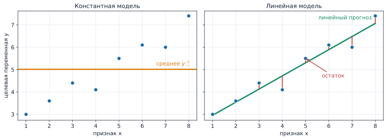
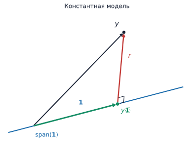
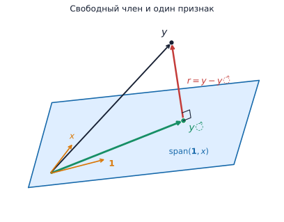
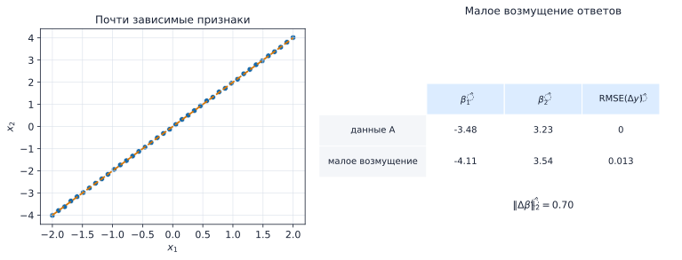
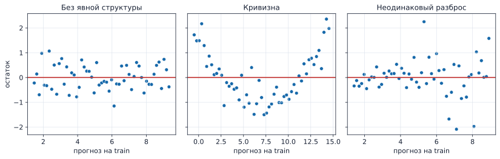
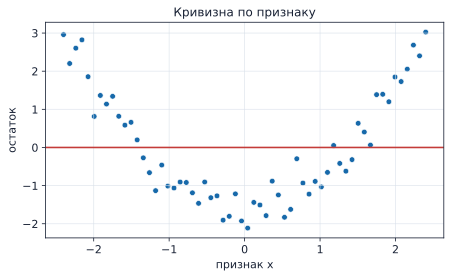
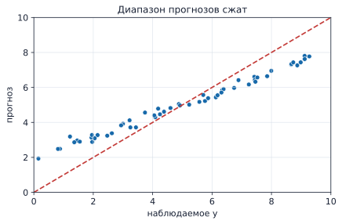
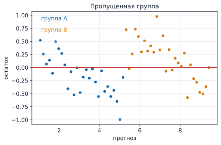
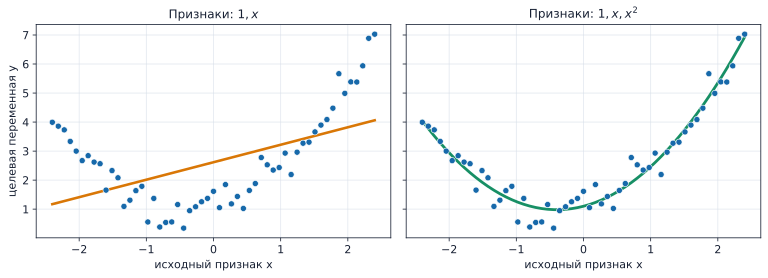
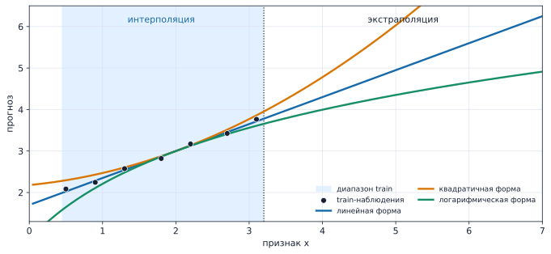

# Линейная регрессия: МНК, геометрия и диагностика

Линейная регрессия — одна из базовых моделей для прогнозирования числовой величины. Прогноз строится как линейная комбинация признаков, а коэффициенты выбираются по данным.

На её примере удобно подробно разобрать устройство обучения модели: какой критерий оптимизируется, откуда берутся коэффициенты, когда решение определяется однозначно, как измерять качество прогноза и что можно узнать из ошибок модели.

В этой лекции рассматривается обычный метод наименьших квадратов (*ordinary least squares*, OLS). Статистический вывод — стандартные ошибки, доверительные интервалы и проверки гипотез — в основную задачу недели не входит.

## 1. Задача регрессии

Объект описывается признаками $x\in\mathcal X$, а целевая переменная принимает числовые значения $y\in\mathbb R$. По обучающей выборке

$$
D=\{(x_i,y_i)\}_{i=1}^n
$$

строят функцию $f:\mathcal X\to\mathbb R$, которая выдаёт прогноз для нового объекта. В отличие от классификации, здесь прогнозом является числовая величина.

В русскоязычной статистической литературе встречается выражение **восстановление регрессии**. Регрессионной функцией называют условное среднее $\mathbb E[Y\mid X=x]$; по выборке пытаются восстановить зависимость ответа от признаков. В курсе будем использовать более короткий термин **задача регрессии**.

### 1.1. Константная модель

Простейшая модель выдаёт один и тот же прогноз $f_c(x)=c$ для всех объектов. Среди постоянных прогнозов выборочное среднее минимизирует сумму квадратов ошибок. Для $\bar y=n^{-1}\sum_i y_i$ имеем

$$
\begin{aligned}
\sum_{i=1}^n(y_i-c)^2
&=\sum_{i=1}^n\bigl[(y_i-\bar y)+(\bar y-c)\bigr]^2\\
&=\sum_{i=1}^n(y_i-\bar y)^2
 +2(\bar y-c)\sum_{i=1}^n(y_i-\bar y)
 +n(\bar y-c)^2.
\end{aligned}
$$

Средний член исчезает, потому что

$$
\sum_{i=1}^n(y_i-\bar y)=\sum_{i=1}^n y_i-n\bar y=0.
$$

Следовательно,

$$
\sum_{i=1}^n(y_i-c)^2
=\sum_{i=1}^n(y_i-\bar y)^2+n(\bar y-c)^2,
$$

и минимум достигается при $c=\bar y$. Константная модель задаёт естественную точку отсчёта для квадратной ошибки. На новых данных качество линейной модели имеет смысл сравнивать с прогнозом, равным среднему ответа на обучающей выборке.

### 1.2. Почему в теории появляется условное среднее

Мы только что увидели, что среди постоянных прогнозов сумму квадратов ошибок минимизирует выборочное среднее $\bar y$. Если для объекта известны признаки $X=x$, оптимальному прогнозу можно разрешить зависеть от $x$.

В вероятностной постановке среди всех чисел $c$ условную среднюю квадратичную ошибку

$$
\mathbb E[(Y-c)^2\mid X=x]
$$

минимизирует

$$
m(x)=\mathbb E[Y\mid X=x].
$$

Действительно, разложим $Y-c$ как $Y-m(x)+m(x)-c$:

$$
\begin{aligned}
\mathbb E[(Y-c)^2\mid X=x]
&=\mathbb E[(Y-m(x))^2\mid X=x]\\
&\quad+2(m(x)-c)\mathbb E[Y-m(x)\mid X=x]\\
&\quad+(m(x)-c)^2.
\end{aligned}
$$

Смешанный член равен нулю, поскольку $\mathbb E[Y-m(x)\mid X=x]=m(x)-m(x)=0$. Первое слагаемое не зависит от $c$, а последнее минимально при $c=m(x)$. Поэтому условное среднее называют регрессионной функцией. Линейная регрессия приближает её функцией выбранного линейного семейства.

Этот результат относится к распределению $(X,Y)$, а не к конечной выборке. Дальнейшая теория МНК не требует считать условное среднее известным.

## 2. Линейная модель и остатки

Для одного числового признака линейная модель имеет вид

$$
f_\beta(x)=\beta_0+\beta_1x.
\tag{1}
$$

Свободный член $\beta_0$ задаёт уровень прогноза при $x=0$, а $\beta_1$ — его изменение при увеличении $x$ на единицу. Единицы измерения $\beta_1$ равны «единицам целевой переменной на единицу признака».

Для $p$ признаков получаем множественную линейную регрессию:

$$
f_\beta(x)=\beta_0+\beta_1x_1+\dots+\beta_px_p,
\qquad
\beta=(\beta_0,\ldots,\beta_p)^\top.
\tag{2}
$$

Здесь $\beta$ — произвольный набор параметров семейства. После обучения получаем оценку $\hat\beta$ и обученную функцию $\hat f=f_{\hat\beta}$. Для объекта из обучающей выборки

$$
\hat y_i=\hat f(x_i),
\qquad
r_i=y_i-\hat y_i.
\tag{3}
$$

Величина $r_i$ называется **остатком**. Положительный остаток соответствует заниженному прогнозу, отрицательный — завышенному.



*Рисунок 1. Константная и линейная модели задают разные прогнозы. Вертикальные отрезки на правой панели — остатки.*

## 3. МНК для одного признака

Метод наименьших квадратов выбирает коэффициенты модели (1), минимизируя сумму квадратов остатков:

$$
(\hat\beta_0,\hat\beta_1)
=\arg\min_{\beta_0,\beta_1}\mathrm{RSS}(\beta_0,\beta_1),
\qquad
\mathrm{RSS}(\beta_0,\beta_1)
=\sum_{i=1}^n(y_i-\beta_0-\beta_1x_i)^2.
\tag{4}
$$

Сначала рассмотрим, когда наклон вообще можно определить. Если $x_i=x_0$ для всех объектов (нет вариации, все $x_i$ одинаковы), то на обучающих данных модель всегда имеет вид $\beta_0+\beta_1x_0$. Данные позволяют определить только это число, но не разделить вклад $\beta_0$ и $\beta_1$. Например, увеличение $\beta_1$ на $t$ можно компенсировать уменьшением $\beta_0$ на $tx_0$. Поэтому далее предполагается

$$
S_{xx}=\sum_{i=1}^n(x_i-\bar x)^2>0.
$$

Функция RSS квадратична по коэффициентам. Приравняем её частные производные к нулю:

$$
\begin{cases}
\displaystyle\sum_{i=1}^n(y_i-\hat\beta_0-\hat\beta_1x_i)=0,\\[0.8em]
\displaystyle\sum_{i=1}^n x_i(y_i-\hat\beta_0-\hat\beta_1x_i)=0.
\end{cases}
\tag{5}
$$

Первая строка даёт

$$
n\hat\beta_0+\hat\beta_1\sum_i x_i=\sum_i y_i,
$$

поэтому $\hat\beta_0=\bar y-\hat\beta_1\bar x$. Подставляя это выражение во второе уравнение, получаем

$$
\sum_i(x_i-\bar x)(y_i-\bar y)
=\hat\beta_1\sum_i(x_i-\bar x)^2.
$$

Следовательно,

$$
\boxed{\hat\beta_1=\frac{S_{xy}}{S_{xx}}}
=\frac{\sum_i(x_i-\bar x)(y_i-\bar y)}
       {\sum_i(x_i-\bar x)^2},
\qquad
\boxed{\hat\beta_0=\bar y-\hat\beta_1\bar x}.
\tag{6}
$$

Условие $S_{xx}>0$ обеспечивает единственность решения. RSS — выпуклая квадратичная функция, поэтому стационарная точка из (5) является её глобальным минимумом.

### 3.1. Ковариация, дисперсия и корреляция

Определим выборочные величины с нормировкой $1/(n-1)$:

$$
s_x^2=\frac{1}{n-1}\sum_i(x_i-\bar x)^2,
\qquad
s_y^2=\frac{1}{n-1}\sum_i(y_i-\bar y)^2,
$$

$$
s_{xy}=\frac{1}{n-1}\sum_i(x_i-\bar x)(y_i-\bar y),
\qquad
r_{xy}=\frac{s_{xy}}{s_xs_y}.
\tag{7}
$$

Тогда

$$
\hat\beta_1=\frac{s_{xy}}{s_x^2}
=r_{xy}\frac{s_y}{s_x}.
\tag{8}
$$

Корреляция задаёт знак и безразмерную силу линейной связи. Отношение стандартных отклонений возвращает коэффициенту нужные единицы измерения.

Из формулы (6) следует

$$
\hat f(\bar x)
=\hat\beta_0+\hat\beta_1\bar x
=\bar y-\hat\beta_1\bar x+\hat\beta_1\bar x
=\bar y.
$$

Поэтому оценённая методом наименьших квадратов прямая проходит через точку $(\bar x,\bar y)$. Эквивалентная центрированная запись имеет вид $\hat f(x)-\bar y=\hat\beta_1(x-\bar x)$.

### 3.2. Сквозной численный пример

Возьмём три наблюдения:

$$
x=(0,1,2)^\top,
\qquad
y=(1,2,2)^\top.
$$

Здесь $\bar x=1$, $\bar y=5/3$, $S_{xx}=2$, $S_{xy}=1$. По (6)

$$
\hat\beta_1=\frac12,
\qquad
\hat\beta_0=\frac76.
$$

Следовательно,

$$
\hat y=\left(\frac76,\frac53,\frac{13}{6}\right)^\top,
\qquad
r=\left(-\frac16,\frac13,-\frac16\right)^\top.
$$

Этот пример вернётся в геометрической интерпретации и в коротком фрагменте Python-кода.

## 4. Множественная регрессия и матричная запись

Пусть строки $X_{\mathrm{raw}}\in\mathbb R^{n\times p}$ содержат признаки объектов. Для модели со свободным членом используют расширенную матрицу признаков:

$$
X=
\begin{pmatrix}
1 & x_{11} & \cdots & x_{1p}\\
1 & x_{21} & \cdots & x_{2p}\\
\vdots & \vdots & \ddots & \vdots\\
1 & x_{n1} & \cdots & x_{np}
\end{pmatrix}
\in\mathbb R^{n\times q},
\qquad q=p+1.
$$

Вектор коэффициентов $\beta=(\beta_0,\ldots,\beta_p)^\top\in\mathbb R^q$, а вектор ответов $y=(y_1,\ldots,y_n)^\top\in\mathbb R^n$. Тогда

$$
\hat y=X\hat\beta,
\qquad
r=y-X\hat\beta.
\tag{9}
$$

В формулах удобно включать столбец единиц прямо в матрицу $X$. Во многих программных интерфейсах пользователь передаёт только исходные признаки, а свободный член оценивается автоматически.

Матричная задача МНК имеет вид

$$
\hat\beta\in\arg\min_{\beta\in\mathbb R^q}\|y-X\beta\|_2^2.
\tag{10}
$$

Нижний индекс $2$ обозначает евклидову норму:

$$
\|v\|_2=\sqrt{\sum_i v_i^2}.
$$

Верхняя степень $2$ означает квадрат этой нормы. Поэтому

$$
\|y-X\beta\|_2^2
=\sum_{i=1}^n\left(y_i-(X\beta)_i\right)^2
=\sum_{i=1}^n\left(y_i-\beta_0-\sum_{j=1}^p\beta_jx_{ij}\right)^2.
$$

Это та же сумма квадратов остатков, записанная сразу для всех объектов. Знак $\in$ в (10) допускает несколько минимизаторов; ниже появятся условия единственности.

**Ранг матрицы** — максимальное число линейно независимых столбцов, или, эквивалентно, размерность пространства, которое они порождают. Для $X\in\mathbb R^{n\times q}$ всегда $\mathrm{rank}(X)\leq q$; равенство означает, что все $q$ столбцов линейно независимы.

### 4.1. Интерпретация коэффициентов

В модели (2) коэффициент $\hat\beta_j$ описывает изменение прогноза при увеличении $x_j$ на единицу при фиксированных остальных признаках. 

1. Значение $\hat\beta_j$ зависит от того, какие другие признаки включены в модель. Добавление или удаление связанного признака может изменить коэффициент.
2. Если $x_j$ почти выражается через остальные признаки, в данных остаётся мало независимой вариации $x_j$. Отдельный коэффициент определяется неустойчиво.
3. Изменение единиц измерения меняет коэффициент, поэтому модули коэффициентов разных признаков нельзя напрямую сравнивать как важности.
4. Причинная интерпретация коэффициентов в рамках этого курса не рассматривается. Она требует отдельной постановки задачи и дополнительных предпосылок.

## 5. Геометрия МНК

Геометрический взгляд связывает четыре результата: константный baseline и МНК оказываются одной идеей проекции; из геометрии следуют нормальные уравнения и ортогональность остатков; она же подготавливает объяснение неединственности коэффициентов при мультиколлинеарности.

Короткое напоминание. Скалярное произведение векторов $a,b\in\mathbb R^n$ равно

$$
\langle a,b\rangle=\sum_{i=1}^n a_i b_i.
$$

Два ненулевых вектора перпендикулярны тогда и только тогда, когда их скалярное произведение равно нулю.

### 5.1. Константная модель как проекция

Начнём с модели, которая вообще не использует признаки. Пусть в обучающей
выборке есть $n$ объектов и наблюдаемые ответы

$$
y=
\begin{pmatrix}
y_1\\
\vdots\\
y_n
\end{pmatrix}
\in\mathbb R^n.
$$

Почему появляется пространство $\mathbb R^n$? У вектора $y$ ровно $n$ координат — по одной на каждый объект обучающей выборки. Алгебраически $y$ является вектором. В геометрической интерпретации тот же набор координат можно изображать точкой в $n$-мерном пространстве.

Рассмотрим также вектор из единиц

$$
\mathbf 1=
\begin{pmatrix}
1\\
\vdots\\
1
\end{pmatrix}
\in\mathbb R^n.
$$

Если константная модель всегда предсказывает число $c$, то сразу для
всех $n$ объектов её прогнозы можно записать как

$$
y(c)=
\begin{pmatrix}
c\\
\vdots\\
c
\end{pmatrix}
=
c
\begin{pmatrix}
1\\
\vdots\\
1
\end{pmatrix}
=
c\mathbf 1.
$$

Меняя $c$, мы получаем все возможные прогнозы константной модели. Геометрически это прямая, проходящая через начало координат в направлении вектора единиц $\mathbf 1$:

$$
L_0=\{c\mathbf 1:\;c\in\mathbb R\}.
$$

В линейной алгебре эту прямую часто обозначают $\mathrm{span}(\mathbf 1)$: это множество всех числовых кратных вектора $\mathbf 1$.

Теперь задача МНК для константной модели получает простой геометрический смысл. Наблюдаемый вектор $y$ обычно не лежит на этой прямой. Среди всех точек $c\mathbf 1$ нужно выбрать ближайшую к $y$.

Ближайшая точка прямой называется ортогональной проекцией. Вектор, соединяющий $y$ с его проекцией, перпендикулярен направлению прямой. Поэтому для оптимального $\hat c$

$$
\langle y-\hat c\mathbf 1,\mathbf 1\rangle=0.
$$

Раскроем скалярное произведение:

$$
\langle y,\mathbf 1\rangle
-
\hat c\langle\mathbf 1,\mathbf 1\rangle
=0.
$$

Но

$$
\langle y,\mathbf 1\rangle=\sum_{i=1}^n y_i,
\qquad
\langle\mathbf 1,\mathbf 1\rangle=n.
$$

Следовательно,

$$
\hat c
=
\frac{\sum_i y_i}{n}
=
\bar y.
\tag{11}
$$

Значит, вектор прогнозов лучшей константной модели равен

$$
\hat y=\bar y\,\mathbf 1
=
\begin{pmatrix}
\bar y\\
\vdots\\
\bar y
\end{pmatrix}.
$$

Мы получили тот же результат, что и в разделе 1, другим способом: выборочное среднее — это не только минимум суммы квадратов среди констант. Геометрически $\bar y\mathbf 1$ является проекцией наблюдаемого вектора $y$ на прямую всех постоянных прогнозов.



*Рисунок 2. Константная модель: $\bar y\mathbf 1$ — ортогональная проекция наблюдаемого вектора $y$ на прямую всех постоянных прогнозов.*

### 5.2. Добавим один признак

Теперь у каждого из тех же $n$ объектов есть один числовой признак.
Соберём его значения в вектор

$$
x=
\begin{pmatrix}
x_1\\
\vdots\\
x_n
\end{pmatrix}
\in\mathbb R^n.
$$

Он имеет ту же размерность, что и $y$: одна координата соответствует
одному объекту обучающей выборки.

Для модели

$$
f_\beta(x_i)=\beta_0+\beta_1x_i
$$

вектор прогнозов сразу на всех $n$ объектах равен

$$
y(\beta)
=
\begin{pmatrix}
\beta_0+\beta_1x_1\\
\vdots\\
\beta_0+\beta_1x_n
\end{pmatrix}.
$$

Эту запись можно разложить на два вектора:

$$
y(\beta)
=
\beta_0
\begin{pmatrix}
1\\
\vdots\\
1
\end{pmatrix}
+
\beta_1
\begin{pmatrix}
x_1\\
\vdots\\
x_n
\end{pmatrix}
=
\beta_0\mathbf 1+\beta_1x.
\tag{12}
$$

Здесь важно различать коэффициенты модели и её прогнозы.

Пара коэффициентов

$$
\beta=
\begin{pmatrix}
\beta_0\\
\beta_1
\end{pmatrix}
\in\mathbb R^2
$$

содержит всего два числа. Но после применения модели к $n$ объектам
мы получаем $n$ прогнозов, поэтому

$$
y(\beta)\in\mathbb R^n.
$$

Матрица признаков связывает эти два представления:

$$
X=
\begin{pmatrix}
1 & x_1\\
\vdots & \vdots\\
1 & x_n
\end{pmatrix},
\qquad
X
\begin{pmatrix}
\beta_0\\
\beta_1
\end{pmatrix}
=
\beta_0\mathbf 1+\beta_1x
=
y(\beta).
$$

Иными словами, коэффициенты говорят, в каких пропорциях нужно сложить
столбцы матрицы $X$, чтобы получить вектор прогнозов.

Что происходит, когда мы меняем $\beta_0$ и $\beta_1$? Мы перебираем всевозможные линейные комбинации двух векторов $\mathbf 1$ и $x$.

Если эти два вектора линейно независимы, их линейные комбинации образуют
двумерную плоскость. При $n=3$ эту плоскость можно буквально нарисовать.
При $n>3$ она по-прежнему двумерна, только находится внутри
$n$-мерного пространства.

Если же все значения признака одинаковы, $x_i=x_0$, то

$$
x=x_0\mathbf 1.
$$

Второго независимого направления не появляется: вместо плоскости остаётся та же прямая. Это геометрическая версия уже знакомого случая $S_{xx}=0$, когда наклон невозможно отделить от свободного члена.

Для нескольких признаков рассуждение не меняется. Каждый столбец матрицы $X$ является вектором из $\mathbb R^n$, поскольку содержит значение одного признака для всех $n$ объектов. Все их линейные комбинации образуют множество всех векторов прогнозов, которые модель способна породить на обучающей выборке.

Это множество называется пространством столбцов матрицы $X$, обозначим его
$$
\mathrm{col}(X).
$$
Его размерность равна $\mathrm{rank}(X)$ и не превосходит числа столбцов $X$.

### 5.3. Почему OLS — это проекция

OLS минимизирует $\|y-X\beta\|_2^2$, то есть квадрат евклидова расстояния между наблюдаемым вектором $y$ и кандидатом на вектор прогнозов $X\beta$. Поэтому он выбирает ближайший к $y$ вектор из $\mathrm{col}(X)$:

$$
\hat y=X\hat\beta.
$$

Это ортогональная проекция $y$ на $\mathrm{col}(X)$. Остаточный вектор равен $r=y-\hat y$.



*Рисунок 3. При свободном члене и одном признаке допустимые векторы прогнозов образуют плоскость. МНК выбирает ближайший к $y$ вектор $\hat y$, а остаток $r=y-\hat y$ перпендикулярен этой плоскости.*

Если изменить свободный член на малую величину $\delta$, то

$$
\hat y\longrightarrow\hat y+\delta\mathbf 1.
$$

Каждый прогноз меняется на одну и ту же величину; на обычном двумерном графике регрессии это сдвиг всей прямой вверх или вниз. Условие

$$
\langle r,\mathbf 1\rangle=\sum_{i=1}^n r_i=0
$$

означает, что малое изменение свободного члена уже не уменьшает RSS.

Если изменить наклон на $\delta$, то

$$
\hat y\longrightarrow\hat y+\delta x.
$$

$i$-й прогноз меняется на $\delta x_i$; в парной регрессии это изменение наклона прямой. Условие

$$
\langle r,x\rangle=\sum_{i=1}^n x_i r_i=0
\tag{13}
$$

означает, что малое изменение наклона также не уменьшает RSS. Для всех столбцов сразу получаем

$$
X^\top r=0,
\tag{14}
$$

а после подстановки $r=y-X\hat\beta$ — нормальные уравнения

$$
X^\top X\hat\beta=X^\top y.
\tag{15}
$$

## 6. Ранг и мультиколлинеарность

### 6.1. Линейная независимость признаков и единственность решения

Если $q$ столбцов $X$ линейно независимы, то $\mathrm{rank}(X)=q$; иногда говорят: матрица имеет полный ранг по столбцам. Проекция $\hat y$ на $\mathrm{col}(X)$ единственна. При линейной независимости её коэффициентное представление также единственно.

Действительно, если $X\beta^{(1)}=X\beta^{(2)}$, то

$$
X\bigl(\beta^{(1)}-\beta^{(2)}\bigr)=0.
$$

Нулевую линейную комбинацию независимых столбцов можно получить только при нулевых коэффициентах. Поэтому $\beta^{(1)}-\beta^{(2)}=0$ и $\beta^{(1)}=\beta^{(2)}$.

В этом случае $X^\top X$ обратима, а нормальные уравнения дают

$$
\hat\beta=(X^\top X)^{-1}X^\top y.
\tag{16}
$$

Почему из линейной независимости столбцов следует обратимость $X^\top X$?

Предположим, что для некоторого $v\in\mathbb R^q$

$$
X^\top Xv=0.
$$

Умножим равенство слева на $v^\top$:

$$
v^\top X^\top Xv
=
(Xv)^\top(Xv)
=
\|Xv\|_2^2
=
0.
$$

Квадрат нормы — это сумма квадратов координат:

$$
\|Xv\|_2^2=\sum_i (Xv)_i^2.
$$

Она может быть равна нулю только тогда, когда все координаты равны нулю.
Следовательно,

$$
Xv=0.
$$

Но столбцы $X$ линейно независимы. Поэтому их линейная комбинация равна нулю только при $v=0$.

Итак, уравнение

$$
X^\top Xv=0
$$

имеет только нулевое решение. Для квадратной матрицы это означает, что $X^\top X$ обратима.

Формула (16) описывает аналитическое решение при линейно независимых столбцах. В практических вычислениях матрицу обычно не обращают явно; к этому вернёмся в конце лекции.

### 6.2. Точная мультиколлинеарность

Пусть $x_2=2x_1$. Возьмём произвольное число $t$ и изменим коэффициенты:

$$
\beta'_1=\beta_1-2t,
\qquad
\beta'_2=\beta_2+t.
$$

Тогда для каждой строки

$$
\begin{aligned}
\beta'_1x_1+\beta'_2x_2
&=(\beta_1-2t)x_1+(\beta_2+t)2x_1\\
&=\beta_1x_1+\beta_2x_2.
\end{aligned}
$$

Мы изменили оба коэффициента, но не изменили ни одного прогноза. Поэтому отдельные коэффициенты не определяются единственным образом: данные определяют только комбинацию $\beta_1+2\beta_2$.

Компактная запись этого же расчёта использует

$$
v=(0,-2,1)^\top.
$$

$Xv=0$ означает, что это направление изменения коэффициентов не видно в прогнозах. Поэтому для любого $t$

$$
X(\hat\beta+tv)=X\hat\beta+tXv=X\hat\beta.
\tag{17}
$$

Таким образом, неоднозначность относится именно к коэффициентам. Все наборы $\hat\beta+tv$ дают один и тот же вектор прогнозов на обучающих объектах. Геометрически это одна и та же точка $\hat y$ в пространстве прогнозов, записанная разными наборами коэффициентов. Данные позволяют определить сам вектор прогнозов, но не позволяют однозначно разделить его на вклад $x_1$ и вклад $x_2$.

### 6.3. Приближённая мультиколлинеарность

При $x_2\approx 2x_1$ данные в основном наблюдают признаки почти в одной пропорции. Их совместный вклад определяется лучше, чем отдельные вклады. Поэтому малое возмущение выборки может заметно изменить пару коэффициентов при похожих прогнозах на train. На новых сочетаниях признаков такие модели способны расходиться сильнее.



*Рисунок 4. Малое возмущение ответов меняет коэффициенты при почти зависимых признаках заметнее, чем прогнозы на тех же объектах.*

Численные методы оценивают также численный ранг матрицы. Малые сингулярные числа могут указывать на направления, которые данные различают плохо. При дефиците ранга решатель выбирает одно решение из множества возможных по своей численной договорённости. Подробности сингулярного разложения, псевдообратной матрицы и числа обусловленности вынесены в дополнительное чтение.

## 7. Метрики регрессии

Пусть на оцениваемой выборке есть ответы $y_1,\ldots,y_m$ и прогнозы $\hat y_1,\ldots,\hat y_m$.

### 7.1. MSE и RMSE

Средняя квадратичная ошибка равна

$$
\mathrm{MSE}=\frac1m\sum_{i=1}^m(y_i-\hat y_i)^2.
\tag{18}
$$

Она измеряется в квадрате единиц целевой переменной и особенно чувствительна к крупным ошибкам. Это удобная математическая мера, но её число не всегда удобно читать в предметных единицах.

Корень из MSE,

$$
\mathrm{RMSE}=\sqrt{\mathrm{MSE}},
\tag{19}
$$

измеряется в тех же единицах, что и target. Если прогнозируется цена в тысячах рублей, RMSE также выражается в тысячах рублей. На фиксированной оцениваемой выборке MSE и RMSE задают одинаковый порядок моделей.

### 7.2. MAE

Средняя абсолютная ошибка

$$
\mathrm{MAE}=\frac1m\sum_{i=1}^m|y_i-\hat y_i|
\tag{20}
$$

тоже измеряется в единицах target. Каждая ошибка входит в неё линейно по модулю, поэтому один редкий крупный промах влияет на MAE слабее, чем на MSE и RMSE.

Сравним два набора ошибок: $A=(2,2,2,2)$ и $B=(0,0,0,8)$. В обоих случаях $\mathrm{MAE}=2$. Однако $\mathrm{RMSE}_A=2$, а $\mathrm{RMSE}_B=4$. MAE одинаково учитывает общий объём абсолютной ошибки, тогда как RMSE сильнее реагирует на концентрацию ошибки в одном крупном промахе.

MAE подходит, например, для прогноза времени доставки, когда важен типичный промах в минутах, или для цены, когда удобно сообщать понятную среднюю абсолютную ошибку и цена ошибки примерно линейна. RMSE полезна в прогнозе спроса или инфраструктурной нагрузки, если редкий очень большой промах операционно опаснее нескольких умеренных. Если недооценка и переоценка имеют разные стоимости или есть пороговые потери, ни MAE, ни RMSE полностью не выражают задачу принятия решения.

Например, при прогнозировании спроса недооценка может привести к дефициту товара и упущенным продажам, а переоценка — к лишним запасам и расходам на хранение. Ошибки $+100$ и $-100$ имеют одинаковый вклад и в MAE, и в RMSE, хотя экономические последствия могут существенно различаться. В такой задаче одной стандартной метрики недостаточно: критерий оценки должен учитывать реальные потери.

### 7.3. Коэффициент детерминации $R^2$

$R^2$ сравнивает квадрат ошибок модели с разбросом ответов относительно их среднего:

$$
R^2=1-\frac{\mathrm{RSS}}{\mathrm{TSS}},
\qquad
\mathrm{TSS}=\sum_{i=1}^m(y_i-\bar y)^2.
\tag{21}
$$

$R^2=1$ соответствует идеальным прогнозам. Для OLS с константой на обучающей выборке знакомое разложение вариации поддерживает эконометрическое толкование через объяснённую выборочную вариацию.

Для произвольной регрессионной модели на test $R^2$ лучше читать как безразмерный показатель квадратной ошибки относительно разброса $y_{\mathrm{true}}$ на оцениваемой выборке. `r2_score` зависит только от $y_{\mathrm{true}}$ и $y_{\mathrm{pred}}$, поэтому его можно вычислять для линейной регрессии, kNN, деревьев, случайного леса, бустинга и любого другого регрессионного предиктора.

$R^2=0$ означает тот же уровень квадрата ошибки, что у постоянного прогноза, равного среднему $y_{\mathrm{true}}$ этой выборки. $R^2<0$ означает, что квадрат ошибок модели больше такой опорной вариации. Среднее test-ответов служит здесь математической точкой отсчёта внутри метрики.

Если target почти не меняется, $R^2$ становится неустойчивой и плохо интерпретируемой метрикой. Поэтому её разумно использовать как дополнительный безразмерный показатель вместе с RMSE или MAE в единицах target. Классическая интерпретация $R^2$ как доли объяснённой вариации опирается на разложение, возникающее для OLS с константой на той же выборке. Для других регрессионных моделей $R^2$ по-прежнему можно использовать как метрику, но разумнее трактовать его как безразмерный показатель квадратной ошибки относительно разброса ответов, а не как буквальную «долю объяснённой вариации».
## 8. Диагностика остатков

Графики остатков помогают искать структуру, которую выбранная модель не описала. Для каждого графика полезно спрашивать: какую структуру мы видим, с какой проблемой она согласуется и что разумно проверить следующим. Сам график обычно формулирует гипотезу, а не доказывает её.

В статистической записи $Y_i=f_{\beta^*}(X_i)+\varepsilon_i$ величина $\varepsilon_i$ — ненаблюдаемая случайная ошибка предполагаемого механизма данных. Остаток $r_i$ вычисляется после оценки конкретной модели. Он может отражать реализацию случайной ошибки, неправильную спецификацию, пропущенные переменные, ошибки измерения и другие особенности наблюдаемых данных.

### 8.1. Остатки против прогнозов



*Рисунок 5. Слева: на графике не обнаружена явная систематическая структура. В центре: кривизна. Справа: разброс ошибок растёт вместе с прогнозом.*

Кривизна означает, что выбранная линейная форма не описала всю систематическую зависимость. Сначала смотрят графики остатков против отдельных числовых признаков, находят признак с устойчивой формой и сопоставляют его с графиком $y$ против этого признака. Затем формулируют одну предметно оправданную гипотезу на train: добавить $x^2$, $\log(1+x)$ или взаимодействие, перестроить $X$, переобучить модель и сравнить метрику вместе с тем же графиком остатков. Если простое преобразование не помогает, можно попробовать более гибкую нелинейную модель.

**Веерообразный рисунок** означает, что характерный размер ошибки зависит от области, в которой находится объект. Например, при небольших прогнозах абсолютная ошибка может обычно составлять 1–2 единицы, а при больших — уже 8–10. В такой ситуации одна общая RMSE скрывает важное различие: модель заметно точнее в одной части данных, чем в другой.

Сначала это различие стоит измерить. Например, можно разбить объекты на несколько диапазонов по величине прогноза и отдельно посчитать MAE или RMSE в каждом диапазоне. Если ошибки действительно систематически растут, следующий вопрос — с чем связан этот рост. Для этого смотрят остатки против отдельных признаков и проверяют, не пропущена ли важная переменная и достаточно ли хорошо описана форма средней зависимости.

Перед интерпретацией веера как изменения дисперсии полезно проверить и форму средней зависимости: иногда похожий рисунок возникает из-за неправильно заданной самой регрессионной зависимости.

Сам по себе неодинаковый разброс не означает, что прогноз среднего обязательно смещён. Он означает, что **неопределённость прогноза различается в разных областях данных**. Для практического применения это может быть критично: одна общая метрика качества не показывает, что для одних объектов прогнозы существенно надёжнее, чем для других. В классическом статистическом выводе гетероскедастичность дополнительно влияет на обычные оценки стандартных ошибок.

Отсутствие заметной структуры на графике означает лишь, что этот график не обнаружил соответствующей систематической закономерности.

### 8.2. Остатки против отдельного признака



*Рисунок 6. Средний остаток меняется вместе с признаком: один линейный член не описал форму зависимости.*

График остатков против прогнозов показывает, что модель систематически ошибается, но обычно не говорит, **с каким именно признаком** связана оставшаяся структура. Поэтому следующим шагом строят остатки против отдельных признаков.

Если средний остаток систематически меняется вместе с $x_j$, после линейной модели в этом признаке осталась предсказуемая структура. U-образный рисунок означает, что в середине диапазона модель систематически ошибается в одну сторону, на краях — в другую. Один конкретный следующий эксперимент — добавить оправданное предметным смыслом преобразование этого признака на train, переобучить модель и повторить и метрику, и этот же график. Полиномиальный член не является автоматическим ответом: может оказаться, что нужна другая переменная или иная модель.

### 8.3. Наблюдаемое значение против прогноза



*Рисунок 7. Диагональ соответствует точному прогнозу. Здесь диапазон прогнозов сжат.*

На таком графике диагональ $y=\hat y$ задаёт точные прогнозы. Например, если наблюдаемые значения лежат примерно в диапазоне 10–100, а прогнозы сосредоточены между 30 и 70, малые значения систематически завышаются, большие — занижаются: прогнозы стягиваются к центру. Например, объект с истинным значением $y=95$ может получать прогноз около $\hat y=70$, а объект с $y=15$ — прогноз около $\hat y=30$. При этом более узкий диапазон прогнозов сам по себе ещё не доказывает ошибку модели. Даже хороший прогноз условного среднего может меняться слабее, чем наблюдаемый $y$, если часть вариации ответа непредсказуема по имеющимся признакам. Поэтому сжатие диапазона — диагностический сигнал: нужно выяснить, связано ли оно с формой модели, нехваткой информации в признаках или свойствами новых данных.


### 8.4. Пропущенная группа



*Рисунок 8. Остатки двух групп систематически лежат по разные стороны нуля.*

Если для двух известных групп остатки систематически расположены по разные стороны нуля, единая модель имеет различное смещение для этих групп. Сначала считают средний остаток и MAE по группам. Если признак группы доступен в момент прогноза и содержательно допустим, его добавляют в модель на train и затем снова проверяют групповые остатки.

### 8.5. Распределение остатков

Гистограмма или Q–Q-график полезны для поиска выраженной асимметрии, тяжёлых хвостов и отдельных необычных наблюдений. Для чисто предсказательной задачи нормальность остатков сама по себе не является требованием к модели. Она становится существеннее в классическом статистическом выводе.

## 9. Линейность по коэффициентам и преобразованные признаки

Модель

$$
f_\beta(x)=\beta_0+\beta_1x+\beta_2x^2
\tag{22}
$$

нелинейна как функция исходного $x$, но линейна по коэффициентам $\beta$. Для МНК столбец $x^2$ — ещё один признак в матрице $X$.



*Рисунок 9. Добавление столбца $x^2$ расширяет семейство доступных зависимостей.*

Аналогично можно включить $\log(1+x)$, если он определён и предметно осмыслен. Взаимодействие $x_1x_2$ позволяет эффекту $x_1$ зависеть от значения $x_2$: предельный эффект по $x_1$ равен $\beta_1+\beta_3x_2$ в модели с членом $\beta_3x_1x_2$.

### 9.1. Экстраполяция



*Рисунок 10. Внутри диапазона train разные формы близки; за его пределами они расходятся.*

Внутри наблюдаемого диапазона несколько форм могут описывать данные почти одинаково. За его пределами прогноз определяется выбранной функциональной формой. Поэтому хорошее качество внутри области train/test не проверяет далёкую экстраполяцию и не заменяет предметного обоснования.

## 10. Как МНК вычисляется на компьютере

Аналитическая формула (16) описывает математическое решение. На компьютере коэффициенты всё равно нужно получить с конечной точностью. Явно вычислять $(X^\top X)^{-1}X^\top y$ необязательно и обычно не следует: специализированные методы линейной алгебры решают исходную задачу наименьших квадратов непосредственно. Это численное решение той же задачи МНК, а не градиентный спуск.

В NumPy к математической задаче ближе всего вызов

```python
beta_hat, *_ = np.linalg.lstsq(X_design, y, rcond=None)
```

`lstsq` численно решает задачу наименьших квадратов и не требует явно обращать $X^\top X$. Он удобен для прямого сопоставления кода с матричной записью.

### 10.1. Как решение получают численно

LAPACK — стандартная низкоуровневая библиотека численной линейной алгебры. Её процедуры-решатели строят решение МНК через разложения матриц (SVD и др.), а не через явную обратную матрицу.

`numpy.linalg.lstsq` — вариант реализации в NumPy: он возвращает решение, сведения об остатках, ранг и сингулярные числа. 

`scipy.linalg.lstsq` решает ту же математическую задачу, но предоставляет больше численных настроек, включая явный выбор `lapack_driver`. Текущий выбор по умолчанию — `gelsd`, решатель на основе сингулярного разложения методом «разделяй и властвуй». `gelss` также использует SVD, но является историческим и обычно более медленным; `gelsy` использует полную ортогональную факторизацию. Запоминать названия не нужно: они показывают, что одна задача МНК допускает несколько устойчивых численных процедур.

В scikit-learn используют интерфейс `LinearRegression`:

```python
from sklearn.linear_model import LinearRegression

model = LinearRegression()
model.fit(X_train, y_train)

model.coef_
model.intercept_

y_pred = model.predict(X_test)
```

После `fit` объект `model` хранит состояние обученной модели. `coef_` содержит коэффициенты при признаках, `intercept_` — свободный член, а `predict` применяет обученную функцию к новым объектам. Для текущей реализации обычного МНК на плотных данных scikit-learn вызывает `scipy.linalg.lstsq`; разреженные матрицы обрабатываются другим численным путём.

Также популярна библиотека `statsmodels`. Его интерфейс ориентирован на подробный статистический анализ оценённой модели и похож на вывод эконометрических пакетов, тогда как scikit-learn использует единый ML-интерфейс `fit`/`predict`. В текущем `statsmodels.OLS.fit()` метод решения по умолчанию — `pinv`: он использует псевдообратную матрицу Мура—Пенроуза; доступен и вариант QR-разложения.

> **Что сделают разные программы при точной мультиколлинеарности?** Математика даёт неединственные коэффициенты. `regress` в Stata обычно помечает одну линейно зависимую переменную как исключённую и оценивает сокращённую параметризацию. EViews при совершенной или почти совершенной коллинеарности может завершить оценивание ошибкой `Near singular matrix`. `numpy.linalg.lstsq` может вернуть одно решение минимальной нормы, а `statsmodels` по умолчанию также выбирает конкретное решение через псевдообратную матрицу. То, что программа вернула числовые коэффициенты, не означает, что данные определили их единственным образом. Это важно понимать при статистической и эконометрической интерпретации коэффициентов, их стандартных ошибок и уровней значимости. Полное исполнимое сравнение оставим для семинара. 

## 11. Роль линейной регрессии в машинном обучении

- Это первая содержательная модель после константного baseline.
- При достаточно простой зависимости она может быть полноценной рабочей моделью.
- Она работает над преобразованными и взаимодействующими признаками, расширяя класс описываемых зависимостей.
- Коэффициенты и остатки делают её прозрачным инструментом исследования структуры данных.
- Она служит точкой сравнения для более сложных моделей.
- На её примере хорошо видно различие между семейством моделей и алгоритмом обучения: одно линейное семейство можно обучать разными численными процедурами.

## 12. Что нужно унести с этой недели

1. Линейная регрессия предсказывает число линейной комбинацией признаков.
2. МНК выбирает коэффициенты по минимуму RSS.
3. В простом случае коэффициенты имеют явное аналитическое решение через средние, ковариацию и дисперсию.
4. Матричная запись выражает ту же задачу для нескольких признаков.
5. Геометрически МНК выбирает ближайший допустимый вектор прогнозов.
6. Мультиколлинеарность затрудняет интерпретацию и делает коэффициенты неединственными или неустойчивыми.
7. Метрика показывает величину ошибки, а диагностика остатков — её структуру.
8. Преобразование признаков меняет класс зависимостей, сохраняя линейность по коэффициентам; экстраполяция определяется выбранной формой.
9. На компьютере МНК обычно решают устойчивыми численными процедурами, а в ML используют интерфейс оценивателя `fit`/`predict`.

## Вопросы для самопроверки

1. Почему выборочное среднее минимизирует сумму квадратов среди констант?
2. Как устроен вывод коэффициентов парной OLS-регрессии?
3. Как наклон связан с выборочной ковариацией, дисперсией и корреляцией?
4. Почему оценённая прямая проходит через $(\bar x,\bar y)$?
5. Что представляет собой пространство столбцов матрицы признаков?
6. Почему ортогональность остатка приводит к нормальным уравнениям?
7. Почему при точной мультиколлинеарности прогнозы могут быть однозначны, а коэффициенты — нет?
8. Когда $R^2$ на test может стать отрицательным?
9. Какие гипотезы о модели дают кривизна и веер на графике остатков?
10. Почему модель с $x^2$ остаётся линейной по коэффициентам?
11. Почему хорошая интерполяция не гарантирует надёжной экстраполяции?
12. Почему аналитическая формула МНК не требует явного обращения матрицы в коде?

## Дополнительное чтение

- **Mathematics for Machine Learning, Chapters 4 и 9** — сингулярное разложение, псевдообратная матрица и численные аспекты МНК.
- **The Elements of Statistical Learning, Section 3.2** — более плотное изложение линейной регрессии, ранга и вычислений.
- **Документация NumPy `lstsq` и SciPy `lstsq`** — возвращаемые характеристики численного решения.
