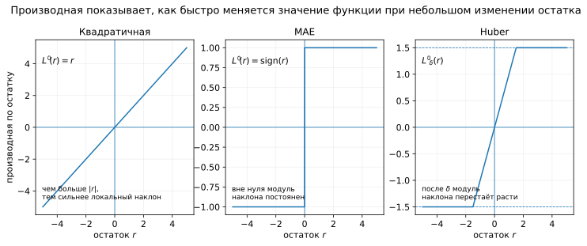
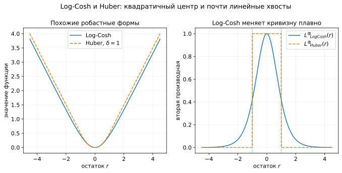
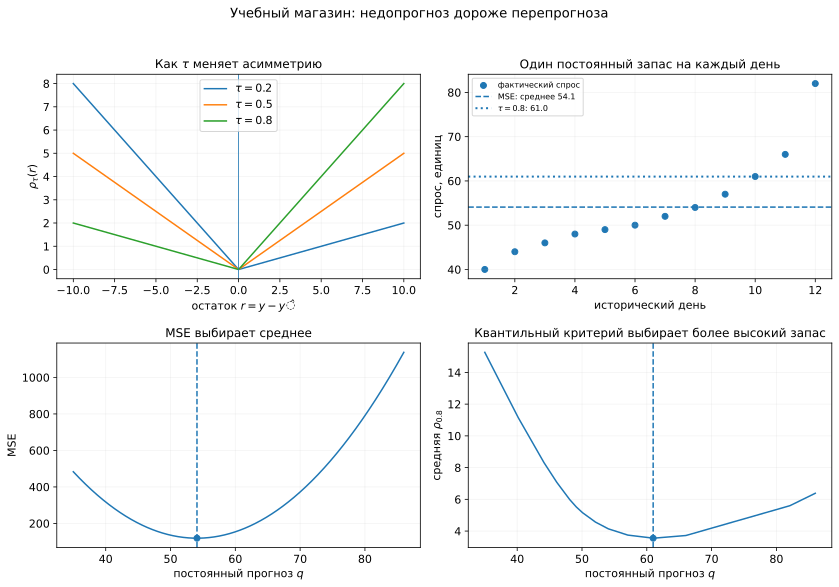
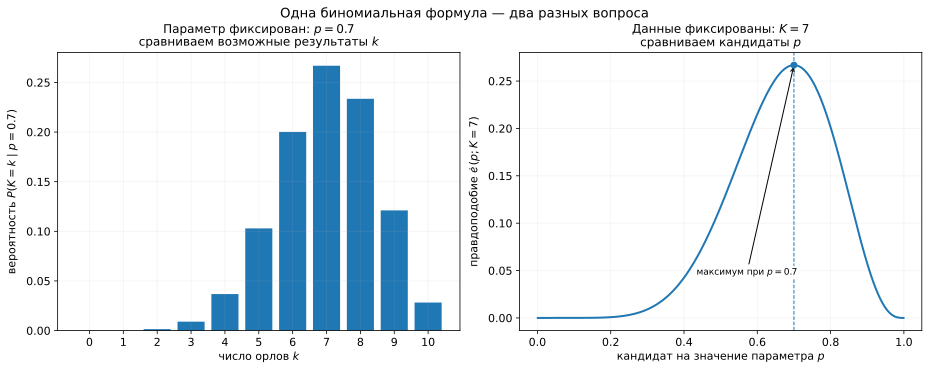
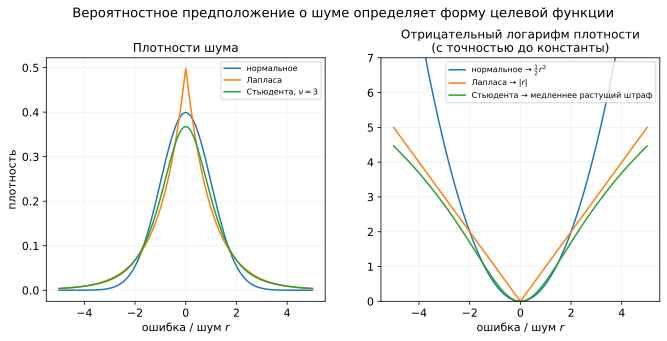
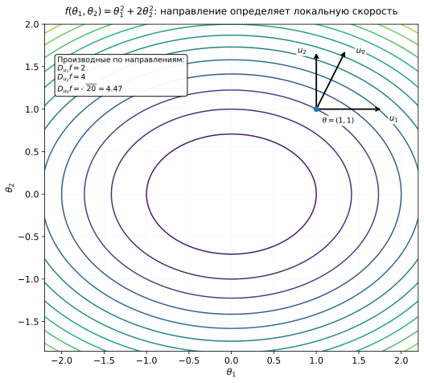
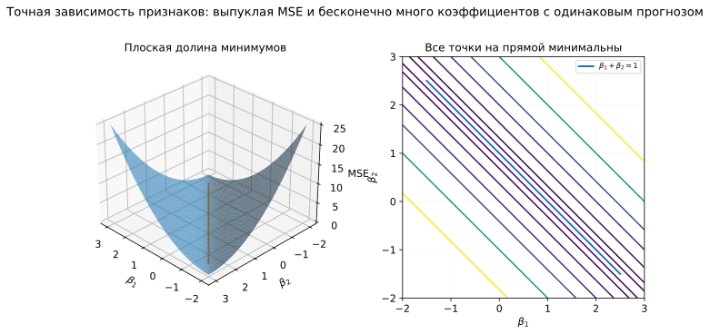
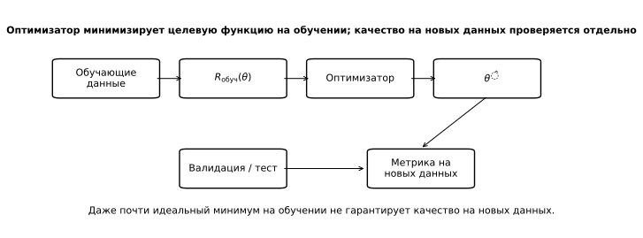

# Функции потерь и градиентный спуск: что минимизируем и как обучаем

На прошлой неделе мы подробно разобрали линейную регрессию. Для матрицы признаков $X$ и вектора коэффициентов $\beta$ прогнозы записывались как

```math
X\beta,
```

а после обучения получался вектор $\hat y=X\hat\beta$. Метод наименьших квадратов выбирал коэффициенты по сумме квадратов остатков. Мы получили нормальные уравнения, посмотрели на задачу как на проекцию и увидели, почему в численном коде лучше пользоваться специализированным решателем вроде `numpy.linalg.lstsq`, а не явно обращать $X^\top X$. Отдельно разобрали, как мультиколлинеарность затрудняет определение и интерпретацию отдельных коэффициентов.

В этой истории остались два вопроса.

Первый: **почему качество подгонки мы измеряли именно квадратами ошибок?** Можно было бы взять модули ошибок, слабее реагировать на редкие экстремальные значения или по-разному оценивать недопрогноз и перепрогноз. Тогда коэффициенты модели в общем случае изменятся.

Второй: **как искать хорошие коэффициенты, если готовой формулы решения нет?** Для МНК существует специальная теория и эффективные численные алгоритмы. У многих других задач такой короткой дороги уже не будет.

Эта лекция посвящена двум связанным идеям. Сначала мы разберём, как математически задаётся критерий обучения. Затем построим общий итеративный способ уменьшать этот критерий и увидим, от чего зависит его поведение.

## 1. От остатка к функции потерь

Для объекта $i$ остаток уже знаком нам из предыдущих лекций:

```math
r_i=y_i-\hat y_i.
\qquad\text{(1)}
```

Он сохраняет знак ошибки. Если $r_i>0$, прогноз оказался ниже наблюдаемого ответа; если $r_i<0$, прогноз оказался выше.

Остаток сообщает величину и направление ошибки, но ещё не задаёт правило, по которому ошибки сравниваются между собой. Ошибка на $20$ единиц может считаться вдвое серьёзнее ошибки на $10$, в четыре раза серьёзнее или иметь какую-то другую прикладную цену. Такое правило задаёт **функция потерь** (*loss function*):

```math
L(y_i,\hat y_i).
\qquad\text{(2)}
```

Во многих задачах регрессии функция потерь зависит от $y_i$ и $\hat y_i$ только через остаток, поэтому удобно писать $L(r_i)$. В разговорной речи иногда говорят, что ошибка получает некоторый **штраф**. Здесь это просто неформальное обозначение для значения функции потерь; позже термин «штраф» появится ещё и в разговоре про регуляризацию.

Для обучения нужно собрать ошибки всех объектов в одно число, зависящее от параметров модели. Если модель имеет вид $f_\theta(x)$, то стандартная конструкция выглядит так:

```math
R_n(\theta)
=
\frac{1}{n}\sum_{i=1}^{n}
L\bigl(y_i,f_\theta(x_i)\bigr).
\qquad\text{(3)}
```

Среднее значение функции потерь на наблюдаемой обучающей выборке называют **эмпирическим риском** (*empirical risk*). Это стандартный термин статистического обучения. Обозначения в литературе различаются: встречаются $R_n$, $\widehat R$, $J$, $\mathcal L$ и другие. В этой лекции используем $R_n(\theta)$; индекс $n$ напоминает, что величина построена по выборке из $n$ объектов.

Ту же величину $R_n(\theta)$ можно называть **целевой функцией обучения**, когда важна её вычислительная роль: именно её значения мы уменьшаем, подбирая параметры.

Задача обучения записывается как

```math
\hat\theta\in\arg\min_\theta R_n(\theta).
\qquad\text{(4)}
```

Запись $\arg\min_\theta R_n(\theta)$, напомним, обозначает множество значений параметра $\theta$, на которых $R_n$ достигает минимума. Если минимизатор единственный, это множество содержит одну точку. Если минимизаторов несколько, запись с $\in$ остаётся корректной.


*Рисунок 1. От ошибки отдельного прогноза к целевой функции обучения.*

Схема подчёркивает два уровня. $L_i$ относится к конкретному объекту $i$, а $R_n(\theta)$ объединяет значения функции потерь по всей обучающей выборке.

### 1.1. Функция потерь, целевая функция и метрика качества

Одна и та же математическая формула может использоваться в разных ролях.

- **Функция потерь** $L(y,\hat y)$ оценивает отдельный прогноз.
- **Целевая функция обучения** агрегирует потери по обучающей выборке и зависит от параметров модели.
- **Метрика качества** оценивает уже полученные прогнозы на выбранной выборке — например, на валидационной или тестовой.

На прошлой неделе мы считали MSE и MAE как метрики качества. В этой лекции MSE одновременно станет целевой функцией, по которой подбираются параметры линейной модели.

Например, обучать линейную модель можно по

```math
R_{\mathrm{train}}(\beta)
=
\frac{1}{n_{\mathrm{train}}}
\sum_{i\in\mathrm{train}}
\bigl(y_i-f_\beta(x_i)\bigr)^2,
\qquad\text{(5)}
```

а после обучения посчитать

```math
\mathrm{MSE}_{\mathrm{test}}
=
\frac{1}{n_{\mathrm{test}}}
\sum_{i\in\mathrm{test}}
(y_i-\hat y_i)^2.
\qquad\text{(6)}
```

В обоих выражениях используется квадрат ошибки. В первой формуле меняется $\beta$: значение MSE определяет, какие параметры будут выбраны. Во второй параметры уже зафиксированы, а MSE описывает качество полученных прогнозов на новых объектах.

Термин `loss` в машинном обучении используют с разной степенью строгости. В одних источниках это значение потери одного объекта (то есть $L_i$), в других `loss` или `training loss` означает уже сумму или среднее по батчу данных либо по всей выборке (то есть $R_n$). Такое употребление встречается и в учебных материалах, и в документации и API библиотек. В этой лекции мы будем различать $L_i$ и $R_n$, когда это помогает проследить математику.

Четыре компонента, которые будут постепенно складываться в единую картину:

1. **модель** $f_\theta$ задаёт возможные прогнозы;
2. **функция потерь** задаёт цену ошибки отдельного прогноза;
3. **оптимизатор** определяет, как искать параметры, уменьшающие целевую функцию;
4. **метрика качества** используется для оценки уже обученной модели.

Сначала разберём, насколько по-разному можно определить цену одной и той же ошибки.

### Итак

- Остаток сохраняет знак и величину ошибки прогноза.
- Функция потерь превращает ошибку отдельного объекта в численную величину.
- Среднюю потерю на обучающей выборке называют эмпирическим риском; она служит целевой функцией обучения.
- MSE может быть и целевой функцией обучения, и метрикой качества. Совпадает формула, но различается роль в эксперименте.

## 2. MSE, MAE и Huber: три отношения к одной ошибке

Пусть $r=y-\hat y$. Рассмотрим три функции, которые по-разному преобразуют один и тот же остаток.


*Рисунок 2. MSE, MAE и Huber как функции одного остатка.*

Для сравнения на рисунке квадратичная кривая показана в масштабе $\frac12r^2$. Положительный постоянный множитель меняет численные значения функции, но не положение её минимума.

### 2.1. MSE: квадратичная функция потерь

В МНК использовался квадрат остатка:

```math
L_{\text{sq}}(r)=r^2.
\qquad\text{(7)}
```

После усреднения по выборке получаем

```math
\mathrm{MSE}
=
\frac{1}{n}\sum_{i=1}^{n}r_i^2.
\qquad\text{(8)}
```

Если модуль ошибки вырос вдвое, её квадрат вырос в четыре раза. Ошибка $10$ даёт вклад $100$, а ошибка $20$ — вклад $400$. Поэтому крупные остатки особенно сильно влияют на сумму квадратов.

Такое поведение полезно, когда крупные промахи действительно особенно опасны. При загрязнённых данных оно же делает решение чувствительным к небольшому числу экстремальных наблюдений.

Для наших одномерных примеров будем называть функцию **гладкой**, если производная существует и меняется непрерывно (функция непрерывно дифференцируема). У квадратичной функции это выполнено:

```math
\frac{d}{dr}r^2=2r.
\qquad\text{(9)}
```

В литературе по оптимизации слово *smooth* иногда используют с дополнительными условиями на скорость изменения градиента. Сейчас нам достаточно простой идеи: у квадратичной кривой нет изломов, а её локальный наклон меняется непрерывно.

Также в учебниках по оптимизации часто пишут $\frac12r^2$. Тогда производная равна $r$, и в формулах исчезает множитель $2$. Минимизатор остаётся прежним: при любом $c>0$ функции $F(\theta)$ и $cF(\theta)$ достигают минимума в одних и тех же точках.

Обозначения $L_1$ и $L_2$ происходят от более общей идеи $p$-нормы. Для конечномерного вектора $v=(v_1,\ldots,v_n)^\top$

```math
\|v\|_p
=
\left(
\sum_{i=1}^{n}|v_i|^p
\right)^{1/p},
\qquad p\ge1.
```

При $p=2$ получаем обычную евклидову норму

```math
\|r\|_2=\sqrt{\sum_i r_i^2},
```

а её квадрат равен RSS. При $p=1$ получим сумму модулей, к которой вернёмся в следующем подразделе. В строгой математической записи для конечномерных векторов часто говорят о $\ell_1$- и $\ell_2$-нормах; в ML широко прижились более свободные названия «$L_1$» и «$L_2$». Историческая теория пространств $L_p$ намного шире нашей задачи, поэтому здесь важен прежде всего индекс $p$: он показывает степень, с которой компоненты входят в норму.

Таким образом, МНК связывают с $L_2$-ошибкой потому, что RSS равна $\|r\|_2^2$, а MSE — тому же квадрату нормы, делённому на $n$.

Для постоянного прогноза $c$ квадратичная функция выбирает среднее:

```math
\arg\min_c\sum_i(y_i-c)^2=\{\bar y\}.
\qquad\text{(10)}
```

Этот результат мы уже получили в прошлой лекции.

### 2.2. MAE: абсолютная функция потерь

Другой естественный вариант — взять модуль остатка:

```math
L_{\text{abs}}(r)=|r|,
\qquad\text{(11)}
```

а по выборке минимизировать

```math
\mathrm{MAE}
=
\frac{1}{n}\sum_{i=1}^{n}|r_i|.
\qquad\text{(12)}
```

Теперь ошибка $20$ ровно вдвое дороже ошибки $10$.

Название $L_1$ возникает так же, как $L_2$ выше. Для вектора остатков

```math
\|r\|_1=\sum_i|r_i|.
```

Поэтому сумма абсолютных ошибок — $L_1$-норма вектора остатков, а MAE — та же сумма, делённая на число объектов.

#### Почему минимумом становится медиана

Рассмотрим простейшую задачу константного прогноза: модель должна выдавать **одно и то же число** $c$ для всех объектов. Для MAE нужно выбрать $c$, минимизирующее сумму расстояний до наблюдаемых ответов:

```math
Q(c)=\sum_{i=1}^{n}|y_i-c|.
\qquad\text{(13)}
```

Отсортируем ответы:

```math
y_{(1)}\le y_{(2)}\le\dots\le y_{(n)}.
```

Теперь рассматриваем $Q(c)$ как функцию именно от прогноза $c$. Пусть $c$ находится между двумя соседними наблюдениями и не совпадает ни с одним $y_i$.

Если точка $y_i$ лежит **слева** от прогноза, то $y_i<c$ и

```math
|y_i-c|=c-y_i.
```

При увеличении $c$ на небольшое $\Delta c$ это расстояние увеличивается на ту же величину. Поэтому производная данного слагаемого по $c$ равна $+1$.

Если точка лежит **справа**, то $y_i>c$ и

```math
|y_i-c|=y_i-c.
```

При увеличении $c$ расстояние уменьшается на $\Delta c$, поэтому производная равна $-1$.

Производная суммы равна сумме производных. Если слева от $c$ находится $N_{\text{left}}$ наблюдений, а справа — $N_{\text{right}}$, то каждое левое наблюдение добавляет $+1$, а каждое правое — $-1$:

```math
\boxed{
Q'(c)=
N_{\text{left}}(c)-N_{\text{right}}(c)
}.
\qquad\text{(14)}
```

Отсюда сразу видна логика минимума.

- Если справа точек больше, то $Q'(c)<0$: движение вправо уменьшает сумму абсолютных ошибок.
- Если слева точек больше, то $Q'(c)>0$: движение вправо уже увеличивает сумму.
- Если слева и справа одинаковое число точек, то $Q'(c)=0$. Именно это происходит для чётного числа наблюдений на всём интервале между двумя центральными значениями.

Для нечётного $n$ при прохождении через центральное наблюдение производная перескакивает с отрицательного значения на положительное. В самой центральной точке $Q$ имеет излом, но именно там достигается минимум. Поэтому оптимальный постоянный прогноз для MAE — медиана.

**Численный пример.** Пусть за пять исторических дней наблюдался спрос

```math
1,\quad 2,\quad 4,\quad 5,\quad 20.
```

Нужно выбрать одно число $c$, которое будем прогнозировать каждый день. Посмотрим, что происходит с производной между наблюдениями:

| Интервал для $c$ | Точек слева | Точек справа | $Q'(c)$ |
|---|---:|---:|---:|
| $1<c<2$ | 1 | 4 | $-3$ |
| $2<c<4$ | 2 | 3 | $-1$ |
| $4<c<5$ | 3 | 2 | $+1$ |
| $5<c<20$ | 4 | 1 | $+3$ |

До $c=4$ функция убывает, после $c=4$ — растёт. Значит минимум достигается при $c=4$, то есть на медиане.

Можно проверить и непосредственно:

```math
Q(2)=1+0+2+3+18=24,
```

```math
Q(4)=3+2+0+1+16=22,
```

```math
Q(5)=4+3+1+0+15=23.
```

Крупное значение $20$ влияет на саму величину MAE, но не сдвигает медиану с центральной позиции.

#### Излом в нуле

Теперь снова рассматриваем функцию одного остатка $L(r)=|r|$. Для $r\ne0$

```math
\frac{d|r|}{dr}
=
\begin{cases}
-1,&r<0,\\
1,&r>0.
\end{cases}
\qquad\text{(15)}
```

В точке $r=0$ левая и правая производные различаются, поэтому обычной производной не существует. Позже мы увидим, почему это важно для градиентных методов. Сейчас достаточно зафиксировать: MAE задаёт корректную задачу оптимизации, но её нельзя без оговорок обрабатывать так, как мы обрабатывали гладкую квадратичную функцию.

Для линейной модели задачу минимизации MAE можно свести к **линейному программированию**: для каждого модуля вводят вспомогательную неотрицательную переменную, которая ограничивает абсолютный остаток сверху, а затем минимизируют сумму этих переменных. В оптимуме каждая такая верхняя граница прижимается к соответствующему $|r_i|$, поэтому новая задача эквивалентна исходной.

Методы линейного программирования в этот курс не входят. Для нас важен общий вывод: отсутствие обычной производной в одной точке не делает задачу с MAE нерешаемой, но оно меняет набор подходящих методов оптимизации.

### 2.3. Huber: квадратичный центр и линейные хвосты

В 1964 году статистик Питер Хубер предложил робастный подход к оцениванию, с которым связана функция, сегодня носящая его имя. Её идея естественно возникает из сравнения MSE и MAE.

MSE сильно увеличивает цену крупных остатков. У MAE дополнительная единица большой ошибки всегда добавляет одно и то же значение функции потерь. Huber использует квадратичное поведение для небольших ошибок и линейное — для крупных.

Для заданного порога $\delta>0$

```math
L_\delta(r)=
\begin{cases}
\frac{1}{2}r^2,&|r|\le\delta,\\[4pt]
\delta\left(|r|-\frac{1}{2}\delta\right),&|r|>\delta.
\end{cases}
\qquad\text{(16)}
```

Порог $\delta$ задаёт границу двух режимов. Когда $|r|\le\delta$, функция квадратична по $r$. Когда $|r|>\delta$,

```math
\delta\left(|r|-\frac12\delta\right)=\delta|r|-\frac12\delta^2.
```

При фиксированном $\delta$ это линейная функция от $|r|$: увеличение $|r|$ на единицу увеличивает значение функции потерь на $\delta$.

В точках перехода ветви склеены. При $r=\delta$

```math
\frac12\delta^2
=
\delta\left(\delta-\frac12\delta\right),
```

и то же верно при $r=-\delta$.

Введём оператор знака:

```math
\mathrm{sign}(r)=
\begin{cases}
-1,&r<0,\\
0,&r=0,\\
1,&r>0.
\end{cases}
```

Производная Huber-функции равна

```math
L_\delta'(r)=
\begin{cases}
r,&|r|\le\delta,\\
\delta\mathrm{sign}(r),&|r|>\delta.
\end{cases}
\qquad\text{(17)}
```

В точках $r=\pm\delta$ совпадают и значения производной, поэтому там нет излома.

Для небольших ошибок функция Хубера ведёт себя квадратично. После порога $\delta$ её наклон по модулю становится постоянным. Это удобно увидеть на числах. Пусть $\delta=2$. Для положительных остатков больше двух

```math
L_2(r)=2(r-1).
```

Поэтому

```math
L_2(6)-L_2(5)=10-8=2,
```

и точно так же

```math
L_2(21)-L_2(20)=40-38=2.
```

Одна дополнительная единица уже крупной ошибки увеличивает значение функции Хубера на одинаковую величину независимо от того, был остаток $5$ или $20$. У квадратов картина другая:

```math
6^2-5^2=11,
\qquad
21^2-20^2=41.
```

Чем крупнее остаток, тем сильнее ещё одна единица ошибки увеличивает квадратичную функцию.

Поэтому Huber сохраняет квадратичную чувствительность к небольшим и умеренным отклонениям, но не позволяет отдельному очень большому остатку получать всё более сильное локальное влияние только из-за его размера. Порог $\delta$ задаёт границу между этими режимами.

### 2.4. Что именно меняется при выборе MSE, MAE или Huber

Соберём три функции одного остатка:

```math
L_{\text{MSE}}(r)=r^2,
```

```math
L_{\text{MAE}}(r)=|r|,
```

```math
L_{\text{Huber},\delta}(r)=
\begin{cases}
\frac12r^2,&|r|\le\delta,\\
\delta\left(|r|-\frac12\delta\right),&|r|>\delta.
\end{cases}
```

Для модели $f_\theta$ им соответствуют три целевые функции:

```math
R_{\text{MSE}}(\theta)
=
\frac1n\sum_i\bigl(y_i-f_\theta(x_i)\bigr)^2,
\qquad\text{(18)}
```

```math
R_{\text{MAE}}(\theta)
=
\frac1n\sum_i\bigl|y_i-f_\theta(x_i)\bigr|,
\qquad\text{(19)}
```

```math
R_{\text{Huber}}(\theta)
=
\frac1n\sum_i L_\delta\bigl(y_i-f_\theta(x_i)\bigr).
\qquad\text{(20)}
```

Полезно сравнить и их производные по остатку.



*Рисунок 3. Производные трёх функций потерь по остатку. На первой панели используется нормированная квадратичная функция $\frac12r^2$, производная которой равна $r$; для $r^2$ производная равна $2r$.*

Для квадратичной функции модуль наклона растёт вместе с $|r|$. У MAE вне нуля он равен единице. У Huber наклон сначала растёт, а после $|r|=\delta$ его модуль остаётся равным $\delta$.

Посмотрим на наблюдаемый результат обучения. Возьмём почти линейные данные и добавим два объекта с очень крупными отклонениями.


*Рисунок 4. Линейные модели, обученные по трём функциям потерь.*

Крупные остатки заметно сильнее сдвигают MSE-решение. MAE меньше реагирует на их величину, а Huber занимает промежуточное положение: небольшие остатки обрабатываются квадратично, крупные переходят в линейный режим.

Это сравнение относится к чувствительности к величине остатка. Оно не гарантирует устойчивости к любым необычным наблюдениям: очень большие значения самих признаков тоже могут сильно влиять на оценённую модель.

Выбор зависит от смысла крупных ошибок. Ошибка измерения, редкий корректный режим и действительно дорогостоящий промах требуют разных решений. Поэтому вопрос «какая функция потерь лучше» заменяется более конкретным: **какое влияние должны иметь разные типы ошибок при подборе параметров?**

### Итак

- Квадратичная функция быстро увеличивает цену больших ошибок и гладко меняет локальный наклон.
- MAE растёт линейно; среди постоянных прогнозов она выбирает медиану.
- Huber ведёт себя как MSE около нуля и как линейная по модулю ошибка в хвостах.
- Форма функции потерь определяет статистические свойства решения и математическую структуру задачи оптимизации.

## 3. Функций потерь больше трёх

MSE, MAE и Huber полезно разобрать глубоко, потому что на них видны основные механизмы. Несколько других примеров показывают, какие ещё свойства можно заложить в критерий обучения.

### Log-Cosh

Гиперболический косинус определяется как

```math
\cosh r=\frac{e^r+e^{-r}}{2}.
```

Функция Log-Cosh имеет вид

```math
L(r)=\log\cosh r.
\qquad\text{(21)}
```

По форме она близка к функции Хубера: около нуля ведёт себя примерно как $\frac12r^2$, а при больших $|r|$

```math
\log\cosh r\approx |r|-\log 2.
```

Есть и отличие. У Huber первая производная непрерывна, но в точках перехода $|r|=\delta$ скачком меняется вторая производная. У Log-Cosh переход полностью плавный:

```math
L'(r)=\tanh r,
\qquad
L''(r)=\frac{1}{\cosh^2 r}.
```

Поэтому Log-Cosh можно рассматривать как гладкий робастный критерий, похожий по идее на Huber. Он встречается и в реальных библиотеках машинного обучения: например, доступен в Keras как функция потерь для регрессии. В классическом ML на табличных данных он встречается реже, чем MSE или Huber, поэтому здесь нужен прежде всего как пример ещё одного разумного компромисса между квадратичным центром и линейными хвостами.



*Рисунок 5. Log-Cosh и Huber имеют близкую общую форму, но Log-Cosh плавнее в точках перехода между центральным и хвостовым режимами.*

### MSLE

Средняя квадратичная логарифмическая ошибка задаётся формулой

```math
\mathrm{MSLE}
=
\frac1n\sum_i
\left[
\log(1+y_i)-\log(1+\hat y_i)
\right]^2.
\qquad\text{(22)}
```

Обычно её рассматривают для неотрицательных ответов и прогнозов. Логарифм сжимает шкалу: различия между большими числами становятся меньше, а отношения величин — заметнее.

Например,

```math
\log(1+20)-\log(1+10)\approx0.65,
```

а

```math
\log(1+200)-\log(1+100)\approx0.69.
```

В исходной шкале ошибки равны $10$ и $100$, но оба примера примерно соответствуют увеличению значения в два раза. Поэтому MSLE бывает содержательной целью, когда целевая переменная положительна, меняется на нескольких порядках и относительное изменение важнее одинаковой ошибки в исходных единицах.

У MSLE есть ещё одна особенность: логарифмическое преобразование несимметрично относительно исходной шкалы. Для одинакового абсолютного отклонения вниз и вверх от положительного $y$ занижение обычно даёт больший разрыв в логарифмах. Поэтому MSLE не следует считать просто «MSE в процентах» — она задаёт собственную геометрию ошибки.

### MAPE и SMAPE

Средняя абсолютная процентная ошибка:

```math
\mathrm{MAPE}
=
\frac1n\sum_i
\left|
\frac{y_i-\hat y_i}{y_i}
\right|.
\qquad\text{(23)}
```

После умножения на $100\%$ результат читается в процентах. Прогноз $90$ при фактическом значении $100$, например, даёт $10\%$ абсолютной процентной ошибки.

MAPE широко используется как **метрика качества** в задачах прогнозирования, где важна относительная ошибка. Некоторые библиотеки позволяют использовать её и как целевую функцию обучения. Однако у неё есть неприятные свойства:

- при $y_i=0$ выражение не определено;
- при очень малом $|y_i|$ даже маленькая абсолютная ошибка получает огромный вес;
- она неодинаково оценивает занижение и завышение в одинаковое число раз. Например, при $y=100$ прогноз $50$ даёт ошибку $50\%$, а прогноз $200$ — $100\%$. При этом одинаковые абсолютные отклонения вверх и вниз от фиксированного $y$ дают одинаковый вклад: прогнозы $50$ и $150$ при $y=100$ оба дают $50\%$.

Одна из известных модификаций — **SMAPE** (*symmetric mean absolute percentage error*):

```math
\mathrm{SMAPE}
=
\frac1n\sum_i
\frac{|y_i-\hat y_i|}
{\left(|y_i|+|\hat y_i|\right)/2}.
\qquad\text{(24)}
```

В такой записи числитель нормируется средним модулем фактического значения и прогноза. Если одновременно $y_i=\hat y_i=0$, требуется отдельно определить соглашение для нулевого знаменателя.

Эти примеры образуют небольшую карту вариантов. При выборе функции потерь можно спрашивать:

- насколько быстро должна расти цена крупной ошибки;
- важна абсолютная или относительная величина отклонения;
- нужна ли гладкая зависимость от параметров;
- одинаково ли должны оцениваться недопрогноз и перепрогноз.

Последний вопрос приводит к асимметричным функциям потерь.

## 4. Инженерный взгляд на выбор функции потерь

Как выбрать функцию потерь для конкретной задачи? Логично начать с прикладного смысла ошибок. Мы спрашиваем, какие промахи особенно дороги, как сравнивать ошибки на разных масштабах и одинаковы ли последствия недопрогноза и перепрогноза. Условно назовём такой способ рассуждения **инженерным взглядом** на выбор функции потерь.

### 4.1. Как относиться к крупным ошибкам

Крупный остаток может означать разные ситуации.

Представим прогноз времени доставки. Ошибка на две минуты и ошибка на два часа действительно могут иметь несопоставимые последствия. Если особенно крупные промахи нужно активно исправлять, квадратичная функция даёт им большой вес при обучении.

Теперь другой сценарий: некоторые значения испорчены неисправным датчиком, ошибкой ручного ввода или перепутанными единицами измерения. Несколько таких точек могут сильно сдвинуть MSE-решение. MAE или Huber уменьшают зависимость параметров от величины экстремальных остатков.

Наконец, крупная ошибка может появиться на редком, но совершенно корректном режиме. Например, в обычные дни спрос на товар стабилен, а перед праздником резко возрастает. Если праздничные дни будут встречаться и после внедрения модели, объявлять их «выбросами» и специально ослаблять их влияние нельзя только потому, что они редкие. Здесь нужно моделировать сам режим или по крайней мере учитывать его при постановке задачи.

Следовательно, крупный остаток сначала нужно интерпретировать содержательно: это дорогой промах, испорченное наблюдение или отдельный реальный режим данных. После этого становится понятнее, нужна ли нам повышенная чувствительность MSE или более робастное поведение MAE/Huber.

### 4.2. Абсолютная или относительная ошибка

Пусть мы прогнозируем дневной спрос на два товара.

- Для товара A типичный спрос — около $10$ единиц.
- Для товара B — около $1000$ единиц.

Ошибка на $10$ единиц для A сопоставима с самим спросом, а для B составляет около одного процента.

Если решение связано с физическим количеством недостающих товаров, абсолютная ошибка $10$ может иметь одинаковый смысл в обоих случаях. Если нас интересует точность **относительно масштаба товара**, эти две ошибки нужно оценивать по-разному.

Отсюда возникает реальный выбор между абсолютными критериями вроде MSE/MAE и относительными или логарифмическими критериями вроде MAPE/MSLE. Такие критерии встречаются в прикладных системах и библиотеках, особенно в прогнозировании спроса, продаж и других положительных величин разных масштабов. При этом MSE остаётся гораздо более универсальной базовой целью: относительная ошибка нужна только тогда, когда её интерпретация действительно соответствует задаче.

Практический вопрос можно сформулировать так: что должно считаться сопоставимой ошибкой — отклонение «на 10 единиц» или отклонение «примерно на 10%»? Если выбран относительный критерий, нужно отдельно проверить поведение около нуля и другие его особенности.

### 4.3. Учебный кейс: дефицит дороже излишка

Рассмотрим небольшой магазин, который каждое утро заранее выбирает запас скоропортящегося товара на день. Используем упрощённые учебные предпосылки:

- каждая единица неудовлетворённого спроса стоит $4$ условных денежных единицы;
- каждая лишняя единица к концу дня стоит $1$ условную денежную единицу;
- других эффектов пока нет.

Пусть $y$ — фактический спрос, $\hat y$ — заранее подготовленный запас, а

```math
r=y-\hat y.
```

При $r>0$ спрос оказался выше запаса: это **недопрогноз**. При $r<0$ запас оказался избыточным: это **перепрогноз**.

Для таких задач используют **квантильную функцию потерь** (*quantile loss*), которую также называют **pinball loss**. Для параметра $\tau\in(0,1)$ удобно записать её так:

```math
\boxed{
\rho_\tau(r)
=
\tau\max(r,0)
+
(1-\tau)\max(-r,0)
}.
\qquad\text{(25)}
```

Из формулы сразу видно:

- если $r>0$ и мы недопрогнозировали, цена одной дополнительной единицы остатка пропорциональна $\tau$;
- если $r<0$ и мы перепрогнозировали, цена одной дополнительной единицы по модулю пропорциональна $1-\tau$.

Эквивалентная кусочная запись:

```math
\rho_\tau(r)
=
\begin{cases}
\tau r,&r\ge0,\\
(1-\tau)(-r),&r<0.
\end{cases}
\qquad\text{(26)}
```

Обе ветви неотрицательны. Чем больше $\tau$, тем сильнее функция штрафует **недопрогноз** относительно перепрогноза. При $\tau=0.5$

```math
\rho_{0.5}(r)=\frac12|r|,
```

поэтому с точностью до постоянного множителя получаем MAE.

В нашем учебном магазине отношение стоимости недопрогноза к стоимости перепрогноза равно $4:1$. Значит хотим такое же отношение наклонов:

```math
\frac{\tau}{1-\tau}=\frac41.
```

Решая это уравнение, получаем

```math
\tau=\frac{4}{4+1}=0.8.
\qquad\text{(27)}
```

Если умножить $\rho_{0.8}$ на $5$, наклон для недопрогноза станет буквально равен $4$, а для перепрогноза — $1$. Умножение всей функции на положительную константу минимизатор не меняет.

Для модели $f_\theta(x)$ целевая функция:

```math
R_{0.8}(\theta)
=
\frac1n\sum_i
\rho_{0.8}\bigl(y_i-f_\theta(x_i)\bigr).
\qquad\text{(28)}
```

Теперь сравним её с MSE на небольшом наборе исторического спроса.



*Рисунок 6. Форма квантильной функции при разных $\tau$ и два разных критерия выбора постоянного запаса.*

На первой панели видно, как $\tau$ меняет асимметрию V-образной функции. При $\tau=0.8$ положительный остаток — недопрогноз — стоит заметно дороже отрицательного.

На второй панели показаны исторические значения спроса. MSE среди постоянных прогнозов выбирает среднее. Квантильная функция с $\tau=0.8$ выбирает более высокий запас, потому что дефицит в нашей постановке дороже излишка.

Две нижние панели показывают соответствующие целевые функции как функции постоянного прогноза $q$. Их минимумы находятся в разных точках, потому что критерии кодируют разные требования.

Есть и точный статистический результат: минимум ожидаемой $\rho_\tau$ достигается на $\tau$-квантили распределения ответа. Поэтому параметр $\tau$ можно читать одновременно как **относительный вес недопрогноза** и как **уровень квантили, которую будет приближать оптимальный прогноз**.

### Граница инженерного взгляда

Прикладная стоимость ошибок помогает сформулировать функцию потерь, но после выбора кандидата нужно проверить:

- какое прогнозное значение он поощряет — среднее, медиану, квантиль или другой функционал;
- насколько чувствителен к экстремальным наблюдениям;
- что происходит около особых точек вроде $y=0$;
- насколько удобно решается получившаяся задача оптимизации.

Есть и второй путь к функции потерь: задать вероятностную модель того, как наблюдаемые ответы отклоняются от прогноза.


## 5. Вероятностный взгляд: от правдоподобия к функции потерь

До сих пор мы описывали обучение через функцию прогноза и функцию потерь. Модель $f_\theta(x)$ выдаёт одно число, а функция потерь определяет, насколько плох получившийся прогноз.

Есть и другой взгляд. Наблюдаемое значение целевой переменной обычно не определяется признаками полностью: на него могут влиять неучтённые факторы, случайные колебания и ошибки измерения. Эту неопределённость можно описать явно:

```math
Y=f_\theta(X)+\varepsilon,
```

где $f_\theta(X)$ задаёт систематическую часть зависимости, а $\varepsilon$ — случайное отклонение от неё.

Чтобы такая постановка стала вероятностной моделью, нужно определить распределение $\varepsilon$ при фиксированных признаках $X=x$. Например, можно предположить условно нормальный или лапласовский шум. Разные предположения о распределении случайного отклонения приводят через метод максимального правдоподобия к разным функциям потерь.

Здесь важно различать случайную ошибку $\varepsilon$ в модели данных и вычисляемый остаток $r_i(\theta)=y_i-f_\theta(x_i)$ при выбранных параметрах. Остатки меняются при подборе параметров. Предположение о независимых нормальных ошибках не означает, что остатки уже обученной модели тоже независимы: они связаны через оценённые по общей выборке параметры.

Сначала разберём само понятие правдоподобия.

### 5.1. Вероятность и правдоподобие

Начнём с дискретного примера, где можно работать с обычными вероятностями.

Пусть проводят $n$ независимых бросков одной монеты. Вероятность орла в каждом броске равна $p$, а случайная величина $K$ обозначает число выпавших орлов. Тогда

```math
K\sim\mathrm{Binomial}(n,p),
```

а вероятность получить ровно $k$ орлов задаётся **формулой Бернулли**:

```math
P(K=k\mid p)
=
C_n^k p^k(1-p)^{n-k}
=
\binom{n}{k}p^k(1-p)^{n-k}.
\qquad\text{(29)}
```

Здесь
```math
C_n^k
=
\binom{n}{k}
=
\frac{n!}{k!(n-k)!}
```

— число способов выбрать, в каких именно $k$ из $n$ испытаний произошёл успех. Записи $C_n^k$ и $\binom{n}{k}$ эквивалентны; первая привычна во многих русскоязычных курсах, вторая часто встречается в современной литературе.

#### Вероятность: фиксируем параметр

Пусть $n=10$ и известно, что

```math
p=0.7.
```
До проведения эксперимента можно спросить: с какой вероятностью получим $k$ орлов?

Для каждого

```math
k=0,1,\ldots,10
```

по формуле Бернулли вычисляется

```math
P(K=k\mid p=0.7).
\qquad\text{(30)}
```

Здесь параметр $p$ фиксирован, а случайная величина $K$ может принимать разные значения. Одиннадцать полученных чисел образуют распределение вероятностей числа орлов.

#### Правдоподобие: фиксируем полученные данные

Теперь эксперимент уже проведён. Допустим, из $10$ бросков выпало ровно $7$ орлов:

```math
K=7.
```
Это уже полученный результат. Неизвестным считаем параметр $p$.

Для любого кандидата $p$ можно вычислить вероятность получить именно семь орлов, если вероятность орла в одном броске была бы равна этому $p$:

```math
\mathcal L(p;K=7)
=
P(K=7\mid p)
=
\binom{10}{7}p^7(1-p)^3.
\qquad\text{(31)}
```

Когда при фиксированных данных это выражение рассматривают как функцию неизвестного параметра, его называют **функцией правдоподобия** (*likelihood function*). Каллиграфическая буква $\mathcal L$ происходит от слова *likelihood*.



*Рисунок 7. Одна биномиальная формула отвечает на два разных вопроса: слева фиксирован параметр $p=0.7$ и сравниваются возможные значения $K$; справа зафиксирован результат $K=7$ и сравниваются кандидаты на значение $p$.*

Главное различие можно сформулировать так:

> **Вероятность:** при заданном параметре насколько вероятны разные возможные результаты?

> **Правдоподобие:** после того как результат уже получен, какие значения параметра лучше согласуются с этими данными?

В дискретном примере значение likelihood при конкретном $p$ буквально равно вероятности получить наблюдаемый результат при этом $p$.

При этом $\mathcal L(p;K=7)$ не является распределением вероятностей самого параметра $p$. Мы используем уже полученные данные, чтобы сравнивать разные значения неизвестного параметра.

**Метод максимального правдоподобия** (*maximum likelihood estimation*, MLE) выбирает значение параметра, при котором функция правдоподобия максимальна. В примере с монетой максимум достигается при

```math
\hat p_{\mathrm{MLE}}=\frac{7}{10}=0.7.
```

Индекс $\mathrm{MLE}$ означает *maximum likelihood estimate* — оценку максимального правдоподобия.

#### От монеты к регрессии

Вернёмся к записи

```math
Y=f_\theta(X)+\varepsilon.
```

Функция $f_\theta(x)$ задаёт **точечный прогноз**. Вероятностная постановка дополнительно описывает, какие значения случайной целевой переменной $Y$ могут возникать при заданных признаках.

При обучении регрессии признаки $x_i$ уже известны. Мы моделируем распределение целевой переменной $Y_i$ при этих признаках.

Для фиксированных признаков $X=x$ и параметров $\theta$ получаем условное распределение

```math
Y\mid X=x.
```
Поскольку далее мы рассматриваем непрерывную целевую переменную, это распределение удобно задавать через **условную плотность**

```math
p_\theta(y\mid x).
```
Здесь:

- $Y$ — случайная целевая переменная;
- $y$ — конкретное значение этой переменной;
- $x$ — заданные признаки объекта;
- $\theta$ — параметры;
- $p_\theta(y\mid x)$ — значение условной плотности $Y$ в точке $y$ при признаках $x$ и параметрах $\theta$.

Важно различать распределение и плотность. Запись $Y\mid X=x$ обозначает само условное распределение, а $p_\theta(y\mid x)$ — функцию, которой мы описываем это распределение в непрерывном случае.

Для непрерывной случайной величины с плотностью вероятность попасть ровно в одно заданное значение равна нулю. Плотность описывает вероятность попадания в небольшую окрестность: в точке непрерывности плотности при малом $\Delta>0$

```math
P(y\le Y\le y+\Delta\mid X=x)
\approx p_\theta(y\mid x)\Delta.
```

Сама плотность не является вероятностью точки и может превышать единицу.

Пусть обучающая выборка уже получена:

```math
D=\{(x_i,y_i)\}_{i=1}^{n}.
```

Все $x_i$ и $y_i$ теперь фиксированы. Функцию правдоподобия всей выборки можно записать как совместную условную плотность полученных значений целевой переменной:

```math
\mathcal L(\theta;D)
=
p_\theta
\bigl(
y_1,\ldots,y_n
\mid
x_1,\ldots,x_n
\bigr).
\qquad\text{(32)}
```

Здесь $\mathcal L(\theta;D)$ рассматривается как функция параметров $\theta$ при фиксированной выборке $D$. Символ $p_\theta$ обозначает соответствующую условную плотность.

Метод максимального правдоподобия выбирает

```math
\hat\theta_{\mathrm{MLE}}
\in
\arg\max_\theta
\mathcal L(\theta;D).
\qquad\text{(33)}
```

То есть мы ищем параметры, при которых совместная плотность фактически полученных значений целевой переменной максимальна.

Теперь используем базовое правило теории вероятностей. Если две случайные величины $A$ и $B$ независимы, их совместная вероятность или плотность раскладывается в произведение:

```math
p(a,b)=p(a)p(b).
```

Аналогично, предположим, что значения целевой переменной разных объектов условно независимы при заданных признаках и параметрах. Тогда

```math
\boxed{
\mathcal L(\theta;D)
=
\prod_{i=1}^{n}
p_\theta(y_i\mid x_i)
}.
\qquad\text{(34)}
```

Каждый множитель показывает плотность полученного значения $y_i$ при признаках $x_i$ и текущих параметрах $\theta$. Произведение объединяет информацию всех объектов выборки.

Условная независимость здесь является предположением вероятностной постановки; именно она позволяет разложить совместную плотность в произведение.

Произведение неудобно и алгебраически, и численно. Поэтому переходят к логарифму. Логарифм строго возрастает, следовательно, точка максимума не меняется, а произведение превращается в сумму:

```math
\log\mathcal L(\theta;D)
=
\sum_{i=1}^{n}
\log p_\theta(y_i\mid x_i).
\qquad\text{(35)}
```
Максимизацию можно эквивалентно записать как минимизацию отрицательного логарифма:

```math
\hat\theta_{\mathrm{MLE}}
\in
\arg\min_\theta
\left[
-\sum_{i=1}^{n}
\log p_\theta(y_i\mid x_i)
\right].
\qquad\text{(36)}
```

Теперь каждый объект вносит отдельное слагаемое

```math
L_i(\theta)
=
-\log p_\theta(y_i\mid x_i).
\qquad\text{(37)}
```

Чем меньшую плотность вероятностная модель присваивает фактически полученному $y_i$, тем больше значение этой функции потерь.

Если определить функцию потерь формулой (37), получим уже знакомый эмпирический риск:

```math
R_n(\theta)
=\frac1n\sum_{i=1}^{n}L_i(\theta)
=-\frac1n\log\mathcal L(\theta;D).
```

Положительный множитель $1/n$ не меняет минимизатор. При упрощении критерия можно отбрасывать только те слагаемые, которые не зависят от подбираемых параметров. Поскольку плотность может превышать единицу, отрицательный логарифм плотности и NLL непрерывной модели могут быть отрицательными. Это не мешает сравнивать значения одного и того же критерия при разных параметрах.

Вероятностная постановка тем самым даёт систематический способ получить функцию потерь:

```math
\boxed{
\text{распределение случайного отклонения}
\longrightarrow
\text{правдоподобие}
\longrightarrow
-\log\mathcal L
\longrightarrow
\text{функция потерь}
}.
```

### 5.2. Нормальный шум приводит к MSE

Теперь выберем конкретное распределение случайного отклонения. Предположим

```math
Y=f_\theta(X)+\varepsilon,
\qquad\text{(38)}
```
где

```math
\varepsilon_i\mid X_i=x_i\sim\mathcal N(0,\sigma^2).
\qquad\text{(39)}
```

Предположение задано условно: оно описывает распределение ошибки при фиксированных признаках. Одной нормальности безусловного распределения $\varepsilon$ для дальнейшего вывода было бы недостаточно. Для простоты считаем $\sigma>0$ фиксированной и одинаковой для всех объектов, а подбираем параметры $\theta$ функции прогноза.
Рассмотрим один объект $i$ с признаками $X_i=x_i$. При заданных $x_i$ и $\theta$ число

```math
f_\theta(x_i)
```
уже определено. Случайной остаётся величина $\varepsilon_i$.

Поэтому

```math
Y_i=f_\theta(x_i)+\varepsilon_i.
```

Добавление константы к нормальной случайной величине с нулевым средним сдвигает её среднее на эту константу и не меняет дисперсию. Следовательно,

```math
Y_i\mid X_i=x_i
\sim
\mathcal N\bigl(f_\theta(x_i),\sigma^2\bigr).
\qquad\text{(40)}
```

То есть при фиксированных признаках условное распределение целевой переменной считается нормальным со средним

```math
\mathbb E[Y_i\mid X_i=x_i]
=
f_\theta(x_i)
```

и дисперсией $\sigma^2$.

Точечный прогноз по-прежнему равен $f_\theta(x_i)$. Нормальное распределение описывает возможную случайную вариативность целевой переменной вокруг этого значения в принятой вероятностной постановке.
Условная плотность фактически полученного значения $y_i$ равна

```math
p_\theta(y_i\mid x_i)
=
\frac{1}{\sqrt{2\pi\sigma^2}}
\exp\left(
-\frac{(y_i-f_\theta(x_i))^2}{2\sigma^2}
\right).
\qquad\text{(41)}
```

Это плотность **одного** объекта. В ней уже появился квадрат остатка

```math
(y_i-f_\theta(x_i))^2.
```

Теперь собираем всю выборку. При условной независимости объектов

```math
\mathcal L(\theta;D)
=
\prod_{i=1}^{n}
\frac{1}{\sqrt{2\pi\sigma^2}}
\exp\left(
-\frac{(y_i-f_\theta(x_i))^2}{2\sigma^2}
\right).
\qquad\text{(42)}
```
Берём логарифм:

```math
\log\mathcal L(\theta;D)
=
-\frac n2\log(2\pi\sigma^2)
-
\frac{1}{2\sigma^2}
\sum_{i=1}^{n}
\bigl(y_i-f_\theta(x_i)\bigr)^2.
\qquad\text{(43)}
```
Теперь максимизируем это выражение по $\theta$.

Первое слагаемое не зависит от $\theta$. Множитель перед суммой квадратов тоже от $\theta$ не зависит и является отрицательным. Поэтому максимизация log-likelihood эквивалентна минимизации суммы квадратов:

```math
\boxed{
\hat\theta_{\mathrm{MLE}}
\in
\arg\min_\theta
\sum_{i=1}^{n}
\bigl(y_i-f_\theta(x_i)\bigr)^2
}.
\qquad\text{(44)}
```

Мы получили RSS. Деление на $n$ превращает RSS в MSE и не меняет минимизатор.

Теперь видно, откуда возникает квадратичная функция потерь. В нормальной плотности зависимость от остатка задаётся экспонентой

```math
\exp\left(
-\frac{r^2}{2\sigma^2}
\right).
```

Если взять отрицательный логарифм полной нормальной плотности, получится

```math
-\log p(r)
=
\text{константа}
+
\frac{r^2}{2\sigma^2}.
```

То есть отрицательный log-likelihood одного объекта зависит от ошибки квадратично.

Итак,

```math
\boxed{
\varepsilon\mid X=x\sim\mathcal N(0,\sigma^2)
\quad\Longrightarrow\quad
\text{максимальное правдоподобие}
\equiv
\text{минимизация MSE}
}
```

при фиксированной $\sigma$.

Этот вывод связывает три уровня:

```math
\text{предположение о шуме}
\longrightarrow
\text{условное распределение }Y\mid X
\longrightarrow
\text{форма функции потерь}.
```

Использование MSE не означает, что перед этим нужно доказать идеальную нормальность реальных ошибок. Логика направлена в другую сторону: если нормальная модель шума с постоянной дисперсией является разумным вероятностным описанием задачи, то MSE естественно возникает из принципа максимального правдоподобия.

### 5.3. Лапласовский шум приводит к MAE

Теперь изменим только распределение случайного отклонения.

Пусть при фиксированных признаках $X_i=x_i$ ошибка $\varepsilon_i$ имеет распределение Лапласа с центром в нуле и одним и тем же фиксированным масштабом $b>0$ для всех объектов. Его плотность, вычисленная в точке $r$, равна

```math
p(r)
=
\frac{1}{2b}
\exp\left(-\frac{|r|}{b}\right),
\qquad b>0.
\qquad\text{(45)}
```

У распределения Лапласа более тяжёлые хвосты, чем у нормального распределения. Поэтому крупному по модулю остатку оно присваивает относительно большую плотность: большие отклонения считаются менее необычными.

Отрицательный логарифм плотности равен

```math
-\log p(r)
=
\log(2b)+\frac{|r|}{b}.
\qquad\text{(46)}
```

При фиксированном $b$ первое слагаемое не зависит от параметров модели, а положительный множитель $1/b$ не меняет минимизатор. Поэтому для всей выборки метод максимального правдоподобия приводит к
```math
\boxed{
\hat\theta_{\mathrm{MLE}}
\in
\arg\min_\theta
\sum_{i=1}^{n}
\left|
y_i-f_\theta(x_i)
\right|
}.
\qquad\text{(47)}
```
Мы получили сумму абсолютных ошибок, то есть критерий MAE с точностью до деления на $n$.

Вероятностная модель изначально допускает крупные отклонения чаще, чем гауссовская модель. Поэтому после перехода к отрицательному логарифму цена большой ошибки растёт линейно, а не квадратично.
Получается уже знакомое соответствие:

```math
\boxed{
\text{нормальный шум}
\longrightarrow
r^2,
\qquad
\text{лапласовский шум}
\longrightarrow
|r|
}.
```

С инженерной точки зрения MSE и MAE по-разному назначают цену крупной ошибке. С вероятностной точки зрения они соответствуют разным предположениям о том, насколько часто мы готовы ожидать крупные случайные отклонения.

Полезно связать этот вывод со средним и медианой. Если при фиксированном $x$ выбирать прогноз $c$ среди всех чисел, то минимум $\mathbb E[(Y-c)^2\mid X=x]$ достигается на условном среднем, когда условный второй момент конечен. Для $\mathbb E[|Y-c|\mid X=x]$ оптимальна условная медиана при конечном условном первом абсолютном моменте. Аналогично квантильная функция потерь из §4 ориентирует прогноз на соответствующий условный квантиль. Ограниченное семейство моделей может лишь приближать эти зависимости.

Таким образом, MSE ориентирует прогноз на условное среднее и без предположения о нормальном шуме. Нормальная модель даёт вероятностное обоснование того же критерия через правдоподобие. Аналогично лапласовская модель приводит к абсолютной ошибке. У обоих рассмотренных симметричных распределений центр совпадает и со средним, и с медианой; в произвольной аддитивной модели $f_\theta(x)$ совпадает с условным средним только при существующем и равном нулю $\mathbb E[\varepsilon\mid X=x]$.

### 5.4. Ещё более тяжёлые хвосты: распределение Стьюдента

Идею можно продолжить. Распределение Стьюдента имеет ещё более тяжёлые хвосты. Для простоты рассмотрим форму с единичным масштабом и фиксированным числом степеней свободы $\nu>0$:

```math
p_\nu(r)
=
\frac{
\Gamma\left(\frac{\nu+1}{2}\right)
}{
\sqrt{\nu\pi}\,
\Gamma\left(\frac{\nu}{2}\right)
}
\left(
1+\frac{r^2}{\nu}
\right)^{-\frac{\nu+1}{2}}.
\qquad\text{(48)}
```

Здесь $\Gamma(\cdot)$ — гамма-функция. Множитель перед скобкой не зависит от $r$. После отрицательного логарифма получаем

```math
-\log p_\nu(r)
=
C_\nu
+
\frac{\nu+1}{2}
\log\left(1+\frac{r^2}{\nu}\right),
\qquad\text{(49)}
```
где $C_\nu$ не зависит от $r$.
Поэтому соответствующую функцию потерь можно записать, отбросив константу:

```math
\rho_\nu(r)
=
\frac{\nu+1}{2}
\log\left(1+\frac{r^2}{\nu}\right).
\qquad\text{(50)}
```

При больших $|r|$ эта функция растёт намного медленнее квадратичной: дальнейшее увеличение крупного остатка слабее меняет значение потерь. Сами потери при этом продолжают расти. В отличие от квадратичной, абсолютной и Huber-функций, эта функция не выпукла на всей числовой прямой. Поэтому меньшая чувствительность к крупным остаткам сопровождается иной геометрией оптимизации; к роли выпуклости вернёмся в §9.



*Рисунок 8. Более тяжёлые хвосты вероятностной модели соответствуют более медленному росту отрицательного логарифма плотности для крупных ошибок.*

Распределение Стьюдента используют, в частности, в робастных вероятностных моделях регрессии, где редкие крупные отклонения считаются возможной частью процесса генерации данных. Для нашего курса это расширение, а не новая обязательная модель.

Общая закономерность теперь видна целиком:

```math
\boxed{
\text{форма распределения случайной ошибки}
\longleftrightarrow
\text{форма отрицательного log-likelihood}
\longleftrightarrow
\text{форма функции потерь}
}.
```

### Итак

- Вероятность сравнивает возможные результаты при фиксированном параметре.
- Правдоподобие фиксирует уже полученные данные и сравнивает по ним значения неизвестного параметра.
- В регрессии вероятностная постановка задаёт условное распределение целевой переменной при известных признаках.
- Для непрерывной целевой переменной это распределение описывается условной плотностью $p_\theta(y\mid x)$.
- При условной независимости объектов правдоподобие выборки раскладывается в произведение индивидуальных плотностей.
- Отрицательный логарифм превращает произведение в сумму вкладов отдельных объектов и приводит к привычной форме целевой функции.
- Нормальный шум приводит к квадратичной функции потерь, лапласовский — к абсолютной.

## 6. $\arg\min$ задаёт цель, но ещё не даёт алгоритма

Запись

```math
\hat\theta\in\arg\min_\theta R_n(\theta)
\qquad\text{(51)}
```

определяет математическую цель: найти параметры с наименьшим значением целевой функции. Способ вычислить такие параметры в этой записи не указан. Итеративный алгоритм за конечное число шагов обычно даёт приближённое решение; запись $\arg\min$ сама по себе не гарантирует, что вычисления достигли точного минимума.

Для МНК нам повезло со специальной структурой задачи. В прошлой лекции мы получили нормальные уравнения и познакомились с `numpy.linalg.lstsq`, который решает least-squares problem методами численной линейной алгебры.

При другой функции потерь или другой модели специального решателя МНК может не существовать. Тогда полезен общий вопрос:

> Если параметры сейчас равны $\theta$, как небольшое изменение параметров изменит значение функции, которую мы минимизируем?

Для дифференцируемых функций ответ строится через производную и градиент.

## 7. От производной к градиенту

### 7.1. Одна переменная: производная как локальный наклон

Для функции одной переменной $f(w)$ производная

```math
f'(w)
=
\lim_{h\to0}
\frac{f(w+h)-f(w)}{h}
\qquad\text{(52)}
```

измеряет локальную скорость изменения функции.

Если $f'(w)>0$, небольшое движение вправо увеличивает $f$; если $f'(w)<0$, уменьшает. Модуль производной показывает крутизну локального наклона.

Производная описывает окрестность текущей точки. Положение глобального минимума из одной производной в одной точке восстановить нельзя.

### 7.2. Производная по направлению

Пусть

```math
f:\mathbb R^d\to\mathbb R
```

зависит от $d$ параметров

```math
\theta=(\theta_1,\ldots,\theta_d)^\top.
```

Индекс $j$ будет обозначать номер координаты: $\theta_j$ — $j$-й параметр. В дальнейшем предполагаем, что $f$ дифференцируема в рассматриваемой точке; одного существования отдельных частных производных для используемого линейного приближения недостаточно.

В одной размерности направление движения фактически задаётся знаками «влево» и «вправо». В $\mathbb R^d$ из одной точки можно двигаться во множестве направлений. Выберем единичный вектор

```math
u=(u_1,\ldots,u_d)^\top,
\qquad
\|u\|_2=1.
```

Чтобы исследовать движение именно вдоль $u$, вводим один скалярный параметр $t$ и рассматриваем точки

```math
\theta(t)=\theta+tu.
\qquad\text{(53)}
```

По координатам это означает

```math
\theta_j(t)=\theta_j+t u_j.
\qquad\text{(54)}
```

При $t=0$ получаем исходную точку. Когда $t$ немного увеличивается, $j$-я координата меняется со скоростью $u_j$.

Теперь подставим эту прямую в многомерную функцию и получим обычную функцию одной переменной:

```math
\phi(t)
=
f\bigl(\theta(t)\bigr)
=
f(\theta+tu).
\qquad\text{(55)}
```

Функция $\phi(t)$ отвечает на вопрос: **как меняется значение $f$, если двигаться из $\theta$ только вдоль выбранного направления $u$?**

Нас интересует её обычная производная в стартовой точке, $\phi'(0)$. По правилу производной сложной функции:

```math
\boxed{
\phi'(0)
=
\sum_{j=1}^{d}
\frac{\partial f}{\partial\theta_j}(\theta)\,u_j
}.
\qquad\text{(56)}
```

Разберём каждый множитель:

- $\frac{\partial f}{\partial\theta_j}(\theta)$ — чувствительность $f$ к изменению $j$-й координаты **в текущей точке $\theta$**;
- $u_j$ — скорость, с которой эта координата меняется при движении вдоль $u$;
- произведение даёт вклад $j$-й координаты в общий темп изменения;
- сумма собирает вклады всех координат.

Вектор частных производных

```math
\nabla f(\theta)
=
\begin{pmatrix}
\frac{\partial f}{\partial\theta_1}(\theta)\\
\vdots\\
\frac{\partial f}{\partial\theta_d}(\theta)
\end{pmatrix}
\qquad\text{(57)}
```

называется **градиентом**. Поэтому ту же сумму можно компактно записать как

```math
D_u f(\theta)
=
\nabla f(\theta)^\top u.
\qquad\text{(58)}
```

Это **производная по направлению $u$** — локальная скорость изменения функции при движении вдоль этого направления.

Рассмотрим численный пример:

```math
f(\theta_1,\theta_2)=\theta_1^2+2\theta_2^2
```

в точке $\theta=(1,1)$. Здесь

```math
\nabla f(1,1)=(2,4)^\top.
```

В направлении первой оси $u_1=(1,0)^\top$

```math
D_{u_1}f=2,
```

а вдоль второй $u_2=(0,1)^\top$

```math
D_{u_2}f=4.
```

Если двигаться по единичному вектору, направленному точно вдоль градиента,

```math
u_\nabla
=
\frac{(2,4)^\top}{\sqrt{20}},
```

то

```math
D_{u_\nabla}f
=
\sqrt{20}
\approx4.47.
```



*Рисунок 9. В одной точке разные направления дают разные локальные скорости изменения функции.*

Именно ради этого сравнения нам и понадобилась производная по направлению. При $\nabla f(\theta)\ne0$ для любого единичного $u$

```math
\nabla f(\theta)^\top u
=
\|\nabla f(\theta)\|_2\cos\varphi,
\qquad\text{(59)}
```

где $\varphi$ — угол между $u$ и $\nabla f$. Наибольшее значение достигается при $\varphi=0$. Следовательно, градиент задаёт направление **наискорейшего локального возрастания**, а $-\nabla f$ — наискорейшего локального убывания среди направлений единичной длины. Если градиент равен нулю, все производные по направлениям равны нулю: линейное приближение не выделяет направления убывания.

### 7.3. Градиент и линии уровня

**Линия уровня** функции двух переменных — множество точек, в которых функция принимает одно и то же значение $c$:

```math
f(\theta_1,\theta_2)=c.
```

Изображение нескольких таких линий называется **картой линий уровня** (*contour plot*).

Почему градиент пересекает линию уровня под прямым углом?

Возьмём точку $\theta_0$ на некоторой линии уровня

```math
f(\theta_1,\theta_2)=c.
```

Предположим, что $f$ непрерывно дифференцируема в окрестности $\theta_0$ и $\nabla f(\theta_0)\ne0$. Тогда локально эту линию можно представить как гладкую кривую $\gamma(s)$, где параметр $s$ просто задаёт положение точки вдоль кривой:

```math
\gamma(0)=\theta_0.
```

При изменении $s$ точка $\gamma(s)$ движется вдоль той же линии уровня. Поэтому значение функции остаётся постоянным:

```math
f(\gamma(s))=c.
```

Правая часть не зависит от $s$, следовательно,

```math
\frac{d}{ds}f(\gamma(s))\Big|_{s=0}=0.
```

По правилу цепочки

```math
\nabla f(\theta_0)^\top\gamma'(0)=0.
\qquad\text{(60)}
```

Если $\gamma'(0)\ne0$, этот вектор направлен по касательной к линии уровня в точке $\theta_0$. Нулевое скалярное произведение означает, что градиент перпендикулярен касательной:

```math
\nabla f(\theta_0)
\perp
\gamma'(0).
```

Иными словами, движение вдоль линии уровня в первом порядке не меняет значение функции, а градиент направлен поперёк линии уровня — в сторону её наиболее быстрого локального роста.


*Рисунок 10. Одна и та же точка показана на поверхности $z=f(\theta_1,\theta_2)$ и на карте линий уровня.*

На поверхности линия уровня — это линия постоянной высоты. На карте справа та же линия видна сверху; градиент направлен поперёк неё в сторону самого быстрого локального роста.

Теперь вычислительная идея становится естественной. Линейное приближение при небольшом шаге даёт

```math
f\bigl(\theta-\eta\nabla f(\theta)\bigr)
\approx f(\theta)-\eta\|\nabla f(\theta)\|_2^2.
```

При ненулевом градиенте и достаточно малом положительном $\eta$ движение против градиента уменьшает функцию. Большой шаг может выйти за область, где это приближение полезно. Поэтому направление шага ещё не определяет его допустимый размер.

### Итак

- Производная по направлению превращает многомерное движение в обычную одномерную производную.
- Градиент собирает частные производные по всем параметрам.
- Ненулевой градиент задаёт направление наискорейшего локального роста; антиградиент — наискорейшего локального убывания.
- В точке с ненулевым градиентом он перпендикулярен касательной к гладкой линии уровня.

## 8. Градиентный спуск

Главная вычислительная идея теперь почти готова. В текущей точке мы умеем найти направление локального уменьшения функции — антиградиент. Осталось превратить один локальный шаг в повторяемый алгоритм.

### 8.1. Начинаем с параболы

Возьмём простую функцию

```math
f(w)=(w-3)^2.
\qquad\text{(61)}
```

Её минимум заранее известен: $w^*=3$. Производная

```math
f'(w)=2(w-3)
```

показывает, куда двигаться из текущей точки.

Выберем старт $w_0=0$ и коэффициент шага $\eta=0.1$. Для одной переменной правило движения выглядит так:

```math
w_{t+1}=w_t-\eta f'(w_t).
\qquad\text{(62)}
```

В стартовой точке $f'(0)=-6$, поэтому

```math
w_1=0-0.1(-6)=0.6.
```

В новой точке $f'(0.6)=-4.8$, и следующий шаг даёт

```math
w_2=0.6-0.1(-4.8)=1.08.
```

На каждом шаге производная вычисляется заново. Алгоритм знает локальный наклон в текущей точке и не получает заранее координату минимума.


*Рисунок 11. Первые шаги градиентного спуска на параболе.*

По мере приближения к $w=3$ модуль производной уменьшается, поэтому при фиксированном $\eta$ шаги становятся короче.

Теперь обобщим правило на вектор параметров. **Градиентный спуск** строит последовательность

```math
\boxed{
\theta^{(t+1)}
=
\theta^{(t)}
-
\eta_t\nabla f\bigl(\theta^{(t)}\bigr)
}.
\qquad\text{(63)}
```

Здесь $\theta^{(t)}$ — текущие параметры, $\nabla f(\theta^{(t)})$ — градиент в текущей точке, знак минус задаёт движение по антиградиенту, а $\eta_t>0$ — **темп обучения** (*learning rate*), масштаб шага. После обновления градиент вычисляется уже в новой точке.

Пока $f$ — произвольная функция, которую мы хотим минимизировать. Позже на её месте окажется целевая функция обучения.

### 8.2. Что делает темп обучения

Для параболы можно точно описать роль $\eta$. Обозначим расстояние со знаком от текущей точки до минимума:

```math
e_t=w_t-3.
```

Из правила обновления

```math
w_{t+1}=w_t-2\eta(w_t-3)
```

получаем

```math
e_{t+1}=(1-2\eta)e_t.
\qquad\text{(64)}
```

Эта формула относится именно к $f(w)=(w-3)^2$. Она даёт пять режимов.

- $0<\eta<0.5$: знак $e_t$ сохраняется, а $|e_t|$ уменьшается.
- $\eta=0.5$: за один шаг попадаем точно в минимум.
- $0.5<\eta<1$: точка перепрыгивает минимум, но амплитуда уменьшается.
- $\eta=1$: $e_{t+1}=-e_t$ — бесконечное перепрыгивание между двумя симметричными точками.
- $\eta>1$: расстояние до минимума растёт, алгоритм расходится.


*Рисунок 12. Одна функция и одна стартовая точка при пяти значениях темпа обучения.*

В каждой панели показано несколько последовательных шагов. При $0.5<\eta<1$ колебания затухают; при $\eta=1$ сохраняются; при $\eta>1$ становятся всё шире.

В более сложной задаче допустимый темп обучения зависит от формы функции. Поэтому большой $\eta$ не означает автоматически быстрое обучение.

Темп обучения также зависит от численного масштаба критерия. Если $\widetilde R(\theta)=aR(\theta)$ при $a>0$, то

```math
\nabla\widetilde R(\theta)=a\nabla R(\theta).
```

Минимизаторы совпадают, но при одном и том же $\eta$ шаги различаются в $a$ раз. Чтобы сохранить прежние обновления, для $\widetilde R$ нужно использовать $\widetilde\eta=\eta/a$. Поэтому переход между RSS, MSE и $\frac12$MSE сохраняет решение, но требует учитывать изменение масштаба градиента. Сам $\eta$ — множитель при градиенте, а длина шага равна $\eta\|\nabla R(\theta)\|_2$.

### 8.3. Невыпуклая функция: старт и размер шага могут изменить результат

У параболы один минимум. Теперь рассмотрим

```math
\ell(x)=(x^2-1)^2+0.9x.
\qquad\text{(65)}
```

Это полином четвёртой степени с двумя локальными минимумами разной глубины и локальным максимумом между ними. Линейное слагаемое $0.9x$ заметно опускает левую долину относительно правой.


*Рисунок 13. Влияние начальной точки и размера шага на невыпуклой функции.*

Левая панель сравнивает две стартовые точки при одинаковом небольшом $\eta$. В этом примере старты приводят к разным локальным минимумам: траектории остаются в соответствующих областях притяжения. В общем случае результат GD не определяется тем, какой минимум ближе к старту по расстоянию.

Правая панель фиксирует стартовую точку, но меняет $\eta$. При одном размере шага траектория остаётся в исходной долине, при другом перескакивает разделяющий максимум и приходит к более глубокому минимуму. Ещё больший шаг способен привести к расходимости.

Градиент остаётся правильной локальной информацией. Он описывает наклон **здесь**, а результат всего процесса зависит от того, через какие области проходит последовательность шагов.

Поэтому результат градиентного спуска определяется сразу тремя вещами: **формой минимизируемой функции, начальной точкой и темпом обучения**. Для выпуклой параболы эта зависимость была почти незаметна; на невыпуклой функции она становится принципиальной.

### 8.4. Две переменные: поверхность и карта линий уровня

Возьмём функцию

```math
f(w_1,w_2)=(w_1-0.6)^2+3(w_2+0.4)^2.
\qquad\text{(66)}
```

Это выпуклая квадратичная поверхность с минимумом в точке $(0.6,-0.4)$.


*Рисунок 14. Одна траектория в двух представлениях одной функции.*

Слева видна высота функции; на поверхность нанесены несколько линий постоянной высоты. Справа показана карта тех же линий уровня. Точки траектории соответствуют друг другу в обоих представлениях.

Карту линий уровня удобно использовать как основной рабочий язык: она показывает геометрию функции и траекторию без перспективных искажений трёхмерного графика.

### 8.5. Когда остановиться

Градиентный спуск — итеративный алгоритм, поэтому нужно заранее определить условия остановки. Здесь рассматриваем произвольную функцию $f(\theta)$.

**Ограничение числа итераций**

```math
t=T.
```

Например, выполнить не более $1000$ шагов. Это вычислительный бюджет и защита от бесконечного цикла; он ничего не утверждает о близости к минимуму.

**Малое изменение функции**

```math
|f(\theta^{(t+1)})-f(\theta^{(t)})|<\varepsilon.
\qquad\text{(67)}
```

Если значение почти перестало меняться, дальнейшие шаги могут давать мало пользы. Абсолютный порог зависит от численного масштаба функции: изменение на $0.01$ может быть большим для функции порядка $10^{-2}$ и ничтожным для функции порядка $10^6$. Поэтому иногда контролируют не абсолютное, а относительное изменение.

В примере $f(w)=(w-3)^2$ при $\eta=1$ и $w_0=0$ получаем цикл $0\to6\to0\to6\to\cdots$. Значение функции всё время равно $9$, поэтому разность соседних значений равна нулю, хотя алгоритм не приближается к минимуму $w=3$. Малое изменение функции само по себе не доказывает сходимость.

**Малая норма градиента**

```math
\|\nabla f(\theta^{(t)})\|_2<\varepsilon.
\qquad\text{(68)}
```

Для гладкой функции локальные производные по всем координатам малы: условие стационарности выполнено приближённо. Само по себе это не гарантирует ни близости к минимуму по координатам, ни малого разрыва по значению функции. Кроме того, нулевой градиент не различает минимум, максимум и седловую точку.

**Малое изменение параметров**

```math
\|\theta^{(t+1)}-\theta^{(t)}\|_2<\varepsilon.
\qquad\text{(69)}
```

Последний шаг короток. Причиной может быть близость к стационарной точке или просто очень малый $\eta$.

На практике часто сочетают несколько условий. `max_iter` задаёт жёсткий предел числа итераций, а `tol` (*tolerance*, допуск) — численный порог $\varepsilon$, ниже которого изменение функции, параметров или другая контролируемая величина считается достаточно малой. Стохастические методы добавят шум, поэтому отдельные значения функции и градиента там требуют ещё более осторожной интерпретации.

В машинном обучении есть ещё **ранняя остановка** (*early stopping*): обучение прекращают, когда перестаёт улучшаться качество на отдельной валидационной выборке. Этот приём может использоваться в нейронных сетях, в градиентном бустинге и в итеративном обучении линейных моделей с SGD. Ранняя остановка уже связана не только с численной сходимостью, но и с качеством на новых данных. Здесь достаточно различать вопросы «перестал ли оптимизатор заметно двигаться?» и «перестаёт ли модель улучшаться на валидации?».

## 9. Какие предпосылки стояли за простой картиной градиентного спуска

### 9.1. Выпуклость и локальные минимумы

Функция $f$ называется **выпуклой**, если для любых точек $x,y$ и любого $\lambda\in[0,1]$

```math
f\bigl(\lambda x+(1-\lambda)y\bigr)
\le
\lambda f(x)+(1-\lambda)f(y).
\qquad\text{(70)}
```

Точка $\lambda x+(1-\lambda)y$ лежит между $x$ и $y$. Правая часть — вертикальная координата соответствующей точки на отрезке, соединяющем $(x,f(x))$ и $(y,f(y))$. Геометрически хорда между любыми двумя точками графика выпуклой функции лежит не ниже самого графика.


*Рисунок 15. Геометрическое различие выпуклой и невыпуклой функции.*

Главное следствие для оптимизации: любой локальный минимум выпуклой функции является глобальным. У невыпуклой функции могут существовать несколько локальных минимумов, и градиентный метод способен прийти в разные из них из разных начальных точек.

На практике невыпуклые задачи продолжают решать. Используют разумную инициализацию, несколько запусков, стохастические методы и накопленный опыт настройки оптимизатора; найденные решения сравнивают по валидационному качеству. Общей гарантии нахождения глобального минимума для произвольной невыпуклой функции обычно нет.

Выпуклость также не гарантирует **единственность** минимума. Вернёмся к точной линейной зависимости признаков. Если

```math
x_2=x_1,
```

то вклад двух коэффициентов равен

```math
\beta_1x_1+\beta_2x_2
=(\beta_1+\beta_2)x_1.
```

Прогнозы зависят только от суммы $\beta_1+\beta_2$. Если оптимальная сумма равна $c$, то все пары

```math
(\beta_1,\beta_2)
\quad\text{такие, что}\quad
\beta_1+\beta_2=c
```

дают одинаковые прогнозы и одинаковое значение MSE. Таких пар **бесконечно много**.



*Рисунок 16. Точная линейная зависимость признаков создаёт плоское направление целевой функции.*

На карте линий уровня минимумы лежат вдоль целой прямой. Это оптимизационный взгляд на неединственность коэффициентов, которую мы обсуждали на прошлой неделе через ранг матрицы $X$.

Несколько уже знакомых функций выпуклы как функции остатка: $r^2$, $|r|$, Huber, квантильная функция и Log-Cosh.

Почему это особенно удобно для линейной модели? Для фиксированного объекта прогноз $x_i^\top\beta$ является линейной функцией коэффициентов $\beta$. Если функция потерь выпукла по прогнозу, то подстановка линейного выражения $x_i^\top\beta$ сохраняет выпуклость по $\beta$. Сумма или среднее выпуклых функций тоже выпуклы. Поэтому линейная регрессия с MSE, MAE, Huber или квантильной функцией потерь приводит к выпуклой задаче оптимизации.

Если прогноз зависит от параметров нелинейно, это свойство может исчезнуть. Простейший пример: пусть для одного объекта модель выдаёт $\hat y=\theta^2$, а правильный ответ равен $y=1$. Квадратичная функция потерь выпукла по самому прогнозу $\hat y$, но как функция параметра получаем

```math
(1-\theta^2)^2,
```

а у неё два минимума $\theta=\pm1$ и невыпуклая форма между ними. Поэтому выпуклость loss по прогнозу ещё не гарантирует выпуклость задачи по параметрам, если зависимость прогноза от параметров нелинейна.

Выпуклость сама по себе не обеспечивает сходимость при произвольном размере шага: на параболе слишком большой $\eta$ уже приводил к расходимости.

### 9.2. Негладкость и субградиент

MAE показывает другую границу обычной градиентной истории: в точке $r=0$ производная $|r|$ не существует.

Для выпуклых функций используют понятие **субградиента**. В многомерном случае вектор $g\in\mathbb R^d$ называется субградиентом выпуклой функции $f:\mathbb R^d\to\mathbb R$ в точке $x_0$, если

```math
f(x)
\ge
f(x_0)+g^\top(x-x_0)
\qquad
\text{для всех }x.
\qquad\text{(71)}
```

Правая часть задаёт опорную гиперплоскость, проходящую через $(x_0,f(x_0))$ и нигде не поднимающуюся выше графика выпуклой функции.

В одной переменной $g$ — обычное число. Для

```math
f(x)=|x|
```

в точке $x_0=0$ подходят все

```math
g\in[-1,1].
```

У гладкой выпуклой функции субградиент единственный и совпадает с обычным градиентом.

На этой идее строится классический **субградиентный метод** и его варианты: на каждом шаге вместо обычного градиента выбирают один из допустимых субградиентов. Для составных негладких задач существуют и другие семейства методов, например проксимальные и координатные алгоритмы. Для линейной MAE-регрессии выше мы также упоминали сведение к линейному программированию.

Субградиентное обновление не обязано уменьшать функцию на каждом шаге: свойства обычного градиентного спуска нельзя переносить на него без дополнительных условий. Подробная теория выходит за рамки курса. В конце лекции есть ссылка на официальные конспекты курса Стивена Бойда по субградиентам и субградиентным методам.

### 9.3. Минимизация ошибки на обучении и качество на новых данных

Когда функция $f$ является целевой функцией обучения, оптимизатор видит только обучающие данные:

```math
R_{\mathrm{train}}(\theta).
```

Валидационная и тестовая выборки в обычное вычисление градиента не входят.



*Рисунок 17. Обучение и оценивание используют разные данные и решают разные задачи.*

Уменьшение $R_{\mathrm{train}}$ означает, что параметры всё лучше решают поставленную задачу на обучающей выборке. Качество на новых объектах может перестать улучшаться или даже ухудшиться из-за переобучения.

Оптимизатор принимает как данность остальные решения эксперимента: целевую переменную, доступные признаки, семейство моделей и выбранную функцию потерь. Ошибочная постановка задачи или утечка данных не исправляются более точной минимизацией целевой функции.

### Итак

- Выпуклость исключает плохие локальные минимумы, но минимум может быть не единственным.
- В невыпуклых задачах результат зависит от геометрии, инициализации и алгоритма.
- Субградиент обобщает градиент для выпуклых негладких функций.
- Успешная минимизация целевой функции на обучающей выборке ещё не означает хорошего качества на новых данных.

## 10. Почему масштаб признаков влияет на градиентный спуск

Масштаб признаков не меняет смысл линейной зависимости сам по себе, но при обучении градиентным спуском может сильно изменить **форму целевой функции в координатах коэффициентов**. Этот раздел нужен именно для понимания вычислительного поведения GD.

Сравним две функции:

```math
f_1(w_1,w_2)=w_1^2+w_2^2,
\qquad\text{(72)}
```

```math
f_2(w_1,w_2)=w_1^2+6w_2^2.
\qquad\text{(73)}
```

У $f_1$ линии уровня — окружности. Одинаковое изменение $w_1$ и $w_2$ влияет на функцию симметрично.

У $f_2$ направление $w_2$ намного круче:

```math
\nabla f_2(w_1,w_2)
=
(2w_1,12w_2)^\top.
\qquad\text{(74)}
```

Возьмём точку $(3,1)$. Градиент равен $(6,12)^\top$, поэтому при одном общем $\eta$ шаг по второй координате получается существенно крупнее. Если он пересекает узкую долину, на следующей итерации знак компоненты по $w_2$ меняется и алгоритм идёт обратно. Возникает зигзаг.


*Рисунок 18. Разная кривизна по координатам меняет траекторию градиентного спуска.*

Почему зигзаг неудобен? Последовательные шаги по крутой координате $w_2$ имеют противоположные знаки: алгоритм то перелетает через дно долины, то возвращается обратно. Эти поперечные перемещения частично компенсируют друг друга и увеличивают длину пути, хотя нас в конечном счёте интересует продвижение к минимуму вдоль долины. Функция при этом может уменьшаться — проблема не в «неправильности» шагов, а в их неэффективной геометрии.

Можно уменьшить $\eta$ настолько, чтобы почти перестать перескакивать долину. Но один и тот же маленький $\eta$ действует и на $w_1$, поэтому движение вдоль пологого направления становится очень медленным. Проблема состоит не в самом рисунке «зигзаг», а в том, что **сильно различающаяся кривизна заставляет один общий темп обучения выбирать компромисс между устойчивостью по крутому направлению и скоростью по пологому**.

### 10.1. Как масштабы признаков создают такую геометрию

Вернёмся к линейной регрессии:

```math
R(\beta)
=
\frac1n\|y-X\beta\|_2^2.
\qquad\text{(75)}
```

Здесь $R$ — MSE на обучающей выборке. Хотим понять, **как быстро она растёт, если немного отойти от оптимальных коэффициентов в разных направлениях**.

Пусть $\hat\beta$ — один из минимизаторов MSE. Любой другой вектор коэффициентов можно записать как

```math
\beta=\hat\beta+h,
```

где $h$ показывает, насколько и в каком направлении мы ушли от решения.

Обозначим оптимальный остаток:

```math
r^*=y-X\hat\beta.
```

Подставим $\beta=\hat\beta+h$:

```math
y-X\beta
=
y-X(\hat\beta+h)
=
r^*-Xh.
```

Здесь $Xh$ имеет простой смысл: это **изменение вектора прогнозов**, вызванное изменением коэффициентов на $h$.

Теперь раскроем квадрат нормы:

```math
\|r^*-Xh\|_2^2
=
\|r^*\|_2^2
-2(r^*)^\top Xh
+\|Xh\|_2^2.
\qquad\text{(76)}
```

Среднее слагаемое описывает взаимодействие оптимального остатка с изменением прогнозов. Но для МНК в оптимуме выполняются нормальные уравнения

```math
X^\top r^*=0.
```

Поэтому

```math
(r^*)^\top Xh
=
(X^\top r^*)^\top h
=
0.
```

Оптимальный остаток ортогонален любому изменению прогнозов, которое можно получить через столбцы $X$. Именно поэтому смешанный член исчезает.

После деления на $n$ остаётся

```math
\boxed{
R(\hat\beta+h)-R(\hat\beta)
=
\frac1n\|Xh\|_2^2
=
\frac1n h^\top X^\top Xh
}.
\qquad\text{(77)}
```

Последнее равенство — главный результат раздела. Оно говорит:

> насколько MSE увеличится при изменении коэффициентов на $h$, определяется тем, насколько сильно это изменение сдвинет прогнозы $Xh$.

Теперь видно, откуда появляется масштаб признаков. Рассмотрим простой случай двух ортогональных столбцов $x_1,x_2$. Тогда

```math
h^\top X^\top Xh
=
\|x_1\|_2^2h_1^2
+
\|x_2\|_2^2h_2^2.
\qquad\text{(78)}
```

Если нормы столбцов близки, одинаковые по величине изменения $h_1$ и $h_2$ увеличивают MSE сопоставимо.

Если же

```math
\|x_2\|_2\gg\|x_1\|_2,
```

то небольшое изменение коэффициента $\beta_2$ намного сильнее меняет прогнозы и MSE, чем такое же изменение $\beta_1$. В пространстве коэффициентов появляются направления с сильно разной крутизной — именно та вытянутая геометрия, которую мы только что видели на абстрактной квадратичной функции.


*Рисунок 19. Большая разница масштабов столбцов $X$ приводит к сильно различающейся кривизне MSE по координатам коэффициентов.*

До масштабирования второй столбец значительно крупнее первого, поэтому один общий learning rate неудобен: по одной координате он близок к опасно большому, по другой — к слишком маленькому. После приведения столбцов к сопоставимым масштабам линии уровня становятся более округлыми, и GD обычно движется к минимуму прямее и быстрее.

### 10.2. Что именно делает масштабирование

Один из распространённых вариантов — **стандартизация** числового признака:

```math
x_j'
=
\frac{x_j-\mu_j}{s_j},
\qquad\text{(79)}
```

где $\mu_j$ — среднее, а $s_j>0$ — мера масштаба, обычно стандартное отклонение на обучающей выборке. Постоянные признаки, в том числе столбец единиц, по этой формуле не преобразуют. Средние и масштабы вычисляют на обучающей выборке, а для новых объектов используют те же значения без пересчёта. Есть и другие варианты, например приведение к фиксированному диапазону.

Для обычной линейной регрессии со свободным членом и без регуляризации такая стандартизация не меняет семейство прогнозов. Умножение признака на ненулевую константу компенсируется обратным изменением коэффициента, а вычитание среднего — изменением свободного члена. Поэтому при использовании устойчивого численного решателя МНК стандартизация **не является обязательным условием существования линейной регрессии**.

Её роль на этой неделе вычислительная: при обучении градиентным спуском сильно разные масштабы признаков могут растянуть целевую функцию и сделать выбор одного $\eta$ неудобным. Масштабирование выравнивает координаты и часто ускоряет сходимость.

Позже появятся ещё две причины обращать внимание на масштаб:

- в регуляризованных линейных моделях размер коэффициента входит в штраф, поэтому единицы признаков влияют на силу регуляризации;
- в методах на расстояниях, например kNN, масштаб признака напрямую меняет расстояние между объектами.

### 10.3. Масштабирование не устраняет мультиколлинеарность

Пусть

```math
x_2=100x_1.
```

После деления второго признака на $100$ получим

```math
x_2'=x_1.
```

Масштабы сравнялись, но линейная зависимость сохранилась. Ранг матрицы признаков не увеличился, и отдельные коэффициенты всё ещё не определяются единственным образом.

Масштабирование улучшает геометрию, возникшую из-за неудачных единиц измерения и разных масштабов столбцов. Независимую информацию в данные оно не добавляет.

## 11. От полного градиента к мини-батчам и SGD

До сих пор на каждом шаге мы вычисляли градиент **всей** целевой функции

```math
R_n(\theta)
=
\frac1n\sum_{i=1}^{n}L_i(\theta).
\qquad\text{(80)}
```

Здесь $L_i(\theta)$ — значение функции потерь для $i$-го обучающего объекта. Если все слагаемые дифференцируемы,

```math
\nabla R_n(\theta)
=
\frac1n\sum_{i=1}^{n}\nabla L_i(\theta).
\qquad\text{(81)}
```

Дифференцирование линейно: производная суммы равна сумме производных, а постоянный множитель $1/n$ можно вынести за знак градиента. Поэтому градиент среднего равен среднему градиентов. Каждый обучающий объект вносит свой вектор $\nabla L_i$, а полный градиент получается их усреднением.

**Полный батч** (*full batch*) означает всю обучающую выборку. Один шаг градиентного спуска по полному батчу должен вычислить вклад градиента для всех $n$ объектов, прежде чем параметры обновятся хотя бы один раз. Поэтому при очень большом $n$ каждый шаг требует полного прохода по данным и может быть дорогим по времени и обмену с памятью.

Можно выбрать небольшой случайный **мини-батч** $B_t$ и посчитать

```math
g_t
=
\frac1{|B_t|}
\sum_{i\in B_t}
\nabla L_i\bigl(\theta^{(t)}\bigr).
\qquad\text{(82)}
```

Величина $g_t$ — **оценка полного градиента**, а не точный $\nabla R_n$. Предположим, что на каждом шаге выбираем новый мини-батч заданного размера равномерно из всей обучающей выборки, независимо от предыдущих случайных выборов. Тогда при текущих параметрах среднее по таким случайным оценкам совпадает с полным градиентом:

```math
\mathbb E[g_t\mid\theta^{(t)}]
=
\nabla R_n\bigl(\theta^{(t)}\bigr).
\qquad\text{(83)}
```

Отдельный мини-батч может дать направление, заметно отличающееся от полного градиента, поэтому траектория становится шумной.

Если $|B_t|=1$, получаем классический **стохастический градиентный спуск** (SGD). На практике обучение по мини-батчам нередко тоже называют SGD.

Обновление сохраняет прежнюю форму:

```math
\theta^{(t+1)}
=
\theta^{(t)}-\eta_tg_t.
\qquad\text{(84)}
```


*Рисунок 20. Три способа оценивать направление шага для одной целевой функции.*

Полный батч даёт точный градиент текущего эмпирического риска, но требует обработать всю выборку перед каждым обновлением. Мини-батч делает один шаг дешевле и позволяет обновлять параметры чаще, однако добавляет случайный шум. SGD с одним объектом — крайний вариант этого компромисса.

Шумная траектория может потребовать больше шагов и не обязана уменьшать полную ошибку на обучающей выборке после каждой итерации. На больших данных вычислительная экономия одного шага часто компенсирует этот недостаток.

При постоянном темпе обучения и сохраняющемся шуме оценки градиента параметры могут продолжать колебаться, не сходясь точно к минимуму. Поэтому темп обучения в стохастических методах часто уменьшают по ходу работы.

Существуют многочисленные дальнейшие развития градиентных методов, в том числе Momentum и Adam. В основном тексте мы на них не останавливаемся; ссылки для продолжения вынесены в раздел «Что почитать дальше».

## 12. Возвращаемся к линейной регрессии

Теперь соберём все идеи на линейной регрессии, для которой решение уже известно из прошлой недели.

### 12.1. Прогноз и остаток

Пусть матрица

```math
X\in\mathbb R^{n\times q}
```

содержит $n$ объектов в строках и $q$ столбцов признаков, включая столбец единиц для свободного члена. Вектор коэффициентов

```math
\beta\in\mathbb R^q.
```

Вектор прогнозов при произвольных коэффициентах:

```math
X\beta=\bigl(f_\beta(x_1),\ldots,f_\beta(x_n)\bigr)^\top.
\qquad\text{(85)}
```

После обучения обозначаем итоговые прогнозы как $\hat y=X\hat\beta$. При подборе коэффициентов рассматриваем зависящие от них остатки:

```math
r(\beta)=y-X\beta.
\qquad\text{(86)}
```

Запись $r(\beta)$ подчёркивает: при изменении коэффициентов меняются прогнозы и остатки. Сам $r_i$ — **остаток**, а функцией потерь одного объекта при MSE является $L_i(\beta)=r_i(\beta)^2$.

### 12.2. Рассмотрим частную производную по одному коэффициенту

Квадратичная функция потерь одного объекта равна $r_i(\beta)^2$. После усреднения по всем объектам получаем **целевую функцию MSE**:

```math
R(\beta)
=
\frac1n\|y-X\beta\|_2^2
=
\frac1n\sum_{i=1}^{n}r_i(\beta)^2.
\qquad\text{(87)}
```

Это та же RSS, делённая на $n$:

```math
R(\beta)=\frac1n\mathrm{RSS}(\beta).
```

Чтобы получить весь градиент, сначала найдём одну его координату — частную производную по конкретному коэффициенту $\beta_j$.

Для объекта $i$

```math
r_i(\beta)
=
y_i-\sum_{k=1}^{q}x_{ik}\beta_k.
\qquad\text{(88)}
```

Здесь:

- $i=1,\ldots,n$ — номер объекта;
- $k=1,\ldots,q$ — индекс столбца матрицы $X$ в сумме;
- $x_{ik}$ — элемент на пересечении строки $i$ и столбца $k$, то есть значение $k$-го признака у объекта $i$;
- $\beta_k$ — коэффициент при $k$-м столбце;
- $j$ — номер **одного выбранного коэффициента**, по которому сейчас берём производную.

В этой матричной записи столбцы нумеруются от $1$ до $q$: если первый столбец состоит из единиц, то $\beta_1$ обозначает свободный член, который в парной записи прошлой недели назывался $\beta_0$.

В этой сумме коэффициент $\beta_j$ встречается только в слагаемом $x_{ij}\beta_j$. Поэтому

```math
\frac{\partial r_i}{\partial\beta_j}
=
-x_{ij}.
\qquad\text{(89)}
```

Теперь применяем правило производной сложной функции к квадрату остатка:

```math
\frac{\partial}{\partial\beta_j}
r_i(\beta)^2
=
2r_i(\beta)
\frac{\partial r_i}{\partial\beta_j}
=
-2x_{ij}r_i(\beta).
\qquad\text{(90)}
```

Целевая функция усредняет квадраты по всем объектам. Поэтому сначала складываем производные отдельных слагаемых, а затем делим на $n$:

```math
\frac{\partial R}{\partial\beta_j}
=
\frac1n
\sum_{i=1}^{n}
\left[-2x_{ij}r_i(\beta)\right].
```

Вынося общую константу, получаем

```math
\boxed{
\frac{\partial R}{\partial\beta_j}
=
-\frac2n
\sum_{i=1}^{n}
x_{ij}r_i(\beta)
}.
\qquad\text{(91)}
```

Так формула читается буквально: для выбранного коэффициента $\beta_j$ каждый объект вносит величину, зависящую от двух чисел — значения признака $x_{ij}$ и текущего остатка $r_i$. Затем эти вклады суммируются по всей выборке. Знаки $x_{ij}$ и $r_i$ определяют, в какую сторону изменение $\beta_j$ локально меняет MSE.

Осталось собрать $q$ частных производных в один вектор:

```math
\nabla_\beta R
=
\begin{pmatrix}
\frac{\partial R}{\partial\beta_1}\\
\vdots\\
\frac{\partial R}{\partial\beta_q}
\end{pmatrix}.
```

Посмотрим на произведение $X^\top r$. По обычному правилу умножения матрицы на вектор

```math
X^\top r
=
\begin{pmatrix}
\sum_{i=1}^{n}x_{i1}r_i\\
\vdots\\
\sum_{i=1}^{n}x_{iq}r_i
\end{pmatrix}.
\qquad\text{(92)}
```

То есть его $j$-я координата **в точности** совпадает с суммой $\sum_i x_{ij}r_i$, которая появилась в формуле частной производной выше. Поэтому все частные производные можно записать одной матричной формулой:

```math
\boxed{
\nabla_\beta R(\beta)
=
-\frac2n
X^\top\bigl(y-X\beta\bigr)
}.
\qquad\text{(93)}
```

Проверим размерности:

```math
X^\top\in\mathbb R^{q\times n},
\qquad
y-X\beta\in\mathbb R^n,
\qquad
X^\top(y-X\beta)\in\mathbb R^q.
```

Получился вектор из $q$ координат — по одной производной для каждого коэффициента линейной модели.


#### Тот же результат через матричное дифференцирование

После покоординатного вывода тот же градиент можно получить значительно короче, если пользоваться правилами матричного дифференцирования.

Начнём с

```math
R(\beta)
=
\frac1n
(y-X\beta)^\top(y-X\beta).
```

Раскроем скобки:

```math
\begin{aligned}
(y-X\beta)^\top(y-X\beta)
&=
y^\top y
-y^\top X\beta
-\beta^\top X^\top y
+\beta^\top X^\top X\beta.
\end{aligned}
```

Величины $y^\top X\beta$ и $\beta^\top X^\top y$ — скаляры и равны друг другу, поэтому

```math
R(\beta)
=
\frac1n
\left(
y^\top y
-
2\beta^\top X^\top y
+
\beta^\top X^\top X\beta
\right).
```

Теперь используем стандартные правила матричного дифференцирования:

```math
\nabla_\beta(y^\top y)=0,
```

```math
\nabla_\beta(\beta^\top a)=a,
```

а для квадратичной формы

```math
\nabla_\beta(\beta^\top A\beta)
=
(A+A^\top)\beta.
```

В нашем случае

```math
A=X^\top X,
```

а эта матрица симметрична:

```math
(X^\top X)^\top=X^\top X.
```

Поэтому

```math
\nabla_\beta
\left(
\beta^\top X^\top X\beta
\right)
=
2X^\top X\beta.
```

В результате

```math
\begin{aligned}
\nabla_\beta R(\beta)
&=
\frac1n
\left(
-2X^\top y
+
2X^\top X\beta
\right)\\[3pt]
&=
\frac2nX^\top(X\beta-y)\\[3pt]
&=
-\frac2nX^\top(y-X\beta).
\end{aligned}
```

Получился тот же градиент, что и в покоординатном выводе. Покомпонентный способ показывает происхождение каждого слагаемого, а матричное дифференцирование позволяет затем свернуть тот же расчёт в несколько строк.

### 12.3. Один шаг обучения

Подставим градиент в правило градиентного спуска:

```math
\begin{aligned}
\beta^{(t+1)}
&=
\beta^{(t)}
-
\eta
\left[
-\frac2nX^\top\bigl(y-X\beta^{(t)}\bigr)
\right]\\[3pt]
&=
\beta^{(t)}
+
\frac{2\eta}{n}
X^\top\bigl(y-X\beta^{(t)}\bigr).
\end{aligned}
\qquad\text{(94)}
```

Логика одного шага:

1. $X\beta^{(t)}$ — текущие прогнозы;
2. $y-X\beta^{(t)}$ — текущие остатки;
3. $X^\top(y-X\beta^{(t)})$ содержит для каждого коэффициента сумму $\sum_i x_{ij}r_i$;
4. множитель $2\eta/n$ задаёт масштаб коррекции;
5. обновлённые коэффициенты строят новые прогнозы, после чего шаг повторяется.

### 12.4. Нулевой градиент возвращает нормальные уравнения

MSE линейной регрессии — выпуклая гладкая функция коэффициентов. В минимуме

```math
\nabla R(\hat\beta)=0.
```

Из формулы градиента

```math
-\frac2nX^\top(y-X\hat\beta)=0.
```

Постоянный множитель можно убрать:

```math
X^\top(y-X\hat\beta)=0.
\qquad\text{(95)}
```

Это снова условие ортогональности остатка столбцам $X$. Раскрывая скобки,

```math
\boxed{
X^\top X\hat\beta=X^\top y
}.
\qquad\text{(96)}
```

Мы вернулись к нормальным уравнениям из прошлой лекции.

Если $X$ имеет полный столбцовый ранг, матрица $X^\top X$ обратима и

```math
\boxed{
\hat\beta=(X^\top X)^{-1}X^\top y
}.
\qquad\text{(97)}
```

Это тот же аналитический результат, который мы получили раньше другим путём. Геометрия прошлой недели дала ортогональность остатка, а теперь мы пришли к тому же условию через нулевой градиент MSE.

### 12.5. Одна задача — разные способы решения


*Рисунок 21. Градиентный спуск приближается к решению МНК.*

На рисунке эталонная прямая МНК вычислена двумя эквивалентными способами для этого хорошо обусловленного примера: аналитической формулой и `lstsq`; линии совпадают. Последовательные состояния GD постепенно приближаются к той же прямой, а MSE — к тому же минимуму.

Для комбинации **линейная модель + MSE** существуют разные вычислительные пути:

| Способ | Что делает |
|---|---|
| аналитическое решение / нормальные уравнения | показывает специальную структуру МНК при полном ранге |
| `lstsq` | решает задачу МНК устойчивым численным методом |
| градиентный спуск | итеративно использует полный градиент MSE |
| SGD / мини-батч | использует более дешёвую шумную оценку градиента |

Модель и целевая функция здесь одинаковы. Меняется способ поиска коэффициентов.

Если оставить линейную модель и заменить MSE на MAE или Huber, изменится уже целевая функция и набор удобных методов оптимизации.

## 13. Итог. Что находится внутри `fit`

После этой лекции важно различать четыре компонента.

### 1. Модель

```math
f_\theta(x)
```

задаёт семейство возможных прогнозов.

### 2. Функция потерь

```math
L(y,\hat y)
```

оценивает ошибку отдельного прогноза. По обучающей выборке значения функции потерь агрегируются в целевую функцию, например эмпирический риск $R_n(\theta)$.

### 3. Оптимизатор

Он задаёт процедуру поиска параметров, уменьшающих целевую функцию. Градиентный спуск использует полный градиент, а мини-батч/SGD — его шумные оценки.

### 4. Метрика качества

Она оценивает прогнозы уже обученной модели на валидационной или тестовой выборке. Формула метрики может совпадать с функцией обучения, но её роль в эксперименте другая.

Итоговая схема короткая:

```math
\boxed{
\text{модель}
\quad+\quad
\text{функция потерь}
\quad+\quad
\text{оптимизатор}
\quad+\quad
\text{метрика качества}
}.
\qquad\text{(98)}
```

Первые три компонента определяют, как проходит `fit`. Метрика и отложенные данные нужны, чтобы проверить качество результата за пределами обучающей выборки.

## Вопросы для самопроверки

1. Чем остаток отличается от функции потерь?
2. Что такое эмпирический риск и почему обозначения для него различаются?
3. Как одна и та же формула MSE может быть целевой функцией обучения и метрикой качества?
4. Почему квадратичная ошибка сильнее реагирует на крупные остатки, чем MAE?
5. Откуда возникают названия $L_1$- и $L_2$-ошибка?
6. Почему MAE среди постоянных прогнозов выбирает медиану?
7. Как вспомогательные переменные превращают линейную MAE-регрессию в задачу линейного программирования?
8. Как устроены две ветви функции Хубера и почему при $|r|=\delta$ нет разрыва или угла?
9. Как параметр $\delta$ меняет компромисс между квадратичным и линейным режимом?
10. Чем Log-Cosh похожа на MSE около нуля и на MAE в хвостах?
11. В каких задачах MSLE или MAPE могут быть содержательнее абсолютных ошибок?
12. Как из соотношения стоимости недопрогноза и перепрогноза получить параметр квантильной функции потерь?
13. Почему MSE и квантильная функция потерь дают разные постоянные прогнозы в задаче управления запасом?
14. Чем вероятность отличается от правдоподобия на биномиальном примере?
15. Почему функция правдоподобия по параметру не является вероятностным распределением этого параметра?
16. Зачем переходят от правдоподобия к его логарифму и отрицательному лог-правдоподобию?
17. Как нормальный шум приводит к MSE?
18. Почему более тяжёлые хвосты лапласовского распределения и Student-t приводят к более медленно растущим функциям потерь?
19. Что измеряет производная по направлению?
20. Как правило цепочки приводит к формуле $D_uf=\nabla f^\top u$?
21. Почему градиент задаёт направление наискорейшего локального роста?
22. Почему градиент перпендикулярен линии уровня?
23. Что означает каждый элемент правила обновления градиентного спуска?
24. Какие пять режимов возникают на параболе при разных значениях $\eta$?
25. Почему начальная точка и размер шага важны в невыпуклой задаче?
26. Чем критерий численной остановки отличается от early stopping?
27. Что означает выпуклость и почему локальный минимум выпуклой функции глобален?
28. Почему при точной мультиколлинеарности у MSE может быть бесконечно много минимизаторов?
29. Какие из разобранных функций потерь выпуклы как функции остатка?
30. Что такое субградиент в многомерном и одномерном случаях?
31. Почему хорошая минимизация ошибки на обучении не гарантирует качество на новых данных?
32. Почему разная кривизна по координатам может вызывать зигзаг GD?
33. Как формула $R(\hat\beta+h)-R(\hat\beta)=\|Xh\|^2/n$ связывает масштабы столбцов $X$ с геометрией MSE?
34. Почему стандартизация может ускорить GD в линейной регрессии, хотя не меняет семейство прогнозов?
35. Почему масштабирование не устраняет мультиколлинеарность?
36. Что такое полный батч, мини-батч и SGD?
37. В каком смысле градиент по мини-батчу является оценкой полного градиента?
38. Что означают индексы $i,j,k$ в выводе градиента линейной регрессии?
39. Как из частной производной по $\beta_j$ получить векторную формулу $-2X^\top(y-X\beta)/n$?
40. Почему условие нулевого градиента возвращает нормальные уравнения?
41. Какие четыре компонента нужно различать при чтении `fit`?

## Что почитать дальше

Этот раздел самодостаточен: ссылки ниже можно использовать независимо от списка источников выше.

- **Marc Peter Deisenroth, A. Aldo Faisal, Cheng Soon Ong — _Mathematics for Machine Learning_, Chapter 7 “Continuous Optimization”.** Бесплатная официальная версия: <https://mml-book.github.io/>. Полезно прочитать всю главу, если хочется глубже понять размер шага, выпуклость, геометрию градиентного спуска и более широкий язык численной оптимизации.
- **Kevin P. Murphy — _Probabilistic Machine Learning: An Introduction_, Chapter 8 “Optimization”.** Официальная страница книги: <https://probml.github.io/pml-book/>. Это следующий уровень после нашего введения в градиентные и стохастические методы; там также появляется метод Ньютона и другие семейства оптимизаторов.
- **Kevin P. Murphy — _Probabilistic Machine Learning: An Introduction_, §11.6 “Robust linear regression”.** Там сопоставляются Laplace likelihood, Student-t likelihood и функция Хубера. Раздел полезен, если хочется продолжить вероятностную линию робастной регрессии.
- **Хендбук Яндекса по машинному обучению — разделы про линейные модели и вероятностный подход.** <https://education.yandex.ru/handbook/ml>. Это компактное русскоязычное повторение MSE, MAE, Huber и перехода от правдоподобия к функции потерь.
- **Stephen Boyd, Stanford EE364b — _Subgradients_ и _Subgradient Methods_.** Официальные конспекты курса: <https://web.stanford.edu/class/ee364b/lectures.html>. Это хороший следующий источник, если хочется понять субградиентные методы после нашего короткого введения.
