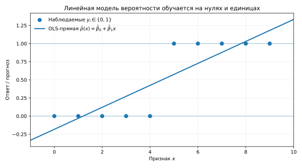
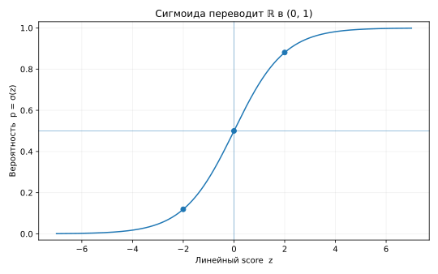
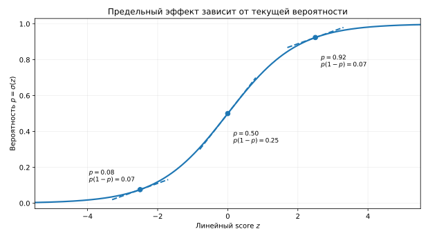
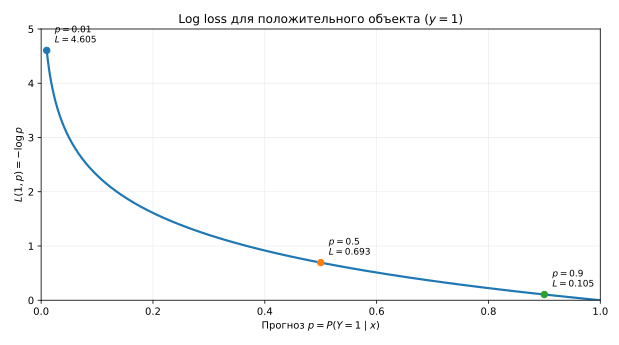
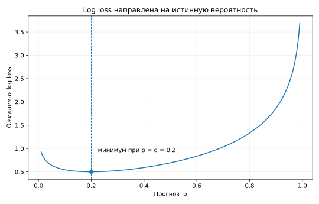
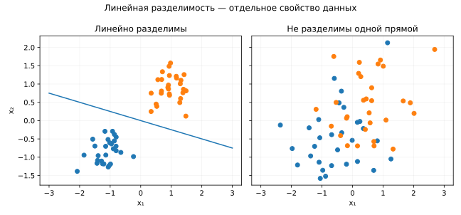

# Линейная классификация: от линейного score к вероятности

В предыдущих лекциях мы разобрали две части общей механики обучения. Сначала линейная регрессия показала, как семейство прогнозов задаётся параметрами и как из данных получить конкретную обученную модель. Затем функции потерь и градиентный спуск отделили **то, что минимизируем**, от **того, как ищем параметры**, и связали оптимизацию с вероятностной постановкой через правдоподобие.

Теперь нас будет интересовать **классификация** — задачи, где целевая переменная принимает одно из нескольких категориальных значений. Например, письмо может оказаться спамом или нет; документ может относиться к одному из нескольких типов; уровень срочности заявки может быть низким, средним или высоким. Основной фокус этой лекции — **бинарный случай**, в котором классов ровно два. На нём удобно подробно разобрать линейный классификатор, вероятностный прогноз и обучение логистической регрессии.

## 1. Категориальная целевая переменная и числовая кодировка

В регрессии целевая переменная количественная: разница между прогнозами 100 и 110 имеет содержательный смысл в исходных единицах. В классификации ответ — категория. Числа, которыми мы обозначаем классы в таблице или коде, сами по себе не делают эту категорию количественной величиной.

Сравним два примера.

1. **Уровень срочности заявки:** `низкий`, `средний`, `высокий`. Здесь естественный порядок между исходами действительно есть.
2. **Тип документа:** `договор`, `резюме`, `счёт`. Здесь никакого естественного порядка между классами нет.

Если во втором случае закодировать классы числами $1$, $2$, $3$ и обучить обычную линейную регрессию, модель автоматически увидит искусственную структуру: второй класс окажется «посередине» между первым и третьим, а расстояния между соседними кодами будут считаться одинаковыми. Даже в первом примере наличие порядка ещё не означает, что расстояния между уровнями можно считать равными. Числовая кодировка должна обслуживать постановку задачи, а не незаметно задавать её смысл.

Для бинарной задачи возникает особый случай. Обозначим положительный класс единицей, отрицательный — нулём:

```math
Y\in\lbrace 0,1\rbrace .
\qquad\text{(1)}
```

Например,

```math
Y=
\begin{cases}
1,&\text{клиент отменил подписку в следующие 30 дней},\\
0,&\text{не отменил.}
\end{cases}
```

Здесь 0 и 1 по-прежнему являются кодами двух категорий. Однако именно у такой кодировки появляется важное вероятностное свойство.

## 2. Почему бинарный ответ связывает классификацию с вероятностью

Обозначим условную вероятность положительного класса при фиксированном значении признаков $X=x$ через

```math
p(x)=P(Y=1\mid X=x).
\qquad\text{(2)}
```

Поскольку $Y$ принимает только значения 0 и 1, условное математическое ожидание равно

```math
\begin{aligned}
\mathbb E[Y\mid X=x]
&=0\cdot P(Y=0\mid X=x)
 +1\cdot P(Y=1\mid X=x)\\
&=P(Y=1\mid X=x).
\end{aligned}
```

Следовательно,

```math
\boxed{\mathbb E[Y\mid X=x]=p(x).}
\qquad\text{(3)}
```

Это возвращает нас к линейной регрессии. Для квадратичной функции потерь оптимальным прогнозом в популяции является условное среднее. В бинарном $0/1$-случае это условное среднее одновременно является вероятностью положительного класса.

Поэтому идея применить линейную регрессию к бинарному ответу не бессмысленна. Она приводит к **линейной модели вероятности** (*linear probability model*, LPM):

```math
\boxed{
P(Y=1\mid X=x)=\beta_0+x^\top\beta.
}
\qquad\text{(4)}
```

После оценки коэффициентов получаем

```math
\widehat p(x)=\widehat\beta_0+x^\top\widehat\beta.
\qquad\text{(5)}
```

Здесь важно не перепутать модельную вероятность с тем, что непосредственно лежит в обучающей выборке. Для каждого объекта мы наблюдаем не $p_i$, а бинарный ответ

```math
y_i\in\lbrace 0,1\rbrace .
```

Коэффициенты LPM можно оценить обычным методом наименьших квадратов — ровно так же, как в линейной регрессии:

```math
(\widehat\beta_0,\widehat\beta)
\in
\arg\min_{\beta_0,\beta}
\sum_{i=1}^{n}
\left(y_i-\beta_0-x_i^\top\beta\right)^2.
```

Почему прогноз после такого обучения вообще можно читать как оценку вероятности? Потому что квадратичная функция потерь нацелена на условное среднее, а для бинарного ответа мы только что установили

```math
\mathbb E[Y\mid X=x]=P(Y=1\mid X=x).
```

Простейший пример показывает это буквально. Пусть вся мини-выборка состоит из десяти объектов с одинаковыми признаками $x$, причём для трёх из них $y=1$, а для семи $y=0$. В этой точке модель фактически выбирает одно число $c$ и минимизирует

```math
\sum_{i=1}^{10}(y_i-c)^2.
```

Минимум достигается при среднем ответе

```math
c=\overline y=\frac{3}{10}=0.3.
```

То есть в таком простом случае МНК буквально возвращает наблюдаемую долю единиц. Когда признаки различаются, линейная модель уже связывает объекты общей линейной зависимостью и оценивает условное среднее через неё.

Такая модель встречается, в частности, в эконометрике. У неё есть очень простая интерпретация коэффициента: при фиксированных остальных признаках увеличение $x_j$ на единицу изменяет предсказанную вероятность на $\beta_j$:

```math
\frac{\partial p(x)}{\partial x_j}=\beta_j.
\qquad\text{(6)}
```

Эта простота одновременно задаёт сильное ограничение: предельный эффект признака считается постоянным на всей области значений.

Есть и более фундаментальная проблема. Линейная функция принимает любые вещественные значения, поэтому ничто не мешает получить

```math
\widehat p(x)<0
\qquad\text{или}\qquad
\widehat p(x)>1.
```

Такой прогноз может сохранять полезный порядок объектов, но его уже нельзя буквально интерпретировать как вероятность.



*Рисунок 1. LPM обучается непосредственно на наблюдаемых нулях и единицах методом наименьших квадратов. Оценённая прямая при этом может продолжиться ниже 0 или выше 1.*

Нам нужна модель, в которой признаки по-прежнему входят через прозрачную линейную комбинацию, но итоговый вероятностный прогноз не выходит за допустимый диапазон $[0,1]$.

### Итак

- Для бинарного ответа $Y\in\lbrace 0,1\rbrace $ условное среднее равно вероятности положительного класса.
- LPM оценивается обычным методом наименьших квадратов по наблюдаемым ответам $y_i\in\lbrace 0,1\rbrace $; отдельные вероятности в обучающую выборку не подставляются.
- Линейная модель вероятности имеет содержательный смысл, но может выходить за допустимый диапазон $[0,1]$.
- В LPM коэффициент задаёт постоянный предельный эффект на вероятность.

## 3. Что значит предсказывать вероятность

Перед тем как выбирать конкретную формулу модели, полезно уточнить, чего мы хотим от вероятностного прогноза.

Представим, что множество объектов имеет одно и то же признаковое описание $x$. Исторически мы наблюдали 100 таких случаев: в 20 из них событие произошло, в 80 — нет. Если условия действительно одинаковы и наблюдений становится всё больше, естественный вероятностный прогноз для такого $x$ должен стремиться к

```math
p(x)=0.2.
```

То есть хороший вероятностный предиктор должен не просто правильно ранжировать объекты или чаще угадывать класс. Его численный прогноз должен быть согласован с частотой события среди объектов одного типа.

Здесь полезно держать в уме два важных тезиса.

- **Во-первых**, критерий обучения должен быть устроен так, чтобы в идеальной постановке его оптимальным прогнозом была истинная условная вероятность.
- **Во-вторых**, это свойство критерия ещё не гарантирует точности конкретной обученной модели: на конечной выборке она всё равно выдаёт только оценку вероятности, качество которой зависит от данных и выбранного семейства моделей.

## 4. Odds: от вероятности к отношению событий и несобытий

Вероятность $p$ задаёт долю событий среди всех случаев. Есть другой способ описать ту же информацию — сравнить число событий непосредственно с числом несобытий.

Пусть

```math
p=0.2.
```

Если мысленно взять 100 похожих случаев, ожидаем примерно 20 событий и 80 несобытий. Их отношение равно

```math
20:80=1:4.
```

В англоязычной литературе это отношение называют **odds**; по-русски его переводят как **шансы**.

Численно

```math
\boxed{
\mathrm{odds}(p)=\frac{p}{1-p}.
}
\qquad\text{(7)}
```

Несколько опорных значений:

| Вероятность $p$ | События : несобытия | Odds |
|---:|---:|---:|
| $0.2$ | $20:80$ | $1:4=0.25$ |
| $0.5$ | $50:50$ | $1:1=1$ |
| $0.8$ | $80:20$ | $4:1=4$ |

Здесь важно различать вероятность вообще и область, на которой мы будем строить следующие преобразования. Любая вероятность может принимать значения из $[0,1]$. Но дальше нам понадобятся строго положительные конечные odds и их логарифм, поэтому сначала рассматриваем внутренний случай $0<p<1$. На границе $p=0$ odds равны нулю, а при $p\to1$ неограниченно растут. Это станет важно на следующем шаге, когда мы возьмём логарифм.

Преобразование переводит интервал вероятностей в положительную полуось:

```math
p\in(0,1)
\quad\Longrightarrow\quad
\mathrm{odds}(p)\in(0,+\infty).
```

Вероятность $0.5$ соответствует odds, равным единице. Для $p<0.5$ odds меньше единицы, а для $p>0.5$ — больше.

До этого момента мы лишь переписали одну и ту же вероятностную информацию на другой шкале. Сама классификация не требует после этого использовать именно линейную модель. Но если мы хотим сохранить знакомую конструкцию

```math
z(x)=\beta_0+x^\top\beta,
```

то возникает дополнительное модельное требование: линейный предиктор $z$ принимает любые вещественные значения, тогда как вероятность вообще лежит на ограниченном отрезке $[0,1]$. Чтобы связать внутренние вероятности $0<p<1$ со всей числовой прямой, нужно подходящее преобразование. Логистическая регрессия выбирает для этого log-odds.

## 5. Log-odds и logit

Почему из odds удобно перейти именно к логарифму? Для $0<p<1$ odds строго положительны и конечны, а логарифм переводит положительную полуось во всю вещественную прямую:

```math
(0,+\infty)\stackrel{\log}{\longrightarrow}\mathbb R.
```

При этом логарифм монотонен, поэтому порядок объектов не меняется; odds $1:1$ переходят в ноль; а мультипликативные изменения odds превращаются в аддитивные сдвиги. Последнее свойство позже даст особенно удобную интерпретацию коэффициентов.

**Логит** (*logit*) определяется как логарифм odds:

```math
\boxed{
\mathrm{logit}(p)
=
\log\frac{p}{1-p}.
}
\qquad\text{(8)}
```

Это же выражение называют **log-odds**.

Связь трёх шкал удобно увидеть на нескольких значениях:

| Вероятность $p$ | Odds | Logit $\log\frac{p}{1-p}$ |
|---:|---:|---:|
| $0.1$ | $1:9\approx0.111$ | $-2.197$ |
| $0.2$ | $1:4=0.25$ | $-1.386$ |
| $0.5$ | $1:1=1$ | $0$ |
| $0.8$ | $4:1=4$ | $1.386$ |
| $0.9$ | $9:1=9$ | $2.197$ |

Таким образом,

```math
\boxed{
(0,1)
\stackrel{\mathrm{logit}}{\longrightarrow}
\mathbb R.
}
\qquad\text{(9)}
```
Граничные вероятности $p=0$ и $p=1$ в область определения logit как вещественной функции не входят. Вместо этого имеет место предельное поведение

```math
p\to0^+
\Rightarrow
\mathrm{logit}(p)\to-\infty,
\qquad
p\to1^-
\Rightarrow
\mathrm{logit}(p)\to+\infty.
```

Это не означает, что вероятности 0 и 1 «запрещены»: просто конечному значению logit соответствует вероятность строго внутри интервала $(0,1)$.

Теперь зададим основное предположение логистической регрессии: линейной функцией признаков будем моделировать не саму вероятность, а её log-odds:

```math
\boxed{
\log\frac{p(x)}{1-p(x)}
=\beta_0+x^\top\beta.
}
\qquad\text{(10)}
```

Правую часть обозначим как

```math
z(x)=\beta_0+x^\top\beta.
\qquad\text{(11)}
```

В контексте классификации $z(x)$ часто называют **линейным score**. В логистической регрессии этот score численно равен логиту вероятности:

```math
\boxed{
z(x)=\mathrm{logit}(p(x))
=\log\frac{P(Y=1\mid X=x)}{P(Y=0\mid X=x)}.
}
\qquad\text{(12)}
```

Здесь одна и та же величина получает две интерпретации. С одной стороны, $z(x)$ — линейная комбинация признаков. С другой — log-odds положительного класса. Logit не является вероятностью и может принимать любое вещественное значение.

Чем больше score, тем больше odds положительного класса. Нулевой score означает odds $1:1$ и вероятность $0.5$.

Важно, что выбор logit не является единственно возможным способом связать вероятность с линейным предиктором. Другие link-функции приведут к другим моделям; к этому коротко вернёмся после введения сигмоиды.

## 6. Сигмоида как обратное преобразование логита

Из уравнения (10) можно выразить вероятность через score. Пусть

```math
z=\log\frac{p}{1-p}.
```

Экспоненцируем обе части:

```math
e^z=\frac{p}{1-p}.
```

Здесь $p\in(0,1)$, поскольку мы обращаем logit, определённый для внутренних вероятностей. Поэтому $1-p>0$. Умножаем обе части на $1-p$:

```math
e^z(1-p)=p.
```

Раскрываем скобки и собираем слагаемые с $p$:

```math
e^z=p+e^zp=p(1+e^z).
```

Следовательно,

```math
p=\frac{e^z}{1+e^z}
=\frac{1}{1+e^{-z}}.
```

Функция

```math
\boxed{
\sigma(z)=\frac{1}{1+e^{-z}}
}
\qquad\text{(13)}
```

называется **логистической функцией** или **сигмоидой**. Теперь можно дать чёткое определение модели.

**Логистическая регрессия** моделирует вероятность положительного класса как сигмоиду линейного score:

```math
\boxed{
p(x)=P(Y=1\mid X=x)=\sigma\bigl(\beta_0+x^\top\beta\bigr).
}
\qquad\text{(14)}
```

У сигмоиды есть три полезных опорных свойства:

```math
z\to-\infty\Rightarrow \sigma(z)\to0,
```

```math
z=0\Rightarrow \sigma(z)=0.5,
```

```math
z\to+\infty\Rightarrow \sigma(z)\to1.
```

Сигмоида монотонно возрастает, поэтому порядок объектов по score и по вероятности совпадает. При этом любой вещественный score превращается в число строго между 0 и 1.



*Рисунок 2. Сигмоида переводит всю числовую прямую значений score в интервал вероятностей $(0,1)$.*

Логистическая функция не является единственным способом связать вещественную линейную комбинацию признаков с вероятностью. Например, в **probit**-модели вместо сигмоиды используют функцию распределения стандартного нормального закона. Тогда линейная комбинация признаков связана с вероятностью через другую функцию связи (link function) и уже не интерпретируется как log-odds. Существуют и другие функции связи. В этой лекции нас интересует логистическая функция связи, потому что её обратное преобразование — logit — даёт особенно прозрачную интерпретацию через odds и log-odds.

### Итак

- Для внутренних вероятностей $p\in(0,1)$ odds принимают значения из $(0,+\infty)$.
- Logit переводит вероятность дальше на всю вещественную прямую.
- Логистическая регрессия делает линейной функцией признаков именно log-odds события.
- Сигмоида — обратное преобразование логита: она превращает неограниченный линейный score в вероятность.

## 7. Что означают коэффициенты логистической регрессии

Для линейной регрессии коэффициент напрямую измерял изменение числового прогноза при увеличении признака на единицу. В логистической регрессии линейной является другая величина — log-odds:

```math
\log\mathrm{odds}(x)
=\beta_0+\beta_1x_1+\dots+\beta_px_p.
\qquad\text{(15)}
```

Если увеличить $x_j$ на единицу, оставив остальные признаки фиксированными, log-odds изменятся на $\beta_j$:

```math
\log\mathrm{odds}_{\text{new}}
-
\log\mathrm{odds}_{\text{old}}
=\beta_j.
```

Экспоненцируем обе части:

```math
\boxed{
\frac{\mathrm{odds}_{\text{new}}}
{\mathrm{odds}_{\text{old}}}
=e^{\beta_j}.
}
\qquad\text{(16)}
```

Величина $e^{\beta_j}$ задаёт **odds ratio**, по-русски **отношение шансов**, для увеличения признака на единицу при фиксированных остальных признаках.

Например, если

```math
\beta_j=\log2,
```

то

```math
e^{\beta_j}=2,
```

и увеличение признака на единицу удваивает odds положительного события. Это не означает удвоение самой вероятности: связь между odds и вероятностью нелинейна.

### 7.1. Предельный эффект на вероятность

На шкале log-odds коэффициент $\beta_j$ имеет постоянный смысл: увеличение $x_j$ на единицу сдвигает log-odds на $\beta_j$. На шкале вероятности эффект уже зависит от того, **какова текущая вероятность**.

Рассмотрим частную производную по признаку $x_j$, считая остальные признаки фиксированными. Из

```math
p(x)=\sigma(z),
\qquad
z=\beta_0+x^\top\beta
```

и

```math
\sigma'(z)=\sigma(z)(1-\sigma(z))=p(x)(1-p(x))
```

по правилу цепочки получаем

```math
\frac{\partial p(x)}{\partial x_j}
=
\frac{d\sigma(z)}{dz}
\frac{\partial z}{\partial x_j}
=
\sigma'(z)\beta_j,
```

поскольку $\partial z/\partial x_j=\beta_j$. Следовательно,

```math
\boxed{
\frac{\partial p(x)}{\partial x_j}
=\beta_jp(x)(1-p(x)).
}
\qquad\text{(17)}
```

Содержательно это означает следующее. Знак $\beta_j$ задаёт направление локального изменения вероятности: при $\beta_j>0$ увеличение признака повышает вероятность, при $\beta_j<0$ — понижает. При этом **скорость изменения вероятности различается** в разных точках. Множитель

```math
p(1-p)
```

максимален при $p=0.5$ и стремится к нулю при $p\to0$ или $p\to1$. Поэтому одинаковый локальный сдвиг score сильнее меняет вероятность около середины сигмоиды и слабее — когда модель уже даёт вероятность, близкую к 0 или 1.

Для небольшого изменения $\Delta x_j$ это можно читать как локальное приближение

```math
\Delta p
\approx
\beta_jp(1-p)\,\Delta x_j.
```



*Рисунок 3. Наклон сигмоиды максимален около $p=0.5$ и уменьшается вблизи 0 и 1. Поэтому один и тот же локальный сдвиг linear score даёт разное изменение вероятности.*

Для большого или дискретного изменения признака производная остаётся только локальной характеристикой; точное изменение вероятности получают сравнением прогнозов до и после изменения признака.

## 8. Вероятностная модель: распределение Бернулли

До этого мы построили функцию, которая для каждого объекта выдаёт число $p_i\in(0,1)$.
Само распределение Бернулли допускает параметр $p\in[0,1]$, включая граничные случаи $p=0$ и $p=1$. Здесь же $p_i\in(0,1)$, потому что $p_i$ получено сигмоидой конечного линейного score. Поэтому $\log p_i$ и $\log(1-p_i)$, которые появятся ниже, остаются конечными. Теперь зададим вероятностную модель для самого бинарного ответа.

Для объекта $i$ обозначим его вектор признаков через $x_i$. В принятой здесь записи $x_i^\top$ является $i$-й строкой матрицы признаков $X$. Положим

```math
p_i=\sigma(x_i^\top\beta),
\qquad\text{(18)}
```

где для компактности считаем, что столбец единиц уже включён в матрицу $X$. Тогда

```math
\boxed{
Y_i\mid X=x_i
\sim
\mathrm{Bernoulli}(p_i).
}
\qquad\text{(19)}
```

Распределение Бернулли естественно появляется здесь потому, что случайная величина бинарна: при заданных признаках она принимает значение 1 с вероятностью $p_i$ и значение 0 с вероятностью $1-p_i$:

```math
P(Y_i=1\mid x_i)=p_i,
```

```math
P(Y_i=0\mid x_i)=1-p_i.
```

Эти два случая можно записать в одну строку:

```math
\boxed{
P(Y_i=y_i\mid x_i)
=p_i^{y_i}(1-p_i)^{1-y_i}.
}
\qquad\text{(20)}
```

Это **компактная запись функции вероятности распределения Бернулли** для наблюдаемого $y_i\in\lbrace 0,1\rbrace $. Под «компактной» здесь имеется в виду только то, что два случая из предыдущих формул объединены в одном выражении.

Проверим это буквально.

Если $y_i=1$, то

```math
p_i^{1}(1-p_i)^0=p_i.
```

Если $y_i=0$, то

```math
p_i^0(1-p_i)^1=1-p_i.
```

Степени $y_i$ и $1-y_i$ просто выбирают нужный из двух вариантов.

## 9. От Bernoulli likelihood к log loss

Ранее мы уже различали вероятность и правдоподобие. Здесь ответы $y_1,\dots,y_n$ наблюдены и зафиксированы, а параметры $\beta$ меняются. Мы спрашиваем: при каких коэффициентах логистическая модель делает полученную выборку наиболее правдоподобной?

Если считать наблюдения условно независимыми при заданных признаках, правдоподобие всей выборки равно произведению вкладов отдельных объектов:

```math
\boxed{
\mathcal L(\beta)
=
\prod_{i=1}^{n}
 p_i^{y_i}(1-p_i)^{1-y_i}.
}
\qquad\text{(21)}
```

Произведение в (21) уже агрегирует все $n$ наблюдений. Оценка максимального правдоподобия определяется как

```math
\widehat\beta
\in
\arg\max_\beta \mathcal L(\beta).
\qquad\text{(22)}
```

Удобнее перейти к логарифму. Логарифм монотонно возрастает, поэтому положение максимума не меняется, а произведение превращается в сумму:

```math
\begin{aligned}
\log\mathcal L(\beta)
&=
\sum_{i=1}^{n}
\log\left[
 p_i^{y_i}(1-p_i)^{1-y_i}
\right]\\
&=
\sum_{i=1}^{n}
\left[
 y_i\log p_i
 +(1-y_i)\log(1-p_i)
\right].
\end{aligned}
\qquad\text{(23)}
```

Максимизация log-likelihood эквивалентна минимизации отрицательного log-likelihood:

```math
-\log\mathcal L(\beta)
=
-\sum_{i=1}^{n}
\left[
 y_i\log p_i
 +(1-y_i)\log(1-p_i)
\right].
\qquad\text{(24)}
```

На этом задача MLE уже полностью определена:

```math
\boxed{
\text{максимизация Bernoulli likelihood}
\quad\Longleftrightarrow\quad
\text{минимизация Bernoulli NLL}.
}
```

Если теперь перейти к знакомому языку эмпирического риска, удобно разделить сумму на число объектов и работать со **средней** функцией потерь:

```math
\boxed{
R_n(\beta)
=
-\frac1n
\sum_{i=1}^{n}
\left[
 y_i\log p_i
 +(1-y_i)\log(1-p_i)
\right].
}
\qquad\text{(25)}
```

Положительный множитель $1/n$ не меняет минимизатор:

```math
\arg\min_\beta[-\log\mathcal L(\beta)]
=
\arg\min_\beta R_n(\beta).
```

Поэтому в языке эмпирического риска ту же задачу можно записать как

```math
\boxed{
\text{максимизация Bernoulli likelihood}
\quad\Longleftrightarrow\quad
\text{минимизация средней log loss}.
}
```

Для одного объекта при $0<p<1$ функция потерь имеет вид

```math
\boxed{
L(y,p)
=-y\log p-(1-y)\log(1-p).
}
\qquad\text{(26)}
```

В разных источниках и библиотеках эту же формулу называют:

- **log loss**;
- **binary log loss**;
- **binary cross-entropy (BCE)**;
- отрицательным Bernoulli log-likelihood, когда подчёркивается вероятностная постановка.

В этой лекции основным термином будет **log loss**; `binary cross-entropy` важно узнавать как распространённое альтернативное название.

### 9.1. Как log loss реагирует на уверенные ошибки

Сначала рассмотрим только положительный объект, $y=1$. Тогда

```math
L(1,p)=-\log p.
```

Если модель прогнозирует $p=0.9$, то

```math
L(1,0.9)\approx0.105.
```

Если $p=0.5$,

```math
L(1,0.5)\approx0.693.
```

Если модель очень уверенно ошибается и выдаёт $p=0.01$,

```math
L(1,0.01)\approx4.605.
```

Чем ближе прогноз к нулю для действительно положительного объекта, тем быстрее растёт цена такой уверенной ошибки.



*Рисунок 4. Для $y=1$ функция $-\log p$ мала при уверенном правильном прогнозе и быстро растёт, когда модель уверенно присваивает положительному объекту вероятность, близкую к нулю.*

Для отрицательного класса картина зеркальна: при $y=0$ имеем $L(0,p)=-\log(1-p)$, и большой штраф возникает при уверенном прогнозе $p\approx1$.

Таким образом, log loss учитывает не только то, на какой стороне будущего порога окажется объект, но и степень уверенности вероятностного прогноза.

### Итак

- Bernoulli-модель задаёт вероятность наблюдаемого бинарного ответа.
- Likelihood всей выборки получается произведением вкладов всех объектов.
- Отрицательный log-likelihood превращает произведение в сумму log loss.
- Деление на $n$ появляется не как новая стадия MLE, а как переход к средней функции потерь — эмпирическому риску.
- Bernoulli NLL, binary log loss и binary cross-entropy описывают одну и ту же базовую формулу с разными соглашениями об агрегировании.

## 10. Почему log loss действительно направлена на вероятность

Вероятностный вывод через MLE уже дал нам функцию потерь. Теперь посмотрим на неё с другой стороны и ответим на более содержательный вопрос: **какой вероятностный прогноз поощряет сама log loss?**

Это теоретический мысленный эксперимент, а не способ обучения модели. В реальной задаче истинная вероятность нам неизвестна — именно её мы пытаемся оценить.

Зафиксируем значение признаков $X=x$ и обозначим истинную условную вероятность положительного класса через

```math
q=P(Y=1\mid X=x).
```

Представим, что мы могли бы много раз наблюдать объекты в одних и тех же условиях $X=x$. Тогда примерно в доле $q$ случаев получили бы $Y=1$, а в доле $1-q$ — $Y=0$.

Пусть модель для таких объектов всегда сообщает один и тот же вероятностный прогноз $p\in(0,1)$. Если реализуется $Y=1$, функция потерь равна

```math
L(1,p)=-\log p,
```

а если реализуется $Y=0$,

```math
L(0,p)=-\log(1-p).
```

Поэтому средняя функция потерь при многократном повторении таких случаев — то есть **ожидаемая log loss** при фиксированном $x$ — равна

```math
\Phi(p)
=
qL(1,p)+(1-q)L(0,p)
=
-q\log p-(1-q)\log(1-p).
\qquad\text{(27)}
```

Теперь вопрос можно сформулировать точно: **какое значение $p$ минимизирует эту среднюю цену ошибок, если истинная вероятность равна $q$?**

Продифференцируем по прогнозу $p$:

```math
\begin{aligned}
\Phi'(p)
&=-\frac{q}{p}+\frac{1-q}{1-p}\\
&=\frac{p-q}{p(1-p)}.
\end{aligned}
\qquad\text{(28)}
```

Для $0<p<1$ знаменатель $p(1-p)$ положителен. Поэтому знак производной определяется только числителем $p-q$:

- если $p<q$, то $\Phi'(p)<0$: увеличение прогноза $p$ уменьшает ожидаемую log loss;

- если $p>q$, то $\Phi'(p)>0$: увеличение $p$ уже увеличивает ожидаемую log loss;

- в точке $p=q$ производная равна нулю.

Значит, функция убывает до $p=q$ и растёт после $p=q$. Минимум находится именно в $p=q$.

```math
\Phi'(p)=0
\quad\Longleftrightarrow\quad
p=q.
```

Вторая производная

```math
\Phi''(p)
=
\frac{q}{p^2}
+
\frac{1-q}{(1-p)^2}
>0
```

Сначала рассматриваем невырожденный случай $0<q<1$.
Тогда:

```math
\boxed{
\arg\min_{p\in(0,1)}
\mathbb E[L(Y,p)\mid X=x]
= q = P(Y=1\mid X=x).
}
\qquad\text{(29)}
```

Это и есть главное свойство. Если среди объектов с одинаковыми признаками положительный класс возникает с вероятностью $q$, то log loss в среднем предпочитает прогнозировать именно $p=q$. Она не поощряет просто «правильную сторону от 0.5»: ей важно, насколько хорошо само число $p$ соответствует вероятности события.



*Рисунок 5. Для фиксированной истинной вероятности $q$ ожидаемая log loss минимальна при прогнозе $p=q$.*

Остались два крайних случая. Если $q=0$, положительный класс в этих условиях вообще не возникает, поэтому чем ближе прогноз $p$ к 0, тем меньше log loss. Если $q=1$, наоборот, всегда наблюдается положительный класс и чем ближе $p$ к 1, тем меньше log loss. Сигмоида конечного score не выдаёт ровно 0 или 1, поэтому для логистической модели эти идеальные прогнозы достигаются только в пределе.

### 10.1. Почему квадратичная функция потерь тоже может оценивать вероятность

Этот вывод помогает понять ещё одну деталь linear probability model. Пусть истинная вероятность положительного класса в точке $x$ равна $q$, а модель прогнозирует число $p$. Тогда с вероятностью $q$ наблюдается $Y=1$, а с вероятностью $1-q$ — $Y=0$. Ожидаемая квадратичная функция потерь равна

```math
\Psi(p)
=
q(1-p)^2+(1-q)p^2.
```

Первое слагаемое отвечает случаю $Y=1$, второе — случаю $Y=0$. Продифференцируем по $p$:

```math
\Psi'(p)=2(p-q).
```

Поэтому минимум снова достигается при

```math
p=q.
```

Значит, квадратичная функция потерь тоже направлена на истинную условную вероятность. Проблема LPM заключалась не в том, что MSE принципиально не умеет оценивать вероятности, а в слишком жёстком линейном представлении $p(x)=\beta_0+x^\top\beta$, которое не гарантирует диапазон $[0,1]$.

### 10.2. А что произойдёт с MAE

Для сравнения рассмотрим абсолютную функцию потерь:

```math
\Omega(p)
=
\mathbb E[|Y-p|\mid X=x].
```

Как и выше, с вероятностью $q$ наблюдается $Y=1$, а с вероятностью $1-q$ — $Y=0$. Поэтому при $p\in[0,1]$

```math
\Omega(p)
=q(1-p)+(1-q)p
=q+p(1-2q).
```

Получилась линейная функция от $p$. Линейная функция на отрезке достигает минимума на одном из концов.

- Если $q>0.5$, коэффициент при $p$ отрицателен, функция убывает и минимум достигается при $p=1$.
- Если $q<0.5$, коэффициент при $p$ положителен, функция растёт и минимум достигается при $p=0$.
- Если $q=0.5$, все $p\in[0,1]$ дают одинаковое значение.

То есть MAE в таком бинарном сценарии стремится сразу выдать жёсткое решение относительно порога $0.5$, а не восстановить саму вероятность $q$.

Этот пример ещё раз показывает общий принцип: форма функции потерь определяет, какой прогноз считается оптимальным.

## 11. Вторая кодировка: классы $-1$ и $+1$

Для вероятностной постановки особенно удобна кодировка

```math
y\in\lbrace 0,1\rbrace ,
```

потому что она напрямую входит в формулу распределения Бернулли и binary cross-entropy.

В литературе по линейной классификации часто используют и другую кодировку:

```math
\widetilde y\in\lbrace -1,+1\rbrace ,
```

связанную с первой формулой

```math
\widetilde y=2y-1.
\qquad\text{(30)}
```

Она удобна, когда мы хотим анализировать знак линейного score. Пусть

```math
z=x^\top\beta.
```

Если истинный класс положительный, правильный score должен быть положительным. Если класс отрицательный — отрицательным. Поэтому произведение

```math
M=\widetilde y z
\qquad\text{(31)}
```

положительно для правильной стороны линейной границы и отрицательно для неправильной. Эту величину часто называют **отступом** (*margin*) в линейной классификации.

Теперь перепишем уже знакомую log loss в этой кодировке. Для положительного класса $\widetilde y=+1$:

```math
L=-\log\sigma(z)
=
\log(1+e^{-z}).
```

Для отрицательного класса $\widetilde y=-1$:

```math
L=-\log(1-\sigma(z))
=
\log(1+e^{z}).
```

Посмотрим на показатели экспоненты в этих двух формулах. Если $\widetilde y=+1$, то

```math
-\widetilde y z=-z,
```

а если $\widetilde y=-1$, то

```math
-\widetilde y z=+z.
```

Значит, выражение $-\widetilde y z$ автоматически выбирает нужный знак перед $z$. Поэтому оба случая можно записать одной формулой:

```math
\boxed{
L(\widetilde y,z)
=
\log\left(1+e^{-\widetilde y z}\right).
}
\qquad\text{(32)}
```

При этом $\widetilde y z$ — уже введённый в (31) отступ: положительный отступ означает правильный знак score, отрицательный — неправильный.

Это та же логистическая функция потерь, только записанная через отступ. Большой положительный $\widetilde y z$ соответствует правильному и уверенному score и даёт малое значение функции потерь; отрицательный отступ соответствует объекту на неправильной стороне границы.

Такая запись полезна для чтения других материалов по линейным классификаторам. Для основной вероятностной истории будем сохранять $0/1$-кодировку.

## 12. Градиент log loss

Теперь у нас есть всё необходимое для обучения модели. Общий алгоритм градиентного спуска уже знаком; осталось получить градиент целевой функции логистической регрессии.

Для объекта $i$

```math
z_i=x_i^\top\beta,
\qquad
p_i=\sigma(z_i),
```

а функция потерь

```math
L_i
=
-y_i\log p_i-(1-y_i)\log(1-p_i).
\qquad\text{(33)}
```

Сначала найдём две производные, которые понадобятся в правиле цепочки.

Производная функции потерь по вероятности:

```math
\frac{\partial L_i}{\partial p_i}
=
-\frac{y_i}{p_i}
+
\frac{1-y_i}{1-p_i}.
\qquad\text{(34)}
```

Производная сигмоиды по score:

```math
\frac{\partial p_i}{\partial z_i}
=
p_i(1-p_i).
\qquad\text{(35)}
```

Теперь явно применим правило цепочки:

```math
\frac{\partial L_i}{\partial z_i}
=
\frac{\partial L_i}{\partial p_i}
\cdot
\frac{\partial p_i}{\partial z_i}.
```

Подставляем (34) и (35):

```math
\begin{aligned}
\frac{\partial L_i}{\partial z_i}
&=
\left(
-\frac{y_i}{p_i}
+
\frac{1-y_i}{1-p_i}
\right)
p_i(1-p_i)\\
&=-y_i(1-p_i)+(1-y_i)p_i\\
&=-y_i+y_ip_i+p_i-y_ip_i\\
&=p_i-y_i.
\end{aligned}
```

Получили компактный результат:

```math
\boxed{
\frac{\partial L_i}{\partial z_i}=p_i-y_i.
}
\qquad\text{(36)}
```

Дальше нужно перейти от производной по score к производной по параметрам $\beta$. Поскольку

```math
z_i=x_i^\top\beta
=x_{i1}\beta_1+\dots+x_{iq}\beta_q,
```

частная производная по каждому коэффициенту $\beta_j$ равна соответствующему признаку $x_{ij}$. Поэтому градиент линейной формы по всему вектору коэффициентов равен вектору признаков:

```math
\nabla_\beta z_i=x_i.
```

Ещё раз применяя правило цепочки,

```math
\nabla_\beta L_i
=
\frac{\partial L_i}{\partial z_i}\nabla_\beta z_i,
```

получаем

```math
\boxed{
\nabla_\beta L_i
=(p_i-y_i)x_i.
}
\qquad\text{(37)}
```

Для среднего эмпирического риска

```math
R_n(\beta)=\frac1n\sum_{i=1}^n L_i
```

градиент равен среднему от градиентов отдельных объектов:

```math
\begin{aligned}
\nabla_\beta R_n(\beta)
&=
\frac1n\sum_{i=1}^n \nabla_\beta L_i\\
&=
\frac1n\sum_{i=1}^n (p_i-y_i)x_i\\
&=
\frac1nX^\top(p-y).
\end{aligned}
\qquad\text{(38)}
```

где

```math
p=
\begin{pmatrix}
p_1\\
\vdots\\
p_n
\end{pmatrix},
\qquad
 y=
\begin{pmatrix}
y_1\\
\vdots\\
y_n
\end{pmatrix}.
```

Последний переход в (38) — это обычная матричная запись той же суммы. Поскольку $i$-я строка матрицы $X$ равна $x_i^\top$, умножение $X^\top$ на вектор $(p-y)$ даёт линейную комбинацию векторов признаков с коэффициентами $(p_i-y_i)$:

```math
X^\top(p-y)
=
\sum_{i=1}^n (p_i-y_i)x_i.
```

То есть матричная форма не добавляет нового математического шага, а компактно упаковывает сумму по всем объектам.

Размерности согласованы:

```math
X\in\mathbb R^{n\times q},
\quad
p-y\in\mathbb R^n,
\quad
X^\top(p-y)\in\mathbb R^q.
```

Следовательно, один шаг градиентного спуска выглядит так:

```math
\boxed{
\beta^{(t+1)}
=
\beta^{(t)}
-
\eta\frac1nX^\top\left(p^{(t)}-y\right).
}
\qquad\text{(39)}
```

Здесь $p^{(t)}$ — вектор вероятностей, вычисленный на текущем наборе параметров:

```math
z^{(t)}=X\beta^{(t)},
\qquad
p^{(t)}=\sigma\!\left(z^{(t)}\right)
=\sigma\!\left(X\beta^{(t)}\right),
```

где сигмоида применяется покомпонентно. После обновления $\beta$ на следующей итерации пересчитываются и score, и вероятности.

Структура обучения снова знакома:

```text
параметры β
→ score z = Xβ
→ вероятность p = sigmoid(z)
→ log loss
→ градиент
→ обновление β
```

Новый алгоритм оптимизации не понадобился: изменились модель, функция потерь и формула градиента, а общий GD-loop остаётся тем же.

### 12.1. Коротко о выпуклости

Для логистической регрессии без регуляризации Гессиан среднего log loss можно записать как

```math
\nabla^2 R_n(\beta)
=
\frac1nX^\top W X,
\qquad\text{(40)}
```

где

```math
W=\mathrm{diag}\bigl(p_i(1-p_i)\bigr).
```

Диагональные элементы $W$ неотрицательны, потому что $0<p_i<1$. Поэтому для любого вектора $v$

```math
\begin{aligned}
v^\top\nabla^2R_n(\beta)v
&=
\frac1n v^\top X^\top W Xv\\
&=
\frac1n(Xv)^\top W(Xv)\\
&\ge0.
\end{aligned}
```

Следовательно, целевая функция выпукла по коэффициентам. Для нас главный практический смысл такой: у обычной логистической регрессии нет множества разных локальных минимумов, между которыми градиентный метод должен «выбирать» в зависимости от старта.

Есть, однако, отдельный тонкий случай. Данные называются **линейно разделимыми**, если существует гиперплоскость, которая полностью отделяет объекты одного класса от объектов другого. На таких данных у нерегуляризованной логистической регрессии максимум правдоподобия может не достигаться при конечных коэффициентах: увеличивая их модуль, можно делать вероятности обучающих объектов всё ближе к 0 и 1 и продолжать уменьшать log loss.



*Рисунок 6. Слева классы полностью разделяются линейной границей; справа такого разделения нет. Именно в первом случае у нерегуляризованной логистической регрессии возникает описанная проблема с неограниченным ростом коэффициентов.*

Позже регуляризация даст способ явно ограничивать такие решения и вообще контролировать сложность линейной модели.

### Итак

- Производная log loss по score упрощается до $p_i-y_i$.
- Матричный градиент имеет форму $X^\top(p-y)/n$.
- Для обучения можно повторно использовать знакомый градиентный спуск.
- Log loss логистической регрессии выпукла по коэффициентам; это делает оптимизационную картину существенно проще многих более сложных моделей.

## 13. Что именно возвращает обученная модель

После обучения получаем коэффициенты $\widehat\beta$. Для нового объекта полезно различать три уровня результата.

### 13.1. Linear score

```math
\widehat z(x)=x^\top\widehat\beta.
\qquad\text{(41)}
```

Score не обязан лежать в $[0,1]$. Он равен оценённым log-odds положительного класса.

### 13.2. Вероятностный прогноз

```math
\widehat p(x)
=
\sigma(\widehat z(x)).
\qquad\text{(42)}
```

Это оценка условной вероятности положительного класса внутри выбранной модели.

Важно не приписывать этой оценке больше, чем она гарантирует. Например, высокая доля правильных классификаций сама по себе ещё не означает, что среди объектов с прогнозом около $0.8$ событие действительно происходит примерно в 80% случаев. Насколько численные вероятности согласованы с наблюдаемыми частотами, — отдельный вопрос качества вероятностных прогнозов.

### 13.3. Жёсткая метка класса

Чтобы превратить вероятность в метку $0/1$, нужно добавить правило решения. Самое простое такое правило использует невырожденный порог $t\in(0,1)$:

```math
\boxed{
\widehat y_t(x)
=
I\bigl[\widehat p(x)\ge t\bigr].
}
\qquad\text{(43)}
```

Здесь $I[\cdot]$ — **индикатор**: он равен 1, если условие в скобках выполнено, и 0 иначе. Пока этого определения достаточно; геометрический смысл порога и последствия его изменения разберём в следующих двух разделах.
Граничные значения $t=0$ и $t=1$ дают вырожденные правила решения. Дальше рассматриваем $0<t<1$, чтобы порог можно было также перевести на шкалу linear score через logit.

Это разделение отражается и в библиотечном API. В `scikit-learn` удобно помнить три уровня:

- `decision_function` — вещественный score;
- `predict_proba` — оценки вероятностей классов;
- `predict` — жёсткие метки класса после применения встроенного правила решения.

## 14. Порог и линейная разделяющая граница

Начнём со стандартного порога

```math
t=0.5.
```

Объект относим к положительному классу, если

```math
\widehat p(x)\ge0.5.
```

Но

```math
\widehat p(x)=\sigma(\widehat z(x)),
```

а сигмоида строго возрастает и удовлетворяет

```math
\sigma(0)=0.5.
```

Поэтому сравнивать вероятность с $0.5$ — то же самое, что сравнивать score с нулём:

```math
\begin{aligned}
\widehat p(x)\ge0.5
&\Longleftrightarrow
\sigma(\widehat z(x))\ge\sigma(0)\\
&\Longleftrightarrow
\widehat z(x)\ge0.
\end{aligned}
```

Если intercept уже включён в вектор признаков, то

```math
\widehat z(x)=x^\top\widehat\beta.
```

Следовательно,

```math
\boxed{
\widehat y(x)=1
\quad\Longleftrightarrow\quad
x^\top\widehat\beta\ge0.
}
```

На одной стороне пространства score положителен и модель выбирает класс 1, на другой — score отрицателен и выбирается класс 0. **Граница** между этими областями возникает в точках, где score ровно равен нулю:

```math
\boxed{
x^\top\widehat\beta=0.
}
\qquad\text{(44)}
```

Если intercept записывать отдельно, та же граница имеет вид

```math
\widehat\beta_0+x^\top\widehat\beta=0.
```

Для двух обычных признаков это прямая, для большего числа признаков — гиперплоскость. Поэтому логистическая регрессия остаётся **линейным классификатором**, хотя сама вероятность нелинейно зависит от линейного score.


Для произвольного порога $t$ можно провести тот же вывод. Поскольку logit — возрастающая функция,

```math
\begin{aligned}
\widehat p(x)\ge t
&\Longleftrightarrow
\mathrm{logit}(\widehat p(x))
\ge
\mathrm{logit}(t)\\
&\Longleftrightarrow
x^\top\widehat\beta
\ge
\log\frac{t}{1-t}.
\end{aligned}
\qquad\text{(45)}
```

Например,

```math
t=0.2
\quad\Longrightarrow\quad
x^\top\widehat\beta\ge\log\frac14\approx-1.386,
```

а

```math
t=0.8
\quad\Longrightarrow\quad
x^\top\widehat\beta\ge\log4\approx1.386.
```

То есть порог можно одинаково описывать и на шкале вероятностей, и на шкале linear score. Значение $0.5$ выделяется только тем, что ему соответствуют odds $1:1$ и нулевой logit; из математики логистической регрессии не следует, что именно этот порог всегда является лучшим прикладным решением.

## 15. Вероятность и решение — разные задачи

Пусть обученная модель выдала для пяти объектов вероятности

```math
0.91,\quad0.72,\quad0.48,\quad0.31,\quad0.08.
```

При пороге $t=0.5$ положительными станут первые два объекта. При $t=0.3$ — уже первые четыре. Сами вероятности и их порядок не изменились; изменилось только правило, которое превращает вероятностный прогноз в действие.

Это различие особенно важно в прикладных задачах. Если положительным классом является редкое опасное событие, пропустить его и поднять ложную тревогу могут стоить совершенно по-разному. Тогда порог выбирают не потому, что «по умолчанию положено $0.5$», а с учётом характера ошибок и последующего действия.

Для системного разговора об этом понадобится различать типы ошибок классификации и выбирать метрики, которые соответствуют задаче. Сейчас достаточно удерживать главное разделение:

```math
\boxed{
\text{score}
\rightarrow
\text{probability}
\rightarrow
\text{threshold}
\rightarrow
\text{decision}.
}
```

## 16. Небольшой пример со `scikit-learn`

Для связи с привычным estimator interface пусть `X_train`, `y_train`, `X_test` уже подготовлены, а бинарная целевая переменная закодирована как $0/1$.

```python
from sklearn.linear_model import LogisticRegression

model = LogisticRegression()
model.fit(X_train, y_train)

score = model.decision_function(X_test)
proba = model.predict_proba(X_test)[:, 1]
pred = model.predict(X_test)
```

Три массива отвечают на разные вопросы.

`score` содержит значения линейного score. В бинарной логистической регрессии они интерпретируются как оценённые log-odds положительного класса.

`proba` содержит оценки $P(Y=1\mid X=x)$, полученные после применения сигмоиды к score.

`pred` содержит уже выбранные метки класса после применения встроенного правила решения.

Полезная техническая оговорка: `sklearn.linear_model.LogisticRegression` по умолчанию использует регуляризацию. Поэтому библиотечные коэффициенты в общем случае не совпадают буквально с нерегуляризованной MLE-оценкой, которую мы выводили выше. Регуляризацию как изменение целевой функции мы разберём отдельно; здесь библиотечный estimator нужен прежде всего для связи математики с интерфейсом `fit` / `predict`.

Ещё одна практическая деталь связана с численной устойчивостью. Формула

```python
1 / (1 + np.exp(-score))
```

полезна для маленьких учебных примеров, но при экстремальных значениях `score` наивное вычисление экспоненты может быть неудобно численно. Готовые реализации используют устойчивые вычислительные схемы, поэтому в рабочем коде вероятности лучше получать через библиотечный интерфейс.

## 17. Итоговая ментальная модель

Логистическая регрессия собирает знакомые элементы обучения в единую модельную конструкцию.

### Представление и вероятностный смысл

```math
z(x)=x^\top\beta
=
\mathrm{logit}p(x).
```

Линейный score одновременно является log-odds положительного класса.

### Вероятностный прогноз

```math
p(x)=\sigma(z(x)).
```

Сигмоида переводит неограниченный score в вероятность.

### Вероятностная модель

```math
Y\mid X=x
\sim
\mathrm{Bernoulli}(p(x)).
```

### Функция потерь

```math
L(y,p)
=-y\log p-(1-y)\log(1-p).
```

Она получается как отрицательный Bernoulli log-likelihood и одновременно известна как binary cross-entropy.

### Оптимизация

```math
\nabla_\beta R_n
=\frac1nX^\top(p-y).
```

После этого применяется знакомый градиентный спуск или другой численный метод оптимизации.

### Решение

```math
\widehat y_t
=I[\widehat p\ge t].
```

Модель оценивает вероятность, а порог задаёт правило действия.

Всю конструкцию можно собрать в одну вертикальную цепочку:

```math
\boxed{
\begin{array}{c}
\text{линейный score } z\\[1mm]
=\\[1mm]
\text{log-odds}\\[2mm]
\downarrow\;\sigma\\[2mm]
\text{вероятность } p\\[2mm]
\downarrow\\[2mm]
\text{Bernoulli likelihood}\\[2mm]
\downarrow\;-\log\\[2mm]
\text{log loss}\\[2mm]
\downarrow\\[2mm]
\text{градиент и обновление параметров}\\[2mm]
\downarrow\\[2mm]
\text{обученная оценка вероятности}\\[2mm]
\downarrow\;t\\[2mm]
\text{решение о классе}
\end{array}
}
```

### Итак

- Бинарная $0/1$-кодировка особая: условное среднее ответа совпадает с вероятностью положительного класса.
- Линейная модель вероятности оценивается обычным МНК, но может выйти за $[0,1]$ и задаёт постоянные предельные эффекты.
- Логистическая регрессия моделирует log-odds линейной функцией признаков, а sigmoid переводит score обратно в вероятность.
- Bernoulli likelihood приводит к log loss, или binary cross-entropy.
- Log loss направлена на истинную условную вероятность; для логистической модели граничные вероятности 0 и 1 являются предельными значениями. Квадратичная функция потерь тоже направлена на условную вероятность, MAE — нет.
- Градиент среднего log loss равен $X^\top(p-y)/n$, поэтому знакомый механизм градиентного спуска переносится почти без изменений.
- Score, оценка вероятности и жёсткая метка класса — разные уровни результата.
- Порог $0.5$ удобен математически, но не является универсально правильным прикладным решением.

## Вопросы для самопроверки

1. Почему кодировка нескольких категорий числами может добавить в задачу искусственный порядок или расстояния?
2. Докажите, что для $Y\in\lbrace 0,1\rbrace $ величина $\mathbb E[Y\mid X=x]$ равна $P(Y=1\mid X=x)$.
3. В чём смысл linear probability model и почему она не является бессмысленной моделью?
4. Какая проблема возникает, если напрямую положить $p(x)=\beta_0+x^\top\beta$?
5. Что означают odds при $p=0.2$? Как перевести вероятность обратно из odds?
6. Почему logit удобен для линейной модели?
7. Выведите sigmoid из уравнения $z=\log[p/(1-p)]$.
8. Что означает коэффициент $\beta_j$ в шкале log-odds? Что означает $e^{\beta_j}$?
9. Почему предельный эффект $\partial p/\partial x_j$ в логистической регрессии зависит от самого $p$?
10. Проверьте формулу $p_i^{y_i}(1-p_i)^{1-y_i}$ отдельно для $y_i=0$ и $y_i=1$.
11. Чем likelihood всей выборки отличается от средней log loss? Зачем появляется множитель $1/n$?
12. Почему log loss называют также binary cross-entropy?
13. Для $0<q<1$ покажите, что ожидаемая log loss минимальна при $p=q=P(Y=1\mid X=x)$. Что меняется при $q=0$ или $q=1$?
14. Почему MAE в бинарной задаче не стремится восстановить саму вероятность?
15. Как связаны кодировки $\lbrace 0,1\rbrace $ и $\lbrace -1,+1\rbrace $?
16. Получите $\partial L_i/\partial z_i=p_i-y_i$ по правилу цепочки.
17. Почему при пороге $0.5$ граница решения определяется уравнением $x^\top\beta=0$?
18. Что меняется, если порог уменьшить с $0.5$ до $0.2$: модель, вероятности или только решения?

## Что почитать

- **James G., Witten D., Hastie T., Tibshirani R., Taylor J. — _An Introduction to Statistical Learning with Applications in Python_, Chapter 4, §§4.2–4.3.** Доступное объяснение перехода от linear probability model к logistic regression, odds, log-odds и maximum likelihood. https://www.statlearning.com/
- **Соколов Е. А. — _Машинное обучение 1_, `lecture04-linclass` и `lecture05-linclass`.** Дополнительный взгляд на линейную классификацию, кодировку $\lbrace -1,+1\rbrace $, отступ, вероятностное оценивание и связь likelihood с logistic loss. https://github.com/esokolov/ml-course-hse/tree/master/ml1-2026-spring
- **Murphy K. P. — _Probabilistic Machine Learning: An Introduction_, разделы о binary logistic regression.** Компактный математический справочник по Bernoulli-модели, binary cross-entropy, градиенту и выпуклости. https://probml.github.io/pml-book/
- **Хендбук Яндекса по машинному обучению — «Линейные модели» и «Вероятностный подход в ML».** Русскоязычный источник для повторения logistic regression, вероятностной интерпретации и терминологии. https://education.yandex.ru/handbook/ml
