# Метрики классификации и принятие решения

На прошлой неделе мы построили логистическую регрессию: линейная оценка (*score*) $\widehat z(x)$ преобразуется сигмоидой в оценку вероятности положительного класса $\widehat p(x)$. Мы разобрали, как обучается модель и почему в этой задаче возникает логистическая функция потерь. Теперь посмотрим, как использовать полученные прогнозы.

Представим, что модель оценивает вероятность мошенничества в транзакции. Само число 0.73 ещё не говорит, что делать: пропустить платёж, отправить его на ручную проверку или автоматически отклонить? Разные действия имеют разные последствия. Если отправлять на проверку слишком много обычных платежей, возникнет очередь и вырастут издержки. Если проверять слишком мало, часть мошеннических операций останется незамеченной.

В этой лекции мы пройдём путь от вероятностного прогноза к решению и будем всё время различать три вопроса:

1. **Каково качество решения при выбранном пороге?**
2. **Насколько хорошо модель упорядочивает объекты по вероятности положительного события, если порог ещё не выбран?**
3. **Можно ли доверять самим численным значениям вероятностей?**

Эти вопросы связаны, но не совпадают. Хорошая модель не обязана быть лучшей по всем трём направлениям одновременно.

## 1. От вероятности к правилу решения

В бинарной задаче обозначим положительный класс через 1, отрицательный — через 0. После обучения модель выдаёт для объекта $x$ оценку

```math
\widehat p(x)=\widehat P(Y=1\mid X=x).
\qquad\text{(1)}
```

Шляпка напоминает, что это оценка, полученная по данным, а не известная нам истинная вероятность. Для логистической регрессии

```math
\widehat p(x)=\sigma(\widehat z(x)),
\qquad
\sigma(z)=\frac{1}{1+e^{-z}}.
\qquad\text{(2)}
```

Пока будем считать, что система должна в итоге выдать одну из двух меток. Введём **порог решения** (*decision threshold*) $t$:

```math
\boxed{
\widehat y_t(x)=
\begin{cases}
1,&\widehat p(x)\ge t,\\
0,&\widehat p(x)<t.
\end{cases}}
\qquad\text{(3)}
```

При $t=0.5$ объект считается положительным, если оценённая вероятность не меньше половины. Это привычное стандартное правило, но прикладная задача может требовать другого порога. Например, транзакция с оценкой вероятности мошенничества 0.20 может заслуживать дополнительной проверки, даже если мошенничество остаётся менее вероятным исходом.

Порог относится к правилу принятия решения. Если мы изменили только $t$, обученные коэффициенты логистической регрессии, её линейные оценки $\widehat z(x)$ и вероятностные прогнозы $\widehat p(x)$ остались прежними. Изменились только метки, которые мы присваиваем объектам.

Тот же принцип действует и для классификатора, который выдаёт не вероятность, а некоторую вещественную оценку $s(x)$: её тоже можно сравнивать с порогом. Однако число 0.5 имеет специальный смысл только на вероятностной шкале. Например, для логистической регрессии вероятностному порогу $0.5$ соответствует линейный порог $\widehat z=0$.

### 1.1. Один небольшой набор объектов

Возьмём двенадцать вымышленных транзакций. Модель уже обучена, и для каждой транзакции известны оценка вероятности мошенничества и фактический исход. Таблица намеренно составлена для учебного примера: здесь пять мошеннических операций из двенадцати, что не отражает реальную распространённость мошенничества. Никакого обучения на этих двенадцати объектах мы не проводим.

| Объект | Оценка $\widehat p$ | Истинный класс $y$ |
|---|---:|---:|
| 1 | 0.95 | 1 |
| 2 | 0.88 | 0 |
| 3 | 0.82 | 1 |
| 4 | 0.75 | 1 |
| 5 | 0.68 | 0 |
| 6 | 0.61 | 0 |
| 7 | 0.55 | 1 |
| 8 | 0.48 | 0 |
| 9 | 0.35 | 1 |
| 10 | 0.30 | 0 |
| 11 | 0.18 | 0 |
| 12 | 0.08 | 0 |

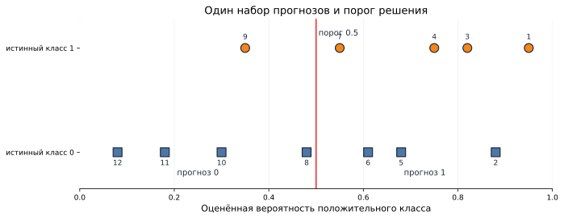

*Рисунок 1. Один и тот же набор объектов отсортирован по оценке вероятности. При пороге 0.5 положительный прогноз получают семь верхних объектов.*

При $t=0.5$ положительные прогнозы получают объекты 1–7. Среди них четыре действительно мошеннические, а три обычные. Из пяти мошеннических операций мы пропустили одну — объект 9. Эти четыре числа станут основой первых метрик.

### Итак

- Вероятностный прогноз и решение — два разных элемента системы.
- Порог превращает числовую оценку в метку класса; изменение порога при фиксированной модели не требует нового обучения.
- Один набор прогнозов может приводить к разным решениям, поэтому качество жёсткой классификации всегда связано с выбранным порогом.

## 2. Четыре возможных исхода и матрица ошибок

Для каждого объекта сравним фактический исход $y$ с предсказанной меткой $\widehat y_t$. Возможны четыре ситуации:

- событие произошло и модель присвоила объекту класс 1 — **true positive (TP)**;
- события не было, но модель присвоила объекту класс 1 — **false positive (FP)**;
- событие произошло, но модель присвоила объекту класс 0 — **false negative (FN)**;
- события не было и модель присвоила объекту класс 0 — **true negative (TN)**.

Слова «положительный» и «отрицательный» относятся к выбранным меткам классов. Положительный класс не обязан быть желательным исходом: в антифроде, диагностике и обнаружении отказов единицей часто обозначают как раз нежелательное событие. В другом приложении положительным классом может быть успешная покупка или отклик на предложение. А иногда мы просто различаем два вида ирисов, и выбор того, какой из них обозначить единицей, является соглашением. Перед вычислением метрик нужно явно определить, что означает $y=1$.

Числа TP, FP, FN и TN удобно собрать в **матрицу ошибок** (*confusion matrix*). В этой лекции строки соответствуют истинным классам, столбцы — предсказанным:

| | Прогноз 0 | Прогноз 1 |
|---|---:|---:|
| Истинный 0 | TN | FP |
| Истинный 1 | FN | TP |

Для нашего примера при $t=0.5$ получаем:

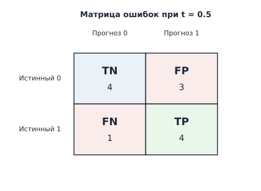

*Рисунок 2. Матрица ошибок при пороге 0.5: TN = 4, FP = 3, FN = 1, TP = 4. Строки соответствуют истинному классу, столбцы — предсказанному.*

Проверим суммы. Всего положительных объектов пять, поэтому $TP+FN=5$. Отрицательных семь, поэтому $TN+FP=7$. Всего положительных прогнозов семь, поэтому $TP+FP=7$. Эти равенства полезны для самопроверки: если суммы не сходятся, где-то перепутаны клетки таблицы.

## 3. Одна матрица — несколько вопросов о качестве

Обозначим число положительных объектов через

```math
N_+=TP+FN,
```

число отрицательных — через

```math
N_-=TN+FP,
```

а общий размер выборки через

```math
N=N_++N_-.
```

Разные метрики возникают потому, что мы задаём к одной и той же матрице разные вопросы и выбираем разные знаменатели.

### 3.1. Accuracy: как часто модель правильно определила класс

Самый общий вопрос — **какая доля всех объектов классифицирована правильно?** На него отвечает **accuracy**:

```math
\boxed{\mathrm{Accuracy}
=\frac{TP+TN}{N}.}
\qquad\text{(4)}
```

В нашем примере правильных ответов восемь из двенадцати:

```math
\mathrm{Accuracy}=\frac{4+4}{12}=\frac23\approx0.667.
```

Это естественная первая характеристика жёстких предсказаний. Но она складывает правильные ответы двух классов в одно число и не показывает, **какие именно ошибки** совершает модель. Поэтому дальше зададим более конкретные вопросы.

### 3.2. Precision: сколько настоящих событий среди положительных прогнозов

В нашем антифрод-примере положительный прогноз означает, что транзакция отправлена на проверку. Возьмём семь таких транзакций и спросим: **какая доля из них действительно мошенническая?**

```math
\boxed{\mathrm{Precision}
=\frac{TP}{TP+FP}.}
\qquad\text{(5)}
```

Для нашего примера

```math
\mathrm{Precision}=\frac47\approx0.571.
```

То есть среди семи транзакций, которым модель присвоила положительный класс, четыре действительно относятся к положительному классу.

Если смотреть на доли как на эмпирические вероятности, precision соответствует вопросу

```math
P(Y=1\mid \widehat Y=1):
```

**среди объектов, которым модель присвоила положительный класс, какова доля действительно положительных?**

Если модель вообще никого не пометила положительным, знаменатель равен нулю и precision математически не определена. Библиотека может использовать техническое соглашение, например возвращать 0 с предупреждением; это нужно отличать от содержательного утверждения о качестве.

### 3.3. Recall: какую долю положительных объектов нашли

Теперь начнём не с решений модели, а со всех действительно положительных объектов. В нашем примере мошеннических транзакций пять. Спросим: **какую долю из них модель обнаружила?**

```math
\boxed{\mathrm{Recall}
=\frac{TP}{TP+FN}=\frac{TP}{N_+}.}
\qquad\text{(6)}
```

В нашем примере

```math
\mathrm{Recall}=\frac45=0.8.
```

То есть модель обнаружила 80% мошеннических операций.

Recall соответствует вопросу

```math
P(\widehat Y=1\mid Y=1):
```

**среди действительно положительных объектов какую долю модель назвала положительными?**

Таким образом, precision и recall используют один и тот же TP в числителе, но отвечают на разные вопросы:

- precision начинает с **положительных решений модели**;
- recall начинает с **истинно положительных объектов**.

Перестановка условия меняет смысл показателя.

Recall также называют **чувствительностью** (*sensitivity*) или **true positive rate, TPR**. Сокращение TPR понадобится нам позже при построении ROC-кривой.

### 3.4. Specificity: какую долю отрицательных объектов правильно оставили отрицательными

Наконец, возьмём все обычные транзакции и спросим, сколько из них модель правильно оставила в классе 0:

```math
\boxed{\mathrm{Specificity}
=\frac{TN}{TN+FP}=\frac{TN}{N_-}.}
\qquad\text{(7)}
```

Specificity называют **специфичностью** или **true negative rate, TNR**. Для наших данных

```math
\mathrm{Specificity}=\frac47\approx0.571.
```

Её можно понимать и как **recall нулевого класса**: если на время считать класс 0 тем классом, который хотим находить, то

```math
\mathrm{Recall}_0=\frac{TN}{TN+FP}=\mathrm{Specificity}.
```

Сопоставим знаменатели основных показателей:

| Метрика | С какой совокупности начинаем? | Вопрос |
|---|---|---|
| Accuracy | Все объекты | Сколько классифицировано правильно? |
| Precision | Все предсказанные положительные | Сколько из них действительно положительные? |
| Recall | Все истинные положительные | Сколько из них нашли? |
| Specificity | Все истинные отрицательные | Сколько из них правильно оставили отрицательными? |

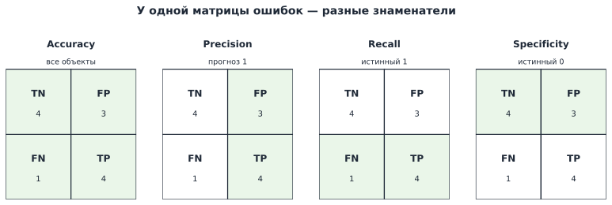

*Рисунок 3. Все показатели строятся из одной матрицы ошибок, но используют разные знаменатели. Это различие важнее механического запоминания формул.*

### 3.5. Почему accuracy может скрывать проблему

Рассмотрим специально созданную выборку из 10 000 объектов. Положительный класс встречается только 100 раз, то есть его доля составляет 1%. Пусть классификатор всегда предсказывает ноль. Тогда

| | Прогноз 0 | Прогноз 1 |
|---|---:|---:|
| Истинный 0 | 9900 | 0 |
| Истинный 1 | 100 | 0 |

Отсюда

```math
\mathrm{Accuracy}=\frac{9900}{10000}=0.99,
```

но

```math
\mathrm{Recall}=0,
```

а precision не определена, потому что модель вообще не выдаёт положительных прогнозов.

Accuracy посчитана корректно: она действительно сообщает, что 99% меток совпали. Проблема возникает, если принять это число за достаточное описание качества в задаче, где наша цель — находить редкие положительные события.

Здесь проявляется **дисбаланс классов** (*class imbalance*) — существенное различие в частотах классов. При дисбалансе особенно полезно сравнивать модель с простым базовым правилом и смотреть на структуру ошибок, а не только на общую долю правильных ответов. Однако из самого факта дисбаланса не следует, что accuracy всегда бесполезна или что существует одна универсальная «метрика для несбалансированных данных».

Можно также встретить **balanced accuracy** — среднее recall двух классов:

```math
\mathrm{BalancedAccuracy}
=\frac{\mathrm{Recall}_1+\mathrm{Recall}_0}{2}
=\frac{\mathrm{Recall}+\mathrm{Specificity}}{2}.
```

Она отвечает на вопрос: **если одинаково важно хорошо распознавать оба класса, какова средняя доля правильно распознанных объектов внутри каждого класса?**

В примере с классификатором, который всегда предсказывает ноль,

```math
\mathrm{Recall}_1=0,
\qquad
\mathrm{Recall}_0=1,
```

поэтому balanced accuracy равна 0.5, хотя обычная accuracy равна 0.99. Balanced accuracy устраняет доминирование многочисленного класса в общей доле правильных ответов, но всё равно не задаёт прикладную цену FP и FN.

### Итак

- Матрица ошибок описывает четыре исхода при фиксированном пороге.
- Accuracy отвечает на общий вопрос о доле правильных ответов, а precision, recall и specificity уточняют структуру этих ответов.
- Precision отвечает на вопрос о положительных прогнозах модели, recall — об истинно положительных объектах.
- Accuracy может быть высокой даже у модели, которая полностью игнорирует редкий положительный класс.
- Смысл метрики определяется не названием предметной области, а конкретным действием и последствиями ошибок.

## 4. Как прикладная задача определяет, что важнее

Вернёмся к вопросу, который мы задавали ещё при постановке задачи машинного обучения: что произойдёт после прогноза и какие ошибки особенно нежелательны? Именно этот вопрос помогает выбрать основной показатель качества.

### Скрининг и последующая диагностика

Представим недорогой первичный тест, после которого положительный результат ведёт к более точному обследованию. Если пропуск заболевания особенно опасен, на первом этапе может быть важен высокий recall. Но это не означает, что precision можно игнорировать: слишком много ложных срабатываний перегрузит следующий этап, создаст расходы и тревогу. Выбор зависит от тяжести заболевания, качества последующего теста, ресурсов и последствий ошибок.

### Автоматическая блокировка и модерация

Если положительное решение приводит к автоматическому удалению материала или блокировке аккаунта, ложноположительная ошибка (FP) может быть дорогостоящей для пользователя. Тогда высокая precision или высокая specificity могут стать важными требованиями. Если же система только предлагает объект человеку для проверки, допустимый баланс может быть совсем другим. Один и тот же классификатор способен использоваться в обоих процессах с разными порогами.

### Антифрод и ограниченная очередь

В нашем примере положительная метка означает направление транзакции на ручную проверку. Recall показывает, какую долю мошенничества мы обнаруживаем, precision — какая доля отправленных на проверку транзакций действительно мошенническая. Если сотрудники могут проверить только ограниченное число операций, важны также общее число срабатываний и качество верхней части списка. Высокая precision при отборе всего одного объекта может оказаться недостаточной, если задача требует находить большую долю мошенничества.

Эти примеры показывают, почему нельзя закрепить за предметной областью универсальное правило вроде «в медицине всегда важнее recall» или «в антифроде всегда важнее precision». Метрику определяют **конкретное действие, последствия ошибок и ограничения процесса**. Иногда естественнее формулировать не одну метрику, а требование вида «максимизировать recall при precision не ниже заданного уровня» или «отобрать не более $k$ объектов».

## 5. Порог меняет баланс ошибок

Продолжим работать с теми же двенадцатью транзакциями. Теперь будем **увеличивать** порог: от $t=0.3$ к $t=0.5$, а затем к $t=0.8$. Чем выше порог, тем труднее объекту получить положительную метку, поэтому множество положительных прогнозов постепенно сужается.

При $t=0.3$:

| | Прогноз 0 | Прогноз 1 |
|---|---:|---:|
| Истинный 0 | 2 | 5 |
| Истинный 1 | 0 | 5 |

При $t=0.5$:

| | Прогноз 0 | Прогноз 1 |
|---|---:|---:|
| Истинный 0 | 4 | 3 |
| Истинный 1 | 1 | 4 |

При $t=0.8$:

| | Прогноз 0 | Прогноз 1 |
|---|---:|---:|
| Истинный 0 | 6 | 1 |
| Истинный 1 | 3 | 2 |

Теперь отдельно сравним показатели:

| Порог $t$ | Precision | Recall | Accuracy |
|---:|---:|---:|---:|
| 0.3 | $5/10=0.5$ | $5/5=1$ | $7/12\approx0.583$ |
| 0.5 | $4/7\approx0.571$ | $4/5=0.8$ | $8/12\approx0.667$ |
| 0.8 | $2/3\approx0.667$ | $2/5=0.4$ | $8/12\approx0.667$ |

При увеличении порога часть объектов перестаёт получать положительную метку. Уже найденные положительные объекты могут исчезать из отбора, но новые положительные объекты появиться не могут. Поэтому recall может только уменьшаться или оставаться прежним.

С precision ситуация сложнее. Когда из положительных прогнозов исчезает отрицательный объект, precision может вырасти; когда исчезает истинно положительный — упасть. Поэтому precision **не обязана монотонно расти** при увеличении порога.

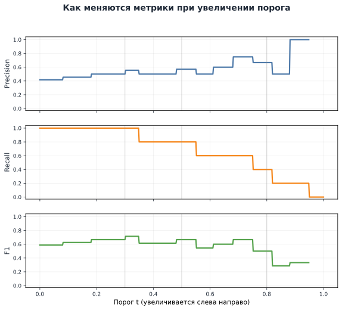

*Рисунок 4. Precision, recall и F1 для одной и той же модели при изменении порога. Порог увеличивается слева направо, как и в таблице выше.*

Отсюда следует важный вывод: **порог 0.5 не является результатом универсальной оптимизации прикладной цели**. Это удобное стандартное правило, пригодность которого нужно проверять в конкретной задаче.

### 5.1. F-мера: один способ совместно учесть precision и recall

Если нам нужны одновременно высокие precision и recall, иногда удобно свести их к одному числу. Наиболее известный вариант — **F1-мера**, гармоническое среднее precision и recall:

```math
\boxed{F_1=\frac{2\,\mathrm{Precision}\,\mathrm{Recall}}
{\mathrm{Precision}+\mathrm{Recall}}.}
\qquad\text{(8)}
```

Почему используется именно гармоническое, а не арифметическое среднее? Рассмотрим резко несбалансированную пару:

```math
\mathrm{Precision}=0.9,
\qquad
\mathrm{Recall}=0.1.
```

Арифметическое среднее равно 0.5 и выглядит умеренно неплохо, хотя одна из двух характеристик почти провалена. Гармоническое среднее равно

```math
F_1=\frac{2\cdot0.9\cdot0.1}{0.9+0.1}=0.18.
```

Поэтому F1 велика только тогда, когда обе составляющие достаточно велики. Она лежит в диапазоне от 0 до 1; значение 1 достигается только при $Precision=Recall=1$, а значения около нуля означают, что хотя бы одна из двух характеристик очень мала.

F1 удобно использовать для сравнения моделей или порогов, если precision и recall хочется считать примерно одинаково важными. Это не универсальная мера качества: если цена пропуска и цена ложного срабатывания существенно различаются, лучше сделать это предпочтение явным.

Подставляя определения precision и recall, получаем полезную запись непосредственно через матрицу ошибок:

```math
F_1=\frac{2TP}{2TP+FP+FN}.
\qquad\text{(9)}
```

При $t=0.5$ в нашем примере

```math
\mathrm{Precision}=\frac47,
\qquad
\mathrm{Recall}=\frac45,
```

поэтому

```math
F_1
=\frac{2\cdot\frac47\cdot\frac45}{\frac47+\frac45}
=\frac23\approx0.667.
```

Существует семейство **$F_\beta$-мер**:

```math
\boxed{F_\beta=(1+\beta^2)
\frac{\mathrm{Precision}\,\mathrm{Recall}}
{\beta^2\mathrm{Precision}+\mathrm{Recall}},
\qquad \beta>0.}
\qquad\text{(10)}
```

При $\beta=1$ получаем F1. При $\beta>1$ больший акцент делается на recall, при $0<\beta<1$ — на precision. Например, $F_2$ используют, когда особенно важно не пропускать положительные объекты, а $F_{0.5}$ — когда сильнее ценят чистоту положительных срабатываний.

Параметр $\beta$ обычно задают из смысла прикладной задачи, а не подбирают как обычный гиперпараметр по таблице результатов. При этом $\beta$ нельзя непосредственно трактовать как денежную цену одной ошибки относительно другой. Если стоимости FP и FN действительно известны, их лучше моделировать напрямую.

### 5.2. Если известна цена отдельных ошибок

Пусть каждый ложноположительный ответ имеет стоимость $c_{FP}$, а каждый ложноотрицательный — $c_{FN}$. Для фиксированного порога общая стоимость ошибок равна

```math
C(t)=c_{FP}FP(t)+c_{FN}FN(t).
\qquad\text{(11)}
```

Если модель выдаёт содержательную вероятность $p=P(Y=1\mid x)$, тот же принцип можно применить к одному объекту.

Если присвоить объекту класс 1, ошибка возникает только при $Y=0$, что имеет вероятность $1-p$. Поэтому ожидаемая стоимость такого решения равна

```math
c_{FP}(1-p).
```

Если присвоить класс 0, ошибка возникает только при $Y=1$, что имеет вероятность $p$, и ожидаемая стоимость равна

```math
c_{FN}p.
```

Выбираем класс 1 тогда, когда ожидаемая стоимость решения «1» не больше ожидаемой стоимости решения «0»:

```math
c_{FP}(1-p)\le c_{FN}p.
```

Раскроем скобки и соберём члены с $p$:

```math
c_{FP}\le (c_{FP}+c_{FN})p.
```

Отсюда

```math
\boxed{
p\ge \frac{c_{FP}}{c_{FP}+c_{FN}}.
}
\qquad\text{(12)}
```

Например, если пропуск положительного события стоит в четыре раза дороже ложного срабатывания,

```math
c_{FN}=4c_{FP},
```

то порог равен

```math
t^*=\frac{1}{1+4}=0.2.
```

Формула опирается на сильные упрощающие предположения: вероятности должны иметь содержательный вероятностный смысл, стоимости — быть известными и одинаковыми для всех ошибок соответствующего типа, а решения — приниматься по объектам независимо. При ограниченной очереди или неодинаковой стоимости разных объектов задача выбора действия становится сложнее.

### 5.3. Выбор порога и честная проверка

Порог тоже выбирается по данным, поэтому важно разделять роли выборок.

Почему бы не выбрать $t$ прямо на обучающей выборке? Потому что модель уже подгонялась под эти объекты. Её прогнозы на обучающих данных обычно выглядят лучше, чем на новых, и дополнительный выбор порога по тем же наблюдениям ещё сильнее приспосабливает процедуру к особенностям обучающей выборки.

Использовать для выбора порога тестовую выборку тоже нельзя: тогда она перестаёт быть независимой финальной проверкой.

Для нашей задачи достаточно простого разделения ролей:

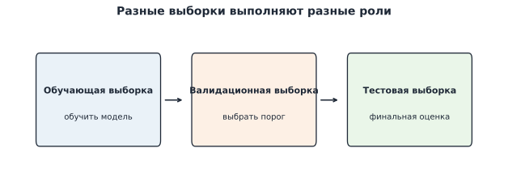

*Рисунок 5. Обучающая выборка используется для настройки параметров модели, валидационная — для выбора порога и других решений, тестовая — для оценки уже зафиксированного варианта.*

Схема такова:

```math
\text{обучающая выборка}\longrightarrow\text{обучить модель},
```

```math
\text{валидационная выборка}\longrightarrow\text{выбрать порог},
```

```math
\text{тестовая выборка}\longrightarrow\text{один раз оценить зафиксированную процедуру}.
```

Порог не является коэффициентом модели, но он всё равно входит в итоговую процедуру принятия решения и потому не должен подбираться по тестовой выборке.

На маленьких данных оценённый лучший порог может быть нестабильным: одна-две ошибки способны заметно изменить precision или recall. Поэтому полезно смотреть не только на максимум выбранной метрики, но и на соседние пороги, число объектов и ограничения процесса.

### Итак

- При увеличении порога recall не увеличивается, а precision может меняться в обе стороны.
- F1 и $F_\beta$ — способы совместно учитывать precision и recall, но они не заменяют явную прикладную цель.
- Если стоимости ошибок известны, их можно моделировать непосредственно.
- Порог выбирают отдельно от обучения модели и не подбирают по тестовой выборке.

## 6. От изменения порога к ROC-кривой

До сих пор мы сравнивали несколько отдельных порогов. Теперь хотим увидеть **все возможные рабочие режимы одной и той же модели**.

Для этого понадобятся две доли.

Мы уже знаем recall, или true positive rate:

```math
\boxed{TPR(t)=\frac{TP(t)}{N_+}.}
\qquad\text{(13)}
```

Он отвечает на вопрос: какую долю истинно положительных объектов мы уже нашли при пороге $t$?

Для отрицательного класса введём **false positive rate, FPR**:

```math
\boxed{FPR(t)=\frac{FP(t)}{N_-}=1-\mathrm{Specificity}(t).}
\qquad\text{(14)}
```

Он отвечает на другой вопрос: какую долю истинно отрицательных объектов мы ошибочно отнесли к положительному классу?

### 6.1. Как TPR и FPR меняются вместе с порогом

Для построения кривой удобно начать с порога выше максимальной вероятности. Тогда все объекты получают класс 0, поэтому

```math
TPR=0,
\qquad
FPR=0.
```

Теперь будем постепенно **снижать** порог. В нашем примере все вероятности различны, поэтому каждый раз через порог переходит ровно один объект.

Если этот объект действительно положительный, число TP увеличивается на единицу. Значит, TPR увеличивается на

```math
\frac1{N_+}=\frac15=0.20,
```

а FPR не меняется.

Если объект отрицательный, число FP увеличивается на единицу. Тогда FPR увеличивается на

```math
\frac1{N_-}=\frac17\approx0.143,
```

а TPR остаётся прежним.

Для нашего набора получаем:

| Через порог прошёл объект | Истинный класс | TP | FP | TPR | FPR |
|---|---:|---:|---:|---:|---:|
| никто | — | 0 | 0 | $0/5=0.00$ | $0/7=0.000$ |
| 1 | 1 | 1 | 0 | $1/5=0.20$ | $0/7=0.000$ |
| 2 | 0 | 1 | 1 | $1/5=0.20$ | $1/7\approx0.143$ |
| 3 | 1 | 2 | 1 | $2/5=0.40$ | $1/7\approx0.143$ |
| 4 | 1 | 3 | 1 | $3/5=0.60$ | $1/7\approx0.143$ |
| 5 | 0 | 3 | 2 | $3/5=0.60$ | $2/7\approx0.286$ |
| 6 | 0 | 3 | 3 | $3/5=0.60$ | $3/7\approx0.429$ |
| 7 | 1 | 4 | 3 | $4/5=0.80$ | $3/7\approx0.429$ |
| 8 | 0 | 4 | 4 | $4/5=0.80$ | $4/7\approx0.571$ |
| 9 | 1 | 5 | 4 | $5/5=1.00$ | $4/7\approx0.571$ |
| 10 | 0 | 5 | 5 | $5/5=1.00$ | $5/7\approx0.714$ |
| 11 | 0 | 5 | 6 | $5/5=1.00$ | $6/7\approx0.857$ |
| 12 | 0 | 5 | 7 | $5/5=1.00$ | $7/7=1.000$ |

Сначала полезно посмотреть на эти две величины как на отдельные функции порога.

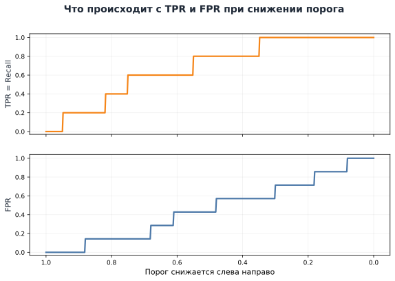

*Рисунок 6. При снижении порога TPR и FPR растут ступенчато. Положительный объект увеличивает только TPR, отрицательный — только FPR.*

Теперь объединим две зависимости в один график.

### 6.2. ROC как траектория рабочих режимов

Для каждого порога у нас есть две величины: $FPR(t)$ и $TPR(t)$. Вместо двух отдельных зависимостей от $t$ нанесём на плоскость одну точку

```math
\boxed{\bigl(FPR(t),TPR(t)\bigr).}
\qquad\text{(15)}
```

В стандартной системе координат первой записывают горизонтальную координату, поэтому по оси $x$ здесь стоит FPR, а по оси $y$ — TPR.

Последовательность таких точек при изменении порога образует **ROC-кривую** (*Receiver Operating Characteristic curve*). Название историческое: буквально оно связано с «рабочей характеристикой приёмника» в задачах обнаружения сигнала. В машинном обучении почти всегда говорят просто **ROC-кривая**.

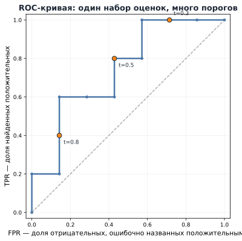

*Рисунок 7. ROC-кривая получается из той же последовательности порогов. При переходе положительного объекта точка движется вверх, при переходе отрицательного — вправо.*

Начальная точка $(0,0)$ означает, что все объекты отнесены к классу 0. Конечная точка $(1,1)$ означает, что все объекты отнесены к классу 1. Идеальный порядок позволил бы сначала пропустить через порог все положительные объекты и только затем отрицательные: тогда кривая прошла бы через точку

```math
(0,1),
```

то есть все положительные найдены, а ни один отрицательный ещё не получил положительную метку.

Если несколько объектов имеют одинаковую числовую оценку, порог не может разделить их. При его снижении такие объекты меняют класс одновременно, поэтому одновременно могут измениться и TPR, и FPR. На графике мы соединяем две соседние достижимые точки прямым отрезком. Внутренние точки этого отрезка служат частью графического изображения перехода и не обязаны соответствовать отдельному детерминированному значению порога.

### 6.3. Как читать геометрию ROC

Представим, что **порядок объектов по оценке модели не содержит информации об истинном классе**. Тогда по мере снижения порога положительные и отрицательные объекты будут попадать в класс 1 примерно в тех же пропорциях, что и во всей выборке. Если мы уже включили примерно долю $q$ отрицательных объектов, то в среднем включили примерно долю $q$ положительных:

```math
FPR\approx q,
\qquad
TPR\approx q.
```

Поэтому естественным ориентиром становится диагональ

```math
TPR=FPR.
```

Точка выше диагонали имеет ясный смысл: **при той же доле ошибочно отмеченных отрицательных объектов мы уже нашли большую долю положительных**.

Например, точка

```math
(FPR,TPR)=(0.14,0.60)
```

означала бы, что модель обнаружила около 60% положительных объектов, ошибочно присвоив класс 1 примерно 14% отрицательных.

Каждая точка ROC — возможный рабочий режим одной и той же системы. Поэтому ROC полезна, когда мы ещё не выбрали один порог и хотим увидеть весь набор компромиссов между долей найденных положительных объектов и долей ложных срабатываний среди отрицательных.

Всю ROC-кривую можно свести в одно число — **площадь под кривой**, *Area Under the Curve*. Отсюда название **ROC-AUC**. Но сама геометрическая площадь пока ещё мало объясняет, что именно измеряет это число. В следующем разделе увидим более содержательную интерпретацию.

## 7. ROC-AUC: от порядка объектов к площади под кривой

Посмотрим, какая информация понадобилась нам для построения ROC. Мы брали объекты в порядке убывания оценки модели и отмечали их истинные классы. Конкретные числа 0.95, 0.88, 0.82 и так далее почти исчезли из расчёта: важен прежде всего **порядок объектов**.

Такой порядок называют **ранжированием**. Хорошее ранжирование в бинарной задаче означает, что положительные объекты в основном получают более высокие оценки, чем отрицательные.

### 7.1. Попарная интерпретация

Возьмём одну положительную и одну отрицательную транзакцию. Если положительная получила более высокую числовую оценку, будем считать эту пару правильно упорядоченной.

В нашем примере пять положительных и семь отрицательных объектов, поэтому всего существует

```math
N_+N_-=5\cdot7=35
```

положительно-отрицательных пар.

Для каждого положительного объекта посчитаем, сколько отрицательных объектов имеют меньшую оценку:

| Оценка положительного объекта | Отрицательных объектов ниже него |
|---:|---:|
| 0.95 | 7 |
| 0.82 | 6 |
| 0.75 | 6 |
| 0.55 | 4 |
| 0.35 | 3 |
| **Итого** | **26** |

Получаем долю правильно упорядоченных пар

```math
\frac{26}{35}\approx0.743.
\qquad\text{(16)}
```

Это число и есть ROC-AUC для нашего примера.


Таким образом, при отсутствии равных оценок ROC-AUC можно записать как

```math
\boxed{
\mathrm{ROC\!\text{-}\!AUC}
=\frac{1}{N_+N_-}
\sum_{i:y_i=1}\sum_{j:y_j=0}
\mathbb 1(s_i>s_j).}
\qquad\text{(17)}
```

Здесь $s_i$ — числовая оценка классификатора: чем она больше, тем сильнее модель склоняется к положительному классу.

Если положительный и отрицательный объект получили одинаковую оценку, модель не умеет определить их взаимный порядок. При случайном разрешении такой ничьей правильный порядок возник бы в половине случаев, поэтому равной паре дают вес $1/2$:

```math
\mathrm{ROC\!\text{-}\!AUC}
=\frac{1}{N_+N_-}
\sum_{i:y_i=1}\sum_{j:y_j=0}
\left[
\mathbb 1(s_i>s_j)+\frac12\mathbb 1(s_i=s_j)
\right].
\qquad\text{(18)}
```

Теперь крайние значения имеют прямой смысл:

- $AUC=1$ — каждый положительный объект расположен выше каждого отрицательного;
- $AUC\approx0.5$ — для случайной положительно-отрицательной пары порядок примерно не лучше случайного;
- $AUC<0.5$ — неправильных попарных порядков больше правильных.

### 7.2. Почему это одновременно площадь под ROC-кривой

Теперь свяжем попарный смысл с геометрией ROC. При пошаговом построении кривой каждый отрицательный объект даёт горизонтальный шаг ширины $1/N_-$. Высота этого шага равна доле положительных объектов, которые уже встретились выше данного отрицательного объекта в ранжированном списке.

Два первых примера удобно свести в таблицу:

| Отрицательный объект | Положительных объектов выше | Ширина шага по FPR | Высота шага по TPR | Площадь под шагом |
|---:|---:|---:|---:|---:|
| 0.88 | 1 | $1/7$ | $1/5$ | $1/35$ |
| 0.68 | 3 | $1/7$ | $3/5$ | $3/35$ |

Во второй строке площадь $3/35$ буквально соответствует трём правильно упорядоченным парам: три положительных объекта стоят выше отрицательного объекта с оценкой $0.68$. Точно так же каждый следующий отрицательный объект добавляет прямоугольник ширины $1/7$, а его высота показывает, сколько положительных объектов уже расположены выше.

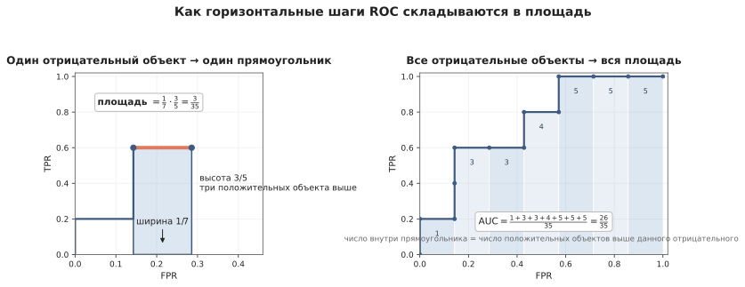

*Рисунок 8. Слева один горизонтальный шаг ROC превращается в прямоугольник: ширина равна $1/7$, а высота — доле положительных объектов, стоящих выше выбранного отрицательного объекта. Справа сложены такие прямоугольники для всех семи отрицательных объектов; их суммарная площадь равна $26/35$.*

В нашем списке числа положительных объектов выше семи отрицательных равны

```math
1,\;3,\;3,\;4,\;5,\;5,\;5.
```

Поэтому площадь под ROC равна

```math
\frac1{7}\left(\frac15+\frac35+\frac35+\frac45+1+1+1\right)
=\frac{26}{35}.
```

Мы получили то же число, что и при непосредственном подсчёте правильно упорядоченных пар.

Если у положительного и отрицательного объекта одинаковая оценка, они проходят через порог одновременно. На ROC одновременно увеличиваются TPR и FPR, поэтому возникает диагональный участок. Площадь трапеции под таким участком соответствует половинному вкладу равной пары — тому самому коэффициенту $1/2$ в формуле (18).

Отсюда

```math
\boxed{
\text{площадь под ROC}
=
\text{доля правильно упорядоченных положительно-отрицательных пар}
}
```

с половинным вкладом равных оценок.

### 7.3. Когда полезны ROC и ROC-AUC

ROC показывает, **как быстро при движении вниз по списку оценок накапливаются положительные объекты по сравнению с отрицательными**. Если положительные объекты в основном стоят высоко, кривая быстро поднимается к левому верхнему углу.

Поэтому ROC полезна, когда нужно:

- увидеть весь набор возможных компромиссов TPR/FPR до выбора одного порога;
- сравнить, как две модели разделяют классы на разных рабочих режимах;
- понять, насколько хорошо числовая оценка модели упорядочивает положительные и отрицательные объекты.

ROC-AUC сворачивает это качество порядка в одно число и удобна для сравнения моделей **без фиксации конкретного порога**.

**Кейс: ограничение на ложные срабатывания.** Платёжная система настраивает отправку транзакций на ручную проверку. Команда допускает, что не более 2% обычных транзакций будут отправлены на проверку ошибочно, и хочет при этом обнаруживать как можно большую долю мошеннических операций.

На ROC это условие записывается как

```math
FPR\le 0.02.
```

Среди точек кривой, удовлетворяющих ограничению, ищем точку с максимальным $TPR$. Её координаты показывают, какую долю мошеннических операций можно обнаружить при допустимом уровне ложных срабатываний, а соответствующий порог задаёт рабочий режим системы.

Можно поставить и обратный вопрос: если требуется обнаруживать не менее 90% положительных объектов, рассматриваем точки с $TPR\ge0.9$ и среди них ищем минимальный $FPR$.

При этом ROC-AUC не отвечает на три других вопроса:

- какой порог лучше выбрать в конкретной задаче;
- насколько «чистыми» будут положительные срабатывания;
- можно ли доверять числовым значениям как вероятностям.

### 7.4. Почему AUC не зависит от конкретной числовой шкалы

Пусть $g$ — строго возрастающая функция. Тогда

```math
s_i>s_j
\quad\Longleftrightarrow\quad
g(s_i)>g(s_j).
```

Все попарные сравнения сохраняются, следовательно, сохраняются ранжирование, ROC-кривая и ROC-AUC. Численные значения порогов при этом могут измениться.

Для логистической регрессии

```math
\widehat p_i=\sigma(\widehat z_i).
```

Сигмоида строго возрастает, поэтому

```math
\widehat z_i>\widehat z_j
\quad\Longleftrightarrow\quad
\widehat p_i>\widehat p_j.
```

Следовательно, ROC-AUC по линейным оценкам $\widehat z$ и по вероятностям $\widehat p$ совпадает. Но пороги на этих двух шкалах — разные числа: вероятностному порогу $0.5$ соответствует линейный порог $0$.

### Итак

- ROC показывает все рабочие режимы одной модели при изменении порога.
- ROC-AUC характеризует порядок: как часто положительный объект оказывается выше отрицательного.
- Геометрическая площадь под ROC и попарная интерпретация — две стороны одной величины.
- Строго возрастающее преобразование числовой оценки сохраняет ROC-AUC.
- AUC не выбирает конкретный рабочий порог, не сообщает precision и не проверяет, насколько правдоподобны сами вероятности.

## 8. PR-кривая: что происходит среди положительных срабатываний

ROC отвечает на два вопроса:

```math
TPR=P(\widehat Y=1\mid Y=1),
```

```math
FPR=P(\widehat Y=1\mid Y=0).
```

В обоих случаях мы начинаем с **истинного класса** и спрашиваем, какая его доля получила положительный прогноз.

Но во многих задачах важен ещё один вопрос: **что находится среди объектов, которым модель уже присвоила положительный класс?** На него отвечает precision.

### 8.1. Одна и та же точка ROC при разной доле положительного класса

Пусть при некотором пороге

```math
TPR=0.8,
\qquad
FPR=0.05.
```

Достаточно ли этих двух чисел, чтобы понять состав положительных срабатываний? Нет: нужно ещё знать, сколько в оценочной выборке положительных и отрицательных объектов.

Сначала рассмотрим 10 000 объектов, среди которых 20% положительных:

```math
N_+=2000,
\qquad
N_-=8000.
```

Тогда

```math
TP=0.8\cdot2000=1600,
\qquad
FP=0.05\cdot8000=400,
```

и

```math
\mathrm{Precision}
=\frac{1600}{1600+400}=0.8.
```

Теперь сохраним те же $TPR=0.8$ и $FPR=0.05$, но уменьшим долю положительного класса до 1%:

```math
N_+=100,
\qquad
N_-=9900.
```

Получим

```math
TP=80,
\qquad
FP=495,
```

и

```math
\mathrm{Precision}
=\frac{80}{80+495}\approx0.139.
```

Модель по-прежнему находит 80% положительных объектов и ошибочно отмечает 5% отрицательных. Но теперь положительных объектов очень мало, а отрицательных — очень много. Поэтому даже 5% от большого отрицательного класса дают 495 ложных срабатываний против 80 истинных.

В общем виде

```math
\boxed{
\mathrm{Precision}
=\frac{TPR\,N_+}
{TPR\,N_+ + FPR\,N_-}.}
\qquad\text{(19)}
```

Это и есть ключ к различию ROC и PR: ROC нормирует ошибки **отдельно внутри каждого истинного класса**, а precision сравнивает TP и FP уже внутри положительных прогнозов.

### 8.2. Как из изменения порога получается PR-кривая

Recall уже отвечает на вопрос «какую долю положительных объектов мы нашли?». Вместо FPR теперь будем одновременно отслеживать precision — «какая доля положительных прогнозов действительно положительная?».

Сначала посмотрим на эти две величины как на функции порога.

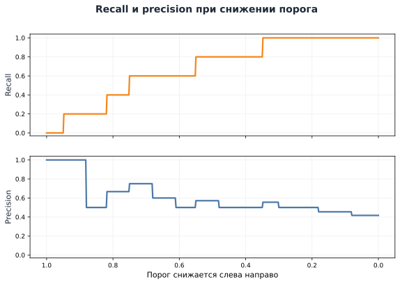

*Рисунок 9. При снижении порога recall растёт ступенчато, а precision может двигаться в обе стороны: её изменение зависит от класса очередного добавленного объекта.*

Теперь для каждого порога объединим две величины в одну точку. По горизонтальной оси отложим recall, по вертикальной — precision:

```math
\boxed{
\bigl(\mathrm{Recall}(t),\mathrm{Precision}(t)\bigr).
}
\qquad\text{(20)}
```

Так получается **PR-кривая** (*precision–recall curve*).

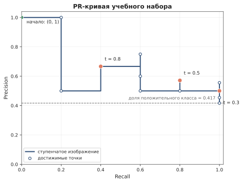

*Рисунок 10. PR-кривая строится по той же последовательности порогов, что и ROC. По горизонтали — доля найденных положительных объектов, по вертикали — доля истинно положительных среди положительных прогнозов.*

Разберём движение по кривой. При пороге выше всех оценок положительных прогнозов нет, поэтому precision формально не определена. Для удобства изображения PR-кривой добавляют начальную точку

```math
(Recall,Precision)=(0,1).
```

Дальше снижаем порог:

- если добавился **положительный** объект, recall увеличивается; precision увеличивается, если до этого среди выбранных были ложные срабатывания, или остаётся равной 1, если выбранные объекты пока все положительные;
- если добавился **отрицательный** объект, recall не меняется, а precision уменьшается.

В самом конце выбраны все объекты. Тогда

```math
Recall=1,
\qquad
Precision=\frac{N_+}{N},
```

то есть конечная precision равна доле положительного класса в выборке.

ROC и PR — не два разных эксперимента. Они описывают одну и ту же последовательность пороговых решений в разных координатах:

- ROC: **какую долю положительных нашли и какую долю отрицательных ошибочно назвали положительными**;
- PR: **какую долю положительных нашли и какая доля положительных прогнозов оказалась верной**.

### 8.3. Базовый уровень PR и редкий положительный класс

Пусть доля положительных объектов в оценочной выборке равна

```math
r=\frac{N_+}{N}.
```

Представим, что порядок объектов по оценке модели фактически случаен и не помогает ставить положительные объекты выше отрицательных. Тогда любой достаточно большой верхний фрагмент такого списка в среднем имеет примерно тот же состав, что и вся выборка.

Если во всей выборке 5% положительных объектов, то среди первых 100 случайно упорядоченных объектов мы ожидаем примерно 5 положительных:

```math
Precision\approx\frac5{100}=0.05.
```

Среди первых 500 — примерно 25:

```math
Precision\approx\frac{25}{500}=0.05.
```

Поэтому для случайного порядка ожидаемая precision остаётся около общей доли положительного класса:

```math
\boxed{\mathbb E[Precision]\approx r.}
```

Это и есть естественный горизонтальный ориентир PR-кривой. В отличие от диагонали ROC, его уровень зависит от состава выборки.

На более крупной выборке легче увидеть эту геометрию и привычную форму кривых:

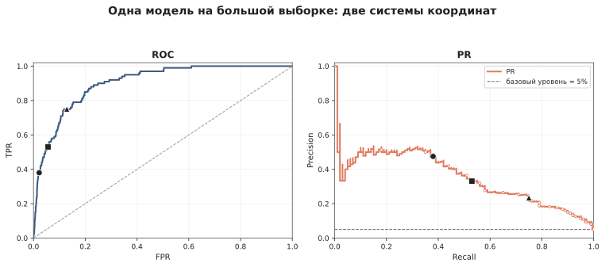

*Рисунок 11. ROC- и PR-кривые для одной и той же синтетической выборки из 2000 объектов, где положительный класс составляет 5%. На PR-графике горизонтальная линия 0.05 показывает базовый уровень случайного порядка. Маркеры показывают достижимые точки при конкретных порогах; PR-кривая изображена ступенчато, чтобы не приписывать промежуточным прямым отрезкам отдельного смысла.*

PR-кривую можно читать как карту допустимых рабочих режимов.

**Кейс: требования к качеству очереди ручной проверки.** Команда готова работать только с потоком, в котором не менее 40% срабатываний действительно относятся к мошенническим операциям. При этом хочется обнаруживать как можно большую долю всего мошенничества.

На PR это условие записывается как

```math
Precision\ge0.4.
```

Проводим горизонтальный уровень $Precision=0.4$ и рассматриваем точки кривой не ниже него. Среди них выбираем самую правую — с максимальным recall. Она показывает, какую наибольшую долю мошеннических операций можно обнаружить, сохраняя требуемую долю истинных срабатываний в очереди.

Можно поставить вопрос наоборот: если требуется $Recall\ge0.8$, проводим вертикальный уровень $Recall=0.8$ и среди допустимых точек справа от него ищем наибольшую precision. В обоих случаях выбранная точка PR-кривой соответствует конкретному порогу.

Теперь видно, почему PR бывает особенно полезна при редком положительном классе. В нашем предыдущем примере при 1% положительных объектов и рабочем режиме

```math
TPR=0.8,
\qquad
FPR=0.05
```

ROC говорит: «мы нашли 80% положительных и ошибочно пометили 5% отрицательных». PR показывает другую сторону того же решения:

```math
Recall=0.8,
\qquad
Precision\approx0.139.
```

То есть среди всех срабатываний лишь около 14% являются истинно положительными. Причина не в том, что ROC «ломается при дисбалансе», а в том, что небольшой процент от очень многочисленного отрицательного класса может дать много FP. PR делает этот состав положительных срабатываний видимым напрямую.

### 8.4. Average Precision: один способ получить число из PR-кривой

PR-кривую тоже бывает удобно свести к одному числу. В `scikit-learn` для этого обычно используют **Average Precision (AP)**.

Вернёмся к исходному ранжированному списку:

| Позиция | Оценка | Истинный класс |
|---:|---:|---:|
| 1 | 0.95 | 1 |
| 2 | 0.88 | 0 |
| 3 | 0.82 | 1 |
| 4 | 0.75 | 1 |
| 5 | 0.68 | 0 |
| 6 | 0.61 | 0 |
| 7 | 0.55 | 1 |
| 8 | 0.48 | 0 |
| 9 | 0.35 | 1 |
| 10 | 0.30 | 0 |
| 11 | 0.18 | 0 |
| 12 | 0.08 | 0 |

Положительные объекты находятся на позициях 1, 3, 4, 7 и 9. Каждый раз, когда мы доходим до очередного настоящего положительного объекта, спросим: **какова precision среди всех объектов, просмотренных до этого места?**

Получаем

```math
1,
\qquad
\frac23,
\qquad
\frac34,
\qquad
\frac47,
\qquad
\frac59.
```

Если положительные объекты действительно сосредоточены наверху списка, эти значения будут высокими. Если перед каждым очередным положительным успело накопиться много отрицательных объектов, precision будет низкой.

Average Precision усредняет эти значения по положительным объектам:

```math
\begin{aligned}
AP
&=\frac15\left(
1+\frac23+\frac34+\frac47+\frac59
\right)\\
&\approx0.709.
\end{aligned}
\qquad\text{(21)}
```

Теперь перепишем ту же формулу так, чтобы она работала и в общем случае. В нашем примере всего пять положительных объектов, поэтому каждый новый найденный положительный увеличивает recall ровно на

```math
\frac1{N_+}=\frac15.
```

Последовательность значений recall при нахождении положительных объектов выглядит так:

```math
0\;\longrightarrow\;\frac15\;\longrightarrow\;\frac25\;\longrightarrow\;\frac35\;\longrightarrow\;\frac45\;\longrightarrow\;1.
```

Поэтому формулу (21) можно буквально записать как

```math
AP
=\frac15\cdot1
+\frac15\cdot\frac23
+\frac15\cdot\frac34
+\frac15\cdot\frac47
+\frac15\cdot\frac59.
```

Каждый множитель $1/5$ здесь — это прирост recall на соответствующем шаге. Обозначим его через

```math
\Delta R_k=R_k-R_{k-1}.
```

Тогда та же самая идея принимает общий вид

```math
\boxed{AP=\sum_k (R_k-R_{k-1})P_k
=\sum_k\Delta R_k P_k.}
\qquad\text{(22)}
```

То есть формула (22) не вводит новый принцип: она просто заменяет одинаковый вес $1/N_+$ на фактический прирост recall. Если из-за одинаковых оценок за один шаг добавилось несколько положительных объектов, $\Delta R_k$ будет больше $1/N_+$, и запись по-прежнему работает.

### 8.5. Почему AP и «площадь под PR-кривой» могут отличаться

В разговоре, статьях и на собеседованиях можно встретить выражения **PR-AUC** или «площадь под PR-кривой». Но здесь важно уточнять способ вычисления.

Сначала вспомним, почему линейное соединение соседних точек естественно выглядит на ROC. Пусть $A$ и $B$ — два рабочих режима. Если первое правило используем с вероятностью $\lambda$, а второе с вероятностью $1-\lambda$, то

```math
TPR_{mix}=\lambda TPR_A+(1-\lambda)TPR_B,
```

```math
FPR_{mix}=\lambda FPR_A+(1-\lambda)FPR_B.
```

Обе координаты усредняются линейно, поэтому смешанный режим $M$ лежит на прямом отрезке между ROC-точками $A$ и $B$.

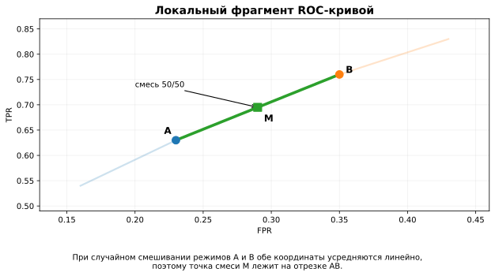

*Рисунок 12. Точки $A$ и $B$ соответствуют двум соседним рабочим режимам. При случайном смешивании этих правил обе ROC-координаты усредняются линейно, поэтому точка смеси $M$ лежит на отрезке $AB$.*

Для PR сначала полезно уточнить, что именно являются «точками кривой» на конечной выборке. Сам порог $t$ можно менять непрерывно, но предсказанные метки меняются только тогда, когда порог пересекает числовую оценку очередного объекта. Между двумя соседними значениями оценки можно двигать порог сколько угодно — набор положительных прогнозов, а значит precision и recall, останутся прежними.

Поэтому на конечной выборке реально достижимых **детерминированных PR-точек конечное число**. Ступенчатая линия, которой мы соединяли их на рисунках, — удобный способ показать последовательность этих точек; она не означает, что каждая промежуточная точка соответствует отдельному значению порога.

Если же случайно смешивать два режима $A$ и $B$, recall действительно усредняется линейно, но precision равна

```math
Precision=\frac{TP}{TP+FP}.
```

При смешивании двух режимов

```math
Precision_{mix}
=\frac{\lambda TP_A+(1-\lambda)TP_B}
{\lambda(TP_A+FP_A)+(1-\lambda)(TP_B+FP_B)},
```

и это в общем случае **не равно**

```math
\lambda Precision_A+(1-\lambda)Precision_B.
```

Иными словами, осмысленный смешанный режим существует, но его PR-координаты в общем случае не лежат на прямом отрезке между координатами $A$ и $B$. Поэтому линейная интерполяция между соседними PR-точками не имеет того же операционного смысла, что в ROC-пространстве.

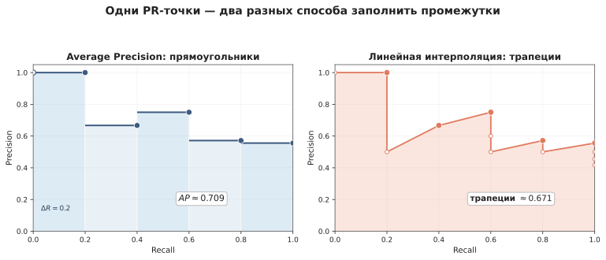

*Рисунок 13. Крупные маркеры — PR-точки, полученные при конкретных порогах. Слева Average Precision представлена как сумма прямоугольников ширины $\Delta R_k$ и высоты $P_k$. Справа те же точки соединены прямыми, и площадь считается трапециями.*

У AP действительно есть геометрическая интерпретация площади: формула (22) складывает прямоугольники

```math
\Delta R_k\,P_k.
```

Поэтому AP равна площади под **соответствующей ступенчатой конструкцией**. Важно, что эта конструкция задаётся именно формулой Average Precision, а не предположением о существовании дополнительных пороговых режимов между соседними PR-точками.

Если те же точки соединить прямыми и посчитать трапеции, мы зададим другую интерполяцию между наблюдаемыми рабочими режимами — и, вообще говоря, получим другое число.

Отсюда получаются две разные величины:

- `average_precision_score` — Average Precision по формуле (22);
- трапецеидальная площадь, например `auc(recall, precision)`, — площадь под выбранной линейной интерполяцией.

Они могут различаться. Поэтому, говоря «PR-AUC», полезно уточнять определение. В практических заданиях этой недели по умолчанию будем использовать AP.

### 8.6. Когда полезны PR и AP

PR-кривая особенно полезна, когда прикладной вопрос одновременно связан с двумя вещами:

- какую долю положительных объектов мы находим;
- насколько много ложных срабатываний оказывается среди положительных прогнозов.

Это часто важно при редком положительном классе, потому что большое число отрицательных объектов способно породить много FP даже при небольшом FPR.

AP даёт одно число для сравнения качества такого ранжирования с акцентом на положительный класс. Но ни PR-кривая, ни AP сами не выбирают рабочий порог. Кроме того, их численные значения зависят от доли положительного класса, поэтому сравнивать AP между выборками с резко различающимся составом нужно осторожно.

**Практическое замечание.** Для accuracy, precision, recall и F1 сначала нужны жёсткие метки при выбранном пороге. Для ROC-AUC и AP, наоборот, следует передавать исходные числовые оценки или вероятности. Если заранее превратить их в 0 и 1, большая часть информации о порядке объектов потеряется.

### Итак

- Одна и та же точка ROC может соответствовать очень разной precision при разном соотношении классов.
- PR-кривая показывает recall и precision при переборе порогов.
- Базовый уровень PR равен доле положительного класса, потому что случайный отбор в среднем сохраняет состав выборки.
- PR особенно наглядна, когда положительный класс редок и важен состав положительных срабатываний.
- Average Precision можно понимать как среднюю precision в моменты нахождения очередных положительных объектов.
- AP и трапецеидальная площадь под линейно соединённой PR-кривой — разные величины.

## 9. Хорошее ранжирование ещё не означает хорошие вероятности

До сих пор для ROC-AUC и AP нам был важен прежде всего порядок объектов. Но иногда численное значение вероятности используется непосредственно. Например, оно может входить в расчёт ожидаемой стоимости решения, использоваться как численная оценка вероятности события или сообщаться человеку как «вероятность события».

Тогда возникает новый вопрос: **если модель говорит 0.8, действительно ли это число ведёт себя как вероятность 80%?**

Рассмотрим пять больших групп объектов с разной фактической частотой события. Именно **группы**, а не пять отдельных объектов: у одного объекта наблюдаемый исход равен только 0 или 1, а частоту 10%, 30% или 90% можно оценить лишь по множеству наблюдений. Будем считать, что в каждой группе достаточно объектов, чтобы сопоставлять средний прогноз модели и наблюдаемую долю положительных исходов.

Пусть две модели упорядочивают эти группы одинаково, но используют разные числовые шкалы:

| Наблюдаемая частота события | Модель A | Модель B |
|---:|---:|---:|
| 0.10 | 0.10 | 0.0122 |
| 0.30 | 0.30 | 0.1552 |
| 0.50 | 0.50 | 0.5000 |
| 0.70 | 0.70 | 0.8448 |
| 0.90 | 0.90 | 0.9878 |

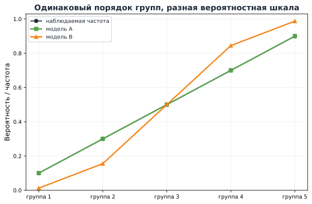

*Рисунок 14. Обе модели располагают группы в одном и том же порядке, но численные значения вероятностей различаются.*

С точки зрения ранжирования эти две модели эквивалентны: если один объект стоял выше другого у модели A, он стоит выше и у модели B. Поэтому их ROC-AUC и AP на одной и той же выборке совпадут.

Но вероятностный смысл различается. В последней группе событие происходит примерно в 90% случаев. Прогноз 0.90 согласуется с этой частотой, а 0.9878 заметно завышает уверенность. Значит, **качество ранжирования и качество вероятностной шкалы — разные свойства**.

Числа во втором столбце модели B специально выбраны так, чтобы сохранить порядок и сделать прогнозы более крайними. Способ их построения здесь не важен: нам нужен только контрпример, показывающий, что одинаковый порядок ещё не делает вероятности одинаково содержательными.

## 10. Калибровка вероятностей

### 10.1. Что означает «0.8 ведёт себя как 80%»

Представим, что модель выдала прогноз около 0.8 для большого числа объектов. Если среди них положительное событие происходит примерно в 80% случаев, такая часть прогнозов выглядит хорошо согласованной с наблюдаемой частотой.

Для контраста:

- прогноз около 0.8 и фактическая частота около 0.8 — хорошее согласование;
- прогноз около 0.8 и частота около 0.5 — модель завышает вероятность события;
- прогноз около 0.8 и частота около 0.95 — модель занижает вероятность события.

Такое соответствие численных прогнозов наблюдаемым частотам называется **калибровкой вероятностей** (*probability calibration*).

Формально идею можно записать как

```math
\boxed{
P\bigl(Y=1\mid \widehat p(X)=s\bigr)=s
}
\qquad\text{(23)}
```

для соответствующих значений $s$. Эта формула — компактная запись уже понятной идеи: среди объектов с прогнозом $s$ доля положительных исходов должна быть близка к $s$.

Здесь важно не перепутать калибровку с более сильным утверждением. В идеальном вероятностном описании нас интересует условная вероятность

```math
p^*(x)=P(Y=1\mid X=x).
```

Но для одного конкретного объекта мы наблюдаем только один исход $y=0$ или $y=1$. По этому единственному исходу нельзя проверить, была ли его условная вероятность именно, например, 0.73. Это не мешает оценивать **качество вероятностных прогнозов на множестве наблюдений**: калибровка, log loss и оценка Брайера используют для этого разные свойства прогнозов.

Калибровка проверяет одно из таких свойств: **согласуются ли численные прогнозы модели с частотами событий среди объектов, получивших похожие прогнозы**.

### 10.2. Калибровочная диаграмма

На практике модель редко выдаёт много совершенно одинаковых чисел. Поэтому на **отложенной оценочной выборке** близкие прогнозы объединяют в интервалы. Пусть $B_k$ — множество объектов этой выборки, чьи предсказанные вероятности попали в $k$-й интервал. Для него вычисляют

```math
\overline p_k
=\frac1{|B_k|}\sum_{i\in B_k}\widehat p_i,
\qquad
\overline y_k
=\frac1{|B_k|}\sum_{i\in B_k}y_i.
\qquad\text{(24)}
```

Первая величина — средняя предсказанная вероятность в группе, вторая — **наблюдаемая доля положительных исходов среди объектов этой же группы оценочной выборки**.

Затем наносят точки

```math
(\overline p_k,\overline y_k).
```

Так получается **калибровочная диаграмма** (*reliability diagram*).

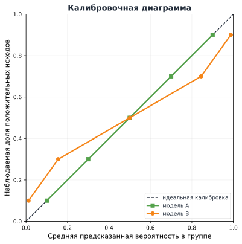

*Рисунок 15. Диагональ соответствует совпадению средней предсказанной вероятности с наблюдаемой частотой события. Точки ниже диагонали означают завышение вероятности положительного исхода, точки выше — занижение.*

Диагональ $y=x$ соответствует идеальному совпадению. Если точка лежит ниже диагонали, средняя предсказанная вероятность выше наблюдаемой частоты. Если точка выше диагонали, модель, наоборот, недооценивает частоту события.

Калибровочная диаграмма сама является оценкой по конечной выборке. Её вид зависит от числа наблюдений, границ интервалов и случайной изменчивости исходов. Особенно осторожно нужно читать области, где объектов мало.

### 10.3. Калибровка и информативность вероятностей — разные свойства

Пусть положительный класс составляет 10% выборки. Модель A выдаёт каждому объекту одну и ту же вероятность

```math
\widehat p=0.1.
```

Если среди этих объектов действительно около 10% положительных исходов, такой прогноз хорошо откалиброван: «0.1» согласуется с наблюдаемой частотой.

Но модель A не различает объекты вообще.

Теперь представим модель B. Половине объектов она выдаёт 0.02, и в этой группе событие действительно происходит примерно в 2% случаев. Другой половине она выдаёт 0.18, и там событие происходит примерно в 18% случаев. Средняя доля положительных всё ещё равна 10%, и модель B тоже хорошо откалибрована.

Однако модель B сообщает существенно больше: она различает группы с низкой и высокой вероятностью события.

Отсюда важное различие:

- **калибровка** спрашивает, соответствуют ли заявленные вероятности наблюдаемым частотам;
- качество вероятностного прогноза в целом также зависит от того, умеет ли модель назначать **разные содержательные вероятности разным объектам**.

Именно поэтому одной калибровочной диаграммы недостаточно для сравнения вероятностных моделей.

### Итак

Калибровочная диаграмма нужна не для выбора порога и не для оценки порядка объектов. Она отвечает на содержательный вопрос: **можно ли использовать числа, выдаваемые моделью, именно как вероятности?** По диаграмме можно увидеть диапазоны, где модель систематически завышает или занижает вероятность события. Это особенно важно, если вероятность входит в расчёт ожидаемой стоимости решения, передаётся другой системе или сообщается человеку как численная вероятность события.

При этом калибровочная диаграмма остаётся диагностическим графиком, а не одним итоговым числом для сравнения моделей. Для численного сравнения вероятностных прогнозов нам понадобятся log loss и оценка Брайера.

## 11. Как одним числом оценить вероятностные прогнозы

Калибровочная диаграмма полезна как диагностика: она показывает, в каких диапазонах вероятности систематически завышены или занижены. Но для сравнения двух вероятностных моделей часто хочется получить и одно итоговое число.

### 11.1. Log loss: знакомая функция потерь в новой роли

В Week 4 мы уже вводили **log loss одного объекта**:

```math
\boxed{
L(y_i,\widehat p_i)
=-y_i\log\widehat p_i-(1-y_i)\log(1-\widehat p_i).
}
\qquad\text{(25)}
```

На обучающей выборке среднее этих величин образовывало эмпирический риск — целевую функцию логистической регрессии:

```math
R_n(\beta)=\frac1n\sum_{i=1}^{n}L(y_i,p_i).
```

Теперь роль данных другая. Берём **отложенную оценочную выборку**, на которой модель не подбиралась, вычисляем log loss для каждого прогноза и усредняем:

```math
\boxed{
\mathrm{LogLoss}
=\frac1N\sum_{i=1}^{N}L(y_i,\widehat p_i).
}
\qquad\text{(26)}
```

То есть математический объект знакомый, но теперь средняя log loss используется не для обучения, а для **оценки уже полученных вероятностных прогнозов**.

Напомним её поведение. Если событие произошло ($y=1$), вклад равен

```math
-\log\widehat p.
```

Например,

```math
-\log0.9\approx0.105,
\qquad
-\log0.01\approx4.605.
```

Правильный уверенный прогноз получает малый штраф, а уверенная ошибка — очень большой.

Почему log loss вообще подходит для оценки вероятности? На прошлой неделе мы видели её связь с Bernoulli likelihood: в идеальной вероятностной постановке ожидаемая log loss минимальна, когда модель выдаёт истинную условную вероятность события. Поэтому она поощряет не просто правильный класс, а содержательный численный вероятностный прогноз.

Практически log loss удобно использовать так:

- сравнивать несколько вероятностных моделей **на одной и той же оценочной выборке** — меньше лучше;
- сравнивать модель с простым вероятностным базовым вариантом, например прогнозом одной и той же базовой частоты класса для всех объектов;
- особенно внимательно учитывать уверенные ошибки: они сильно ухудшают log loss.

Само число log loss редко имеет столь же очевидный прикладной смысл, как, например, recall 80%. Поэтому оно особенно полезно **в сравнении**: дала ли модель лучший вероятностный прогноз, чем другая модель или простой базовый вариант?

### 11.2. Оценка Брайера: квадратичная ошибка вероятности

Второй способ — **оценка Брайера** (*Brier score*):

```math
\boxed{
\mathrm{Brier}
=\frac1N\sum_{i=1}^N(y_i-\widehat p_i)^2.
}
\qquad\text{(27)}
```

Это буквально средняя квадратичная ошибка между бинарным исходом $y_i\in\lbrace 0,1\rbrace $ и предсказанной вероятностью $\widehat p_i$.

Связь с уже знакомой регрессией не случайна. Для бинарного $Y$

```math
E[Y\mid X=x]=P(Y=1\mid X=x).
```

Поэтому квадратичная ошибка также естественно оценивает вероятностный прогноз. В используемой здесь нормировке Brier лежит между 0 и 1, и меньшие значения лучше.

### 11.3. Когда смотреть на log loss/Brier, а когда — на калибровку

Эти инструменты отвечают на разные вопросы.

**Калибровочная диаграмма** — диагностический график. Она позволяет спросить, например:

> среди объектов с прогнозом около 0.7 событие действительно происходит примерно в 70% случаев?

Она показывает **где именно** вероятностная шкала завышена или занижена.

**Log loss и Brier** дают одно число по всем объектам сразу. Они подходят для сравнения вероятностных прогнозов моделей. Две модели могут быть обе хорошо откалиброваны, но одна выдавать почти всем базовую частоту, а другая полезно различать объекты с низкой и высокой вероятностью события. Вторая модель содержит больше информации и может получить лучшую log loss или Brier, хотя обе проходят проверку калибровки.

Поэтому, если численные вероятности важны в прикладной задаче, полезно сочетать два взгляда:

- log loss или Brier — **для итогового сравнения вероятностных прогнозов**;
- калибровочную диаграмму — **для диагностики вероятностной шкалы по диапазонам**.

Ни один из этих инструментов не заменяет анализ решения при выбранном пороге.

## 12. Что делать, если вероятности плохо откалиброваны

Существуют методы повторной калибровки: они преобразуют исходные числовые оценки модели так, чтобы полученная вероятностная шкала лучше согласовывалась с наблюдаемыми частотами.

Здесь достаточно знать два принципа. Во-первых, такая процедура не должна оцениваться на тех же прогнозах, по которым она подбиралась. Во-вторых, если преобразование меняет числовую шкалу вероятностей, старое численное значение порога не обязано оставаться подходящим.

Подробные методы повторной калибровки не входят в обязательный материал этой недели. К ним можно вернуться позже, если они понадобятся в практическом эксперименте.

## 13. Три разных вопроса о качестве классификатора

Теперь можно собрать всю лекцию в одну схему.

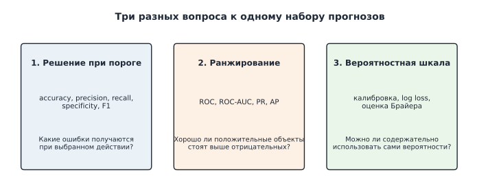

*Рисунок 16. Один набор прогнозов можно оценивать на трёх уровнях: качество решения при выбранном пороге, качество ранжирования и качество вероятностной шкалы.*

### 13.1. Качество решения при выбранном пороге

Если системе нужно выдать конкретную метку или действие для каждого объекта, важны матрица ошибок и показатели, зависящие от порога:

- accuracy;
- precision;
- recall;
- specificity;
- F1 и другие прикладные показатели.

Здесь ключевой вопрос: **какие последствия имеют FP и FN при выбранном действии?**

### 13.2. Качество ранжирования

Если нужно упорядочить объекты по вероятности события или сравнить модели до выбора конкретного порога, полезны:

- ROC и ROC-AUC;
- PR-кривая;
- Average Precision.

Здесь ключевой вопрос: **насколько хорошо модель ставит положительные объекты выше отрицательных и какие рабочие режимы получаются при изменении порога?**

### 13.3. Качество вероятностной шкалы

Если численное значение вероятности используется само по себе, нужно отдельно смотреть на:

- калибровочную диаграмму;
- log loss;
- оценку Брайера.

Калибровка отвечает на вопрос о соответствии численной шкалы наблюдаемым частотам, а log loss и Brier позволяют сравнивать вероятностные прогнозы одним числом.

Ни одна из этих групп показателей не заменяет две другие. Высокая ROC-AUC не гарантирует подходящего решения при конкретном пороге. Высокая precision может сопровождаться низким recall. Хорошая калибровка не означает, что модель умеет полезно различать объекты по вероятности события. А низкая log loss сама по себе не выбирает действие, которое следует предпринять.

### 13.4. Минимальный протокол для новой задачи

После этой недели для новой бинарной задачи достаточно последовательно ответить на несколько вопросов:

1. Что означает положительный класс и какое действие последует за положительным прогнозом?
2. Какие последствия имеют FP и FN?
3. Нужен ли прежде всего конкретный порог, качественное ранжирование или содержательные численные вероятности?
4. Какие показатели отвечают этому вопросу и чего они не показывают?
5. На каких данных выбирается порог и где выполняется независимая финальная оценка?
6. Если численные вероятности важны, согласуется ли их шкала с наблюдаемыми частотами?

Хороший эксперимент не обязан вычислять все известные метрики. Важно заранее понимать, **какой вопрос задаёт каждая из выбранных величин** и почему этот вопрос связан с реальным использованием модели.

## Вопросы для самопроверки

1. Почему изменение порога после обучения логистической регрессии не меняет её коэффициенты и вероятностные прогнозы? Что при этом меняется?
2. При $t=0.5$ получены $TP=40$, $FP=10$, $FN=20$, $TN=930$. Вычислите accuracy, precision, recall, specificity и F1. Как specificity связана с recall нулевого класса?
3. Классификатор на выборке с долей положительных 1% всегда предсказывает ноль. Почему accuracy 99% не является достаточным свидетельством качества задачи обнаружения положительного класса? Чему равна balanced accuracy такого классификатора?
4. Приведите два приложения, в которых одно и то же значение recall может считаться приемлемым и неприемлемым. Какие свойства последующего действия определяют различие?
5. Что происходит с recall при увеличении порога? Почему precision при этом может изменяться в обе стороны?
6. В каких границах лежит F1 и когда имеет смысл использовать её для сравнения моделей или порогов? Чем $F_\beta$ отличается от явной модели стоимости FP и FN?
7. Почему не следует выбирать порог по обучающей выборке? Почему выбор порога по тестовой выборке лишает её роли независимой финальной проверки?
8. Для нашего набора объясните, почему при снижении порога положительный объект даёт вертикальный шаг ROC на $1/5$, а отрицательный — горизонтальный шаг на $1/7$.
9. Почему при случайном порядке объектов ROC в среднем идёт вдоль диагонали $TPR=FPR$?
10. Что означает ROC-AUC = 0.8 в терминах случайной положительно-отрицательной пары? Почему это не означает accuracy 80%?
11. Пусть $TPR=0.8$ и $FPR=0.05$. Почему precision будет различаться на оценочных выборках с 20% и 1% положительных объектов?
12. Почему базовый уровень PR-кривой для случайного порядка равен доле положительного класса?
13. Как Average Precision получается из ранжированного списка? Почему `average_precision_score` и трапецеидальная площадь под линейно соединённой PR-кривой могут не совпадать?
14. Что означает утверждение «модель хорошо откалибрована»? Почему один исход отдельного объекта не позволяет непосредственно проверить его условную вероятность?
15. Могут ли две модели быть обе хорошо откалиброваны, но заметно различаться по качеству вероятностного прогноза? Приведите пример.
16. Как связаны log loss одного объекта и эмпирический риск из Week 4 с log loss как показателем качества на отложенной выборке?
17. Когда полезнее смотреть на калибровочную диаграмму, а когда — на log loss или оценку Брайера?

### Дополнительная задача

Рассмотрим **одну фиксированную оценочную выборку** из $N$ объектов. Пусть в ней $N_+$ положительных объектов, и их доля равна

```math
r=\frac{N_+}{N}.
```

Для некоторого порога на этой же выборке известны

```math
P=\mathrm{Precision},
\qquad
R=\mathrm{Recall}.
```

1. Выразите соответствующие ROC-координаты $TPR$ и $FPR$ через $P$, $R$ и $r$.
2. Объясните, почему без знания $r$ одной PR-точки $(R,P)$ недостаточно для восстановления ROC-точки. Какая дополнительная информация вместе с PR-кривой позволяет восстановить ROC-кривую на той же фиксированной выборке?

**Подсказка.** Сначала выразите $TP$ через recall и число положительных объектов, затем $FP$ через precision.

## Что почитать дальше

- Дьяконов А. Г. **Машинное обучение и анализ данных**, главы о показателях качества бинарной классификации, скоринговых функциях и ROC/PR-кривых. Хороший русскоязычный источник для повторения всей логики этой недели и более подробного разбора кривых. [Официальный репозиторий книги](https://github.com/Dyakonov/MLDM_BOOK).
- **Machine Learning in Python with scikit-learn MOOC — Classification metrics.** Практический и доступный разбор матрицы ошибок, precision/recall, дисбаланса классов и кривых качества. [Материал](https://inria.github.io/scikit-learn-mooc/python_scripts/metrics_classification.html).
- **scikit-learn User Guide.** Полезный справочник по [метрикам и оцениванию](https://scikit-learn.org/stable/modules/model_evaluation.html), [выбору порога](https://scikit-learn.org/stable/modules/classification_threshold.html) и [калибровке вероятностей](https://scikit-learn.org/stable/modules/calibration.html).
- Соколов Е. А. **Машинное обучение 1**, семинары 5–6. Более математический разбор ROC-AUC, попарной интерпретации и калибровки вероятностей. [Материалы курса](https://github.com/esokolov/ml-course-hse/tree/master/ml1-2026-spring/seminars).
- Hardt M., Recht B. **Patterns, Predictions, and Actions — Decision Making.** Полезное продолжение темы связи прогноза, стоимости ошибок и последующего действия. [Открытая книга](https://mlstory.org/decision.html).
- Fawcett T. **An Introduction to ROC Analysis**. Pattern Recognition Letters, 2006. [DOI: 10.1016/j.patrec.2005.10.010](https://doi.org/10.1016/j.patrec.2005.10.010). Подробная геометрия ROC-пространства и интерпретация рабочих режимов.
- Davis J., Goadrich M. **The Relationship Between Precision-Recall and ROC Curves**. ICML, 2006. Полезное углубление в связь ROC и PR и в вопрос интерполяции между точками PR-кривой. [Открытая версия](https://mlanthology.org/icml/2006/davis2006icml-relationship/).
- Saito T., Rehmsmeier M. **The Precision-Recall Plot Is More Informative than the ROC Plot When Evaluating Binary Classifiers on Imbalanced Datasets**. PLOS ONE, 2015. [Открытая статья](https://doi.org/10.1371/journal.pone.0118432). Дополнительный взгляд на поведение ROC и PR при редком положительном классе.
- Murphy K. P. **Probabilistic Machine Learning: An Introduction**, Chapter 5, *Decision Theory*. Более широкая вероятностная рамка для связи прогноза, стоимости ошибок и принятия решения. [Официальная страница книги](https://probml.github.io/pml-book/).
