# Линейная модель, функция потерь и оптимизация

Линейная регрессия — одна из базовых моделей для прогнозирования числовой величины. Её удобно использовать не только как самостоятельный метод, но и как пример, на котором хорошо видны основные элементы обучения модели: как задаётся семейство допустимых зависимостей, как выбираются параметры, как оценивается качество прогнозов и каким способом решается возникающая вычислительная задача.

Начнём с метода наименьших квадратов и его аналитического решения, а затем рассмотрим, как эта задача решается численно и какие свойства данных могут влиять на полученные коэффициенты.

## 1. Линейная модель и задача МНК

В задаче регрессии объект описывается признаками $x\in\mathcal X$, а целевая переменная принимает числовые значения $y\in\mathbb R$. По обучающей выборке

```math
D=\lbrace (x_i,y_i)\rbrace _{i=1}^n
```

строят функцию $f:\mathcal X\to\mathbb R$, которая выдаёт числовой прогноз для нового объекта.

Самый простой ориентир — **константная модель**:

```math
f_c(x)=c.
```

Если качество измерять суммой квадратов ошибок, лучший постоянный прогноз равен выборочному среднему $\bar y$. Такая модель задаёт простую точку отсчёта, с которой можно сравнивать модели, использующие признаки.

Теперь разрешим прогнозу зависеть от признаков.

Для одного числового признака линейная модель имеет вид

```math
f_\beta(x)=\beta_0+\beta_1x.
\qquad\text{(1)}
```

Свободный член $\beta_0$ задаёт уровень прогноза при $x=0$, а коэффициент $\beta_1$ — изменение прогноза при увеличении признака на единицу.

Для $p$ признаков получаем множественную линейную регрессию:

```math
f_\beta(x)
=
\beta_0+\beta_1x_1+\dots+\beta_px_p,
\qquad
\beta=(\beta_0,\ldots,\beta_p)^\top.
\qquad\text{(2)}
```

Пока $\beta$ — произвольный набор параметров из семейства линейных моделей. После обучения появится конкретная оценка $\hat\beta$ и обученная функция

```math
\hat f=f_{\hat\beta}.
```

Для объекта $i$ прогноз и остаток равны

```math
\hat y_i=\hat f(x_i),
\qquad
r_i=y_i-\hat y_i.
\qquad\text{(3)}
```

Положительный остаток означает, что модель недооценила наблюдаемое значение, отрицательный — что переоценила.


*Рисунок 1. Константная и линейная модели задают разные прогнозы. Вертикальные отрезки на правой панели — остатки.*

### 1.1. Метод наименьших квадратов

Само семейство линейных моделей ещё не говорит, какие коэффициенты следует выбрать. Нужно правило, которое позволит сравнивать разные значения параметров.

Метод наименьших квадратов (*ordinary least squares*, OLS) выбирает коэффициенты, минимизируя сумму квадратов остатков:

```math
(\hat\beta_0,\hat\beta_1)
=
\arg\min_{\beta_0,\beta_1}
\mathrm{RSS}(\beta_0,\beta_1),
```

где

```math
\mathrm{RSS}(\beta_0,\beta_1)
=
\sum_{i=1}^n
\left(
y_i-\beta_0-\beta_1x_i
\right)^2.
\qquad\text{(4)}
```

Здесь уже полезно разделять две вещи:

- формула (1) задаёт **семейство моделей**;
- формула (4) задаёт **правило выбора параметров** внутри этого семейства.

### 1.2. Короткое напоминание аналитического решения

Для OLS с одним признаком решение можно получить аналитически. Поскольку RSS — дифференцируемая квадратичная функция коэффициентов, в точке минимума её частные производные обращаются в ноль:

```math
\frac{\partial RSS}{\partial\beta_0}=0,
\qquad
\frac{\partial RSS}{\partial\beta_1}=0.
```

После дифференцирования получаем систему

```math
\begin{cases}
\displaystyle
\sum_{i=1}^{n}
\left(
y_i-\hat\beta_0-\hat\beta_1x_i
\right)=0,\\
\displaystyle
\sum_{i=1}^{n}
x_i
\left(
y_i-\hat\beta_0-\hat\beta_1x_i
\right)=0.
\end{cases}
\qquad\text{(5)}
```

При наличии вариации признака,

```math
\sum_i(x_i-\bar x)^2>0,
```

решение имеет вид

```math
\boxed{
\hat\beta_1
=
\frac{
\sum_i(x_i-\bar x)(y_i-\bar y)
}{
\sum_i(x_i-\bar x)^2
}
},
\qquad
\boxed{
\hat\beta_0
=
\bar y-\hat\beta_1\bar x
}.
\qquad\text{(6)}
```

Для нескольких признаков удобно собрать данные в матрицу. Пусть строки $X_{\mathrm{raw}}\in\mathbb R^{n\times p}$ содержат значения признаков. Если свободный член включён в матрицу явно, получаем

```math
X=
\begin{pmatrix}
1 & x_{11} & \cdots & x_{1p}\\
1 & x_{21} & \cdots & x_{2p}\\
\vdots & \vdots & \ddots & \vdots\\
1 & x_{n1} & \cdots & x_{np}
\end{pmatrix},
\qquad
\beta=
\begin{pmatrix}
\beta_0\\
\beta_1\\
\vdots\\
\beta_p
\end{pmatrix}.
```

Тогда все прогнозы записываются одной формулой:

```math
\hat y=X\hat\beta,
```

а вектор остатков равен

```math
r=y-X\hat\beta.
\qquad\text{(7)}
```

Задача МНК принимает компактный вид

```math
\hat\beta
\in
\arg\min_{\beta}
\|y-X\beta\|_2^2.
\qquad\text{(8)}
```

Поскольку

```math
\|y-X\beta\|_2^2
=
\sum_{i=1}^{n}
\left(
y_i-(X\beta)_i
\right)^2,
```

это та же сумма квадратов остатков, записанная сразу для всей выборки.

Условие минимума приводит к системе **нормальных уравнений**

```math
X^\top X\hat\beta=X^\top y.
\qquad\text{(9)}
```

Если столбцы $X$ линейно независимы, матрица $X^\top X$ обратима и решение можно записать как

```math
\hat\beta
=
(X^\top X)^{-1}X^\top y.
\qquad\text{(10)}
```

Формула (10) описывает аналитическое решение задачи МНК. Однако аналитическая запись решения и способ его вычисления на компьютере — не одно и то же.

## 2. Как МНК решается на практике

На первый взгляд формула (10) сразу подсказывает алгоритм:

1. вычислить $X^\top X$;
2. найти $(X^\top X)^{-1}$;
3. умножить результат на $X^\top y$.

Для численных вычислений такой путь обычно не является лучшим.

Во-первых, явное обращение матрицы не требуется, если конечная цель — решить систему уравнений. Во-вторых, переход от $X$ к $X^\top X$ может усилить численные проблемы: плохо различимые направления в исходной матрице становятся ещё хуже различимыми после такого преобразования.

Поэтому задачу

```math
\min_\beta \|y-X\beta\|_2^2
\qquad\text{(11)}
```

обычно решают напрямую с помощью методов численной линейной алгебры.

Один из основных подходов основан на **матричных разложениях**. Идея состоит в том, чтобы представить исходную матрицу в форме, с которой задача решается устойчивее и без явного вычисления обратной матрицы.

Например, при полном столбцовом ранге можно использовать QR-разложение

```math
X=QR,
```

где столбцы $Q$ ортонормированы, а $R$ — верхнетреугольная матрица. Тогда least-squares-задача сводится к более простой системе для $R$.

Другой важный инструмент — сингулярное разложение:

```math
X=U\Sigma V^\top.
```

Оно особенно удобно, когда матрица имеет линейно зависимые или почти линейно зависимые столбцы: величины на диагонали $\Sigma$ показывают, какие направления данных определяются хорошо, а какие — плохо.

В NumPy для решения least-squares-задачи есть функция [`numpy.linalg.lstsq`](https://numpy.org/doc/stable/reference/generated/numpy.linalg.lstsq.html):

```python
beta_hat, residuals, rank, singular_values = np.linalg.lstsq(
    X,
    y,
    rcond=None,
)
```

Она принимает матрицу $X$ и вектор $y$ и возвращает решение задачи

```math
\min_\beta \|y-X\beta\|_2.
```

Кроме самих коэффициентов функция возвращает диагностическую информацию: сумму квадратов остатков в тех случаях, когда она определяется в соответствующем формате, ранг матрицы и её сингулярные числа.

Функции `numpy.linalg` используют низкоуровневые реализации стандартных алгоритмов линейной алгебры из BLAS и LAPACK. Пользователю при этом не требуется самостоятельно выбирать последовательность элементарных матричных операций.

Если минимум единственный, `lstsq` возвращает соответствующий вектор коэффициентов, соответствующий аналитическому решению. Если же разных векторов $\beta$ с минимальной ошибкой несколько, функция возвращает среди них решение с наименьшей евклидовой нормой:

```math
\|\hat\beta\|_2
=
\min_{\beta\in\mathcal S}\|\beta\|_2,
```

где $\mathcal S$ — множество всех решений, минимизирующих ошибку.

Это свойство становится особенно важным, когда признаки линейно зависимы.

Для работы в стиле scikit-learn ту же задачу можно записать через стандартный интерфейс модели:

```python
from sklearn.linear_model import LinearRegression

model = LinearRegression()
model.fit(X_train, y_train)

y_pred = model.predict(X_test)
```

После обучения найденные коэффициенты доступны как

```python
model.coef_
model.intercept_
```

Такой интерфейс отделяет постановку задачи от деталей её численного решения. Мы задаём данные и семейство линейных моделей, вызываем `fit`, а выбор конкретной вычислительной процедуры остаётся частью реализации.

## 3. Мультиколлинеарность

Вычислительная процедура может корректно вернуть конкретный вектор коэффициентов даже тогда, когда сами данные не позволяют однозначно определить эти коэффициенты. Число в `model.coef_` ещё не означает, что соответствующий эффект однозначно восстановлен из данных.

Здесь важно различать две возможные цели.

Если основная задача — **получать прогнозы**, может оказаться достаточно того, что разные наборы коэффициентов дают практически одинаковые значения $\hat y$.

Если же нас интересуют **сами коэффициенты**, их статистическая интерпретация и классические выводы линейной модели, то устойчивость и идентифицируемость параметров становятся принципиальными. В частности, для стандартной постановки теоремы Гаусса—Маркова требуется, чтобы параметры линейной модели были однозначно определены матрицей признаков.

### 3.1. Точная мультиколлинеарность

Пусть один признак точно выражается через другой:

```math
x_2=2x_1.
```

Рассмотрим модель

```math
\hat y
=
\beta_0+\beta_1x_1+\beta_2x_2.
```

Изменим коэффициенты следующим образом:

```math
\beta'_1=\beta_1-2t,
\qquad
\beta'_2=\beta_2+t.
```

Тогда

```math
\begin{aligned}
\beta'_1x_1+\beta'_2x_2
&=
(\beta_1-2t)x_1+(\beta_2+t)2x_1\\
&=
\beta_1x_1+\beta_2x_2.
\end{aligned}
```

Коэффициенты изменились, а прогнозы — нет.

Следовательно, задача МНК имеет несколько наборов коэффициентов с одинаковым значением ошибки. Данные определяют прогнозы, но не позволяют однозначно разделить вклад между $\beta_1$ и $\beta_2$.

```math
\boxed{
\text{одинаковые прогнозы}
\;\not\Rightarrow\;
\text{одинаковые коэффициенты}
}
```

Именно здесь становится полезно знать поведение численного решателя. `np.linalg.lstsq` всё равно вернёт один конкретный ответ: среди всех least-squares-решений будет выбран вектор коэффициентов с наименьшей евклидовой нормой.

Это правило делает ответ вычислительно определённым, но не создаёт новую информацию в данных. Полученный набор коэффициентов нельзя интерпретировать так, будто выборка сама однозначно указала именно на него.

### 3.2. Приближённая мультиколлинеарность

В реальных данных точное равенство встречается редко. Гораздо типичнее ситуация

```math
x_2\approx 2x_1.
```

Теперь решение обычно единственно, но отдельные коэффициенты могут быть чувствительны к небольшим изменениям данных.

Интуитивно данные хорошо определяют некоторый **совместный вклад** двух связанных признаков, но гораздо хуже отвечают на вопрос, какую часть этого вклада следует приписать каждому коэффициенту отдельно.

Поэтому небольшое изменение обучающей выборки может заметно изменить $\hat\beta_1$ и $\hat\beta_2$, тогда как прогнозы

```math
\hat y=X\hat\beta
```

изменятся значительно слабее.


*Рисунок 2. Малое возмущение данных может заметно изменить коэффициенты при почти зависимых признаках, хотя прогнозы меняются значительно слабее.*

Отсюда следует практическое различие:

- для задачи прогнозирования в центре внимания находится качество $\hat y$ на новых данных;
- для содержательной интерпретации коэффициентов важно дополнительно понимать, насколько устойчиво данные определяют каждый параметр.

Один и тот же линейный алгоритм может быть вполне полезным в первой роли и значительно более проблемным во второй.


## 4. Метрики качества регрессии

После обучения модели у нас есть фактические значения

```math
y_1,\ldots,y_m
```

и соответствующие им прогнозы

```math
\hat y_1,\ldots,\hat y_m.
```

Чтобы сравнивать модели и понимать величину их ошибок, используют **метрики качества** — числовые характеристики, вычисляемые по фактическим значениям и прогнозам.

Разные метрики по-разному агрегируют ошибки. Поэтому значение метрики нельзя интерпретировать отдельно от её определения: две модели могут выглядеть почти одинаково по одной мере и заметно различаться по другой.

### 4.1. MSE и RMSE

Средняя квадратичная ошибка (*mean squared error*, MSE) равна

```math
\mathrm{MSE}
=
\frac1m
\sum_{i=1}^{m}
(y_i-\hat y_i)^2.
\qquad\text{(11)}
```

Крупные ошибки получают больший вес из-за возведения в квадрат. Если одна модель допускает редкие, но очень большие промахи, MSE будет особенно чувствительна к таким наблюдениям.

У MSE есть неудобство для интерпретации: её размерность равна квадрату размерности целевой переменной. Например, если прогнозируется цена в тысячах рублей, MSE измеряется в квадрате тысяч рублей.

Корень из MSE,

```math
\mathrm{RMSE}
=
\sqrt{\mathrm{MSE}},
\qquad\text{(12)}
```

возвращает исходную размерность целевой переменной. Поэтому RMSE часто удобнее читать содержательно: значение можно сопоставлять непосредственно с масштабом прогнозируемой величины.

На одной и той же оцениваемой выборке MSE и RMSE упорядочивают модели одинаково, поскольку квадратный корень — строго возрастающая функция.

### 4.2. MAE

Средняя абсолютная ошибка (*mean absolute error*, MAE) равна

```math
\mathrm{MAE}
=
\frac1m
\sum_{i=1}^{m}
|y_i-\hat y_i|.
\qquad\text{(13)}
```

Она тоже измеряется в единицах целевой переменной, но каждая ошибка входит в сумму линейно по модулю.

Сравним два набора ошибок:

```math
A=(2,2,2,2),
\qquad
B=(0,0,0,8).
```

В обоих случаях

```math
\mathrm{MAE}=2.
```

Но

```math
\mathrm{RMSE}_A=2,
\qquad
\mathrm{RMSE}_B=4.
```

MAE одинаково оценивает общий объём абсолютных отклонений, тогда как RMSE сильнее реагирует на то, что ошибка сконцентрирована в одном крупном промахе.

Поэтому вопрос «какая метрика лучше» сам по себе поставлен неправильно. Выбор зависит от того, какие свойства ошибки важны в конкретной задаче.

### 4.3. Коэффициент детерминации \(R^2\)

Коэффициент детерминации сравнивает сумму квадратов ошибок модели с разбросом фактических значений относительно их среднего:

```math
R^2
=
1-
\frac{
\sum_{i=1}^{m}(y_i-\hat y_i)^2
}{
\sum_{i=1}^{m}(y_i-\bar y)^2
}.
\qquad\text{(14)}
```

Здесь $\bar y$ — среднее фактических значений на той выборке, где вычисляется метрика.

Если прогнозы идеальны, числитель равен нулю и

```math
R^2=1.
```

Значение

```math
R^2=0
```

соответствует такому же суммарному квадрату ошибок, как у постоянного прогноза, равного среднему фактических значений этой выборки.

На отложенных данных возможно и

```math
R^2<0.
```

Это означает, что квадрат ошибок модели оказался больше, чем у такой постоянной точки отсчёта.

Для OLS с константой на обучающей выборке $R^2$ связан с классическим разложением вариации и часто интерпретируется через долю объяснённой вариации. Для произвольной модели на новых данных безопаснее воспринимать его как безразмерное сравнение квадратной ошибки модели с разбросом ответов на оцениваемой выборке.

### 4.4. MAPE

Иногда важнее не абсолютный размер ошибки, а её величина относительно фактического значения. Один из распространённых вариантов — средняя абсолютная процентная ошибка (*mean absolute percentage error*, MAPE):

```math
\mathrm{MAPE}
=
\frac1m
\sum_{i=1}^{m}
\left|
\frac{y_i-\hat y_i}{y_i}
\right|.
\qquad\text{(15)}
```

После умножения на $100\%$ результат можно читать в процентах. Например, при $y=100$ и $\hat y=90$ абсолютная процентная ошибка равна $10\%$.

Такое представление удобно, когда одинаковая абсолютная ошибка имеет разный смысл при разных масштабах целевой величины. Ошибка на 10 единиц может быть небольшой при значении 1000 и очень большой при значении 20.

У MAPE есть существенное ограничение: при $y_i=0$ выражение не определено, а при очень малом $|y_i|$ даже небольшая абсолютная ошибка может дать очень большое значение. Поэтому MAPE особенно плохо подходит для задач, где целевая переменная может быть равна нулю или часто находится близко к нему.

### 4.5. Одна метрика не описывает поведение модели полностью

Метрика сводит ошибки по множеству объектов к одному числу. Это удобно для сравнения моделей, но неизбежно скрывает часть структуры.

Две модели могут иметь близкий RMSE, хотя одна систематически ошибается в определённой области признаков, а другая допускает несколько редких крупных промахов. Одно число не показывает, **где** именно возникает ошибка и есть ли в ней закономерность.

Поэтому числовые метрики полезно дополнять анализом остатков.

## 5. Диагностика остатков

Для обученной модели остаток объекта $i$ равен

```math
r_i=y_i-\hat y_i.
\qquad\text{(16)}
```

Остаток показывает не только величину, но и направление ошибки. Набор остатков позволяет проверить, осталась ли после обучения систематическая структура, которую выбранная модель не описала.

Важно отличать остаток от ненаблюдаемой случайной ошибки в статистической модели. Остаток вычисляется по данным после оценки коэффициентов. Он может отражать случайный шум, неверно выбранную форму зависимости, пропущенные признаки, ошибки измерения и другие особенности данных.

### 5.1. Остатки против прогнозов

Один из простых диагностических графиков сопоставляет прогноз $\hat y_i$ и остаток $r_i$ для каждого объекта.


*Рисунок 3. Слева не видно явной систематической структуры. В центре остаётся кривизна. Справа разброс ошибок увеличивается вместе с прогнозом.*

Если точки располагаются вокруг нуля без заметной закономерности, этот график не обнаруживает явной структуры ошибки.

Кривизна — более содержательный сигнал. Она означает, что в данных остаётся зависимость, которую выбранная форма модели систематически не описывает. В такой ситуации увеличение числа итераций численного алгоритма не решит проблему: коэффициенты уже подбираются внутри слишком ограниченного семейства функций.

Например, если зависимость от признака имеет заметную кривизну, вместо

```math
f_\beta(x)=\beta_0+\beta_1x
```

можно рассмотреть

```math
f_\beta(x)
=
\beta_0+\beta_1x+\beta_2x^2.
\qquad\text{(17)}
```


*Рисунок 4. Добавление признака $x^2$ расширяет семейство зависимостей, которое можно описать линейной по коэффициентам моделью.*

Модель (17) нелинейна по исходному признаку $x$, но остаётся линейной по коэффициентам $\beta$. Для метода наименьших квадратов столбец $x^2$ — просто ещё один столбец матрицы признаков.

Таким образом, структура в остатках может указывать не на проблему вычисления коэффициентов, а на необходимость изменить сам набор зависимостей, среди которых выбирается модель.

### 5.2. Остатки против отдельных признаков

График остатков против прогнозов показывает наличие систематической ошибки, но не всегда объясняет, с каким именно признаком она связана.

Поэтому остатки также сопоставляют с отдельными признаками. Если средний остаток заметно меняется вместе с $x_j$, то после обучения в этом признаке осталась предсказуемая структура.

Например, U-образный рисунок может указывать, что одного линейного члена недостаточно для описания зависимости. После изменения набора признаков полезно повторно проверить и числовую метрику, и тот же диагностический график.

Диагностика здесь не даёт автоматического рецепта. Она формулирует гипотезу о том, что именно модель не смогла описать.

### 5.3. Экстраполяция

Даже хорошее качество внутри наблюдаемого диапазона не гарантирует разумного поведения модели далеко за его пределами.


*Рисунок 5. Внутри диапазона наблюдаемых данных разные функциональные формы могут быть близки, а за его пределами — быстро расходиться.*

Если две модели почти одинаково описывают данные внутри обучающего диапазона, числовые метрики могут практически не различаться. Но при экстраполяции прогноз уже определяется тем, какую функциональную форму мы выбрали.

Поэтому качество на наблюдаемых данных проверяет поведение модели прежде всего в похожей области признаков. Далёкая экстраполяция требует дополнительного содержательного обоснования.

Метрики и диагностика отвечают на разные вопросы:

- метрика показывает, **насколько велики ошибки в среднем по выбранному правилу**;
- диагностика помогает увидеть, **есть ли в ошибках систематическая структура**.

Теперь можно точнее разделить несколько компонентов, которые до этого встречались вместе внутри процедуры обучения модели.

## 6. Четыре роли в обучении и оценке модели

Рассмотрим уже знакомую линейную регрессию. Чтобы получить прогнозы, недостаточно написать только формулу

```math
f_\beta(x)=\beta_0+\beta_1x_1+\dots+\beta_px_p.
```

Эта формула задаёт возможные прогнозы при разных значениях коэффициентов, но сама по себе не определяет, какие коэффициенты следует выбрать и как их найти.

Полезно разделять четыре разные роли.

### 6.1. Модель

**Модель** задаёт семейство функций

```math
f_\theta(x),
```

из которого выбирается конкретная зависимость.

Для линейной регрессии параметр $\theta$ — это вектор коэффициентов $\beta$, а семейство состоит из функций, линейных по этим коэффициентам.

Изменение набора признаков меняет семейство допустимых зависимостей. Например, добавление столбца $x^2$ позволяет описывать кривизну, недоступную модели только с $x$.

### 6.2. Функция потерь

Чтобы выбрать одну функцию из семейства, нужно определить, насколько плох каждый отдельный прогноз.

**Функция потерь** (*loss function*)

```math
L(y,\hat y)
```

ставит в соответствие фактическому значению $y$ и прогнозу $\hat y$ числовую цену ошибки.

Метод наименьших квадратов уже использовал один конкретный вариант такого правила: квадрат остатка

```math
L(y,\hat y)
=
(y-\hat y)^2.
\qquad\text{(18)}
```

До этого квадрат ошибки появился у нас внутри формулы RSS. Теперь выделим его как самостоятельный элемент постановки задачи.

### 6.3. Оптимизатор или численный решатель

После выбора правила оценки ошибок возникает вычислительная задача: найти параметры, при которых суммарная ошибка мала.

**Оптимизатор** или **численный решатель** задаёт процедуру поиска этих параметров.

Для OLS мы уже познакомились с `np.linalg.lstsq`, который использует методы численной линейной алгебры для непосредственного решения least-squares-задачи.

Но наличие специального решателя — свойство конкретной задачи. Если изменить правило оценки ошибок или выбрать другую модель, удобного аналитического решения может уже не быть.

### 6.4. Метрика качества

**Метрика качества** оценивает уже полученные прогнозы на выбранном наборе данных.

Например, после обучения модели можно вычислить

```math
\mathrm{RMSE},
\qquad
\mathrm{MAE},
\qquad
R^2
```

на отложенной выборке.

Метрика и правило, использованное при подборе параметров, не обязаны совпадать.

Более того, одна и та же формула может выполнять разные роли. Квадрат ошибки можно использовать при выборе коэффициентов линейной модели, а затем снова вычислить средний квадрат ошибки для уже зафиксированной модели на новых данных.

Различается не формула, а вопрос, на который она отвечает.

Для линейной регрессии рассмотренная до сих пор конструкция выглядит так:

```math
\boxed{
\begin{array}{c}
\text{модель: } f_\beta(x)\\[0.3em]
\text{правило оценки ошибки: } (y-\hat y)^2\\[0.3em]
\text{решатель: least squares}\\[0.3em]
\text{метрики: RMSE,\ MAE,\ }R^2,\ldots
\end{array}
}
```

Следующий шаг — подробнее разобраться со вторым пунктом: как именно правило оценки отдельной ошибки определяет задачу обучения.


## 7. От функции потерь к целевой функции обучения

Функция потерь

```math
L(y_i,\hat y_i)
```

оценивает ошибку одного прогноза. Но параметры модели общие для всей обучающей выборки, поэтому отдельные значения потерь нужно объединить в один критерий.

Пусть модель имеет вид

```math
\hat y_i=f_\theta(x_i).
```

Тогда среднее значение функции потерь по обучающей выборке равно

```math
R_n(\theta)
=
\frac1n
\sum_{i=1}^{n}
L\bigl(y_i,f_\theta(x_i)\bigr).
\qquad\text{(19)}
```

Эту величину называют **эмпирическим риском**. При обучении она играет роль **целевой функции**: параметры выбираются так, чтобы сделать её как можно меньше,

```math
\hat\theta
\in
\arg\min_\theta R_n(\theta).
\qquad\text{(20)}
```

Здесь важно различать два уровня:

- $L(y_i,\hat y_i)$ относится к одному объекту;
- $R_n(\theta)$ объединяет ошибки всей обучающей выборки и зависит от параметров модели.

Для метода наименьших квадратов эта конструкция уже встречалась в знакомом виде. Если

```math
L(y,\hat y)=(y-\hat y)^2,
```

то

```math
R_n(\theta)
=
\frac1n
\sum_{i=1}^{n}
\bigl(y_i-f_\theta(x_i)\bigr)^2.
```

Для линейной модели это MSE на обучающей выборке. RSS отличается от неё только множителем $n$, поэтому обе функции достигают минимума при одних и тех же значениях параметров.

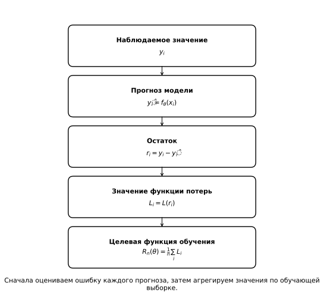

*Рисунок 6. Ошибка отдельного прогноза преобразуется функцией потерь, после чего значения по обучающей выборке объединяются в целевую функцию.*

Одна и та же модель может обучаться по разным функциям потерь. В этом случае семейство допустимых прогнозов не меняется, но меняется правило, по которому среди них выбирается конкретная функция.

### 7.1. MSE: крупные ошибки получают больший вес

Для квадратичной функции потерь

```math
L_{\mathrm{sq}}(r)=r^2,
\qquad
r=y-\hat y.
\qquad\text{(21)}
```

Целевая функция имеет вид

```math
R_{\mathrm{MSE}}(\theta)
=
\frac1n
\sum_{i=1}^{n}
\bigl(y_i-f_\theta(x_i)\bigr)^2.
\qquad\text{(22)}
```

Если модуль остатка увеличился в два раза, его вклад в целевую функцию увеличился в четыре раза:

```math
10^2=100,
\qquad
20^2=400.
```

Поэтому крупные ошибки особенно сильно влияют на параметры, полученные при минимизации MSE.

Это может быть желательным свойством, если большие промахи действительно особенно дороги. Но то же свойство делает решение чувствительным к небольшому числу наблюдений с очень крупными остатками.

Квадратичная функция удобна и с вычислительной точки зрения: она гладкая, а её производная меняется непрерывно,

```math
\frac{d}{dr}r^2=2r.
\qquad\text{(23)}
```

Иногда вместо $r^2$ используют

```math
\frac12r^2.
```

Положительный постоянный множитель не меняет положение минимума, зато производная принимает более компактный вид:

```math
\frac{d}{dr}\frac12r^2=r.
```

### 7.2. MAE: линейная цена величины ошибки

Другой естественный вариант — модуль остатка:

```math
L_{\mathrm{abs}}(r)=|r|.
\qquad\text{(24)}
```

Тогда

```math
R_{\mathrm{MAE}}(\theta)
=
\frac1n
\sum_{i=1}^{n}
\bigl|y_i-f_\theta(x_i)\bigr|.
\qquad\text{(25)}
```

При таком правиле ошибка $20$ ровно вдвое дороже ошибки $10$. Влияние крупного остатка растёт линейно, а не квадратично.

Это различие хорошо видно на простом примере. Для наборов ошибок

```math
A=(2,2,2,2),
\qquad
B=(0,0,0,8)
```

MAE одинакова:

```math
\mathrm{MAE}_A
=
\mathrm{MAE}_B
=
2.
```

Но квадратичный критерий сильнее реагирует на единственную ошибку $8$.

#### Среднее и медиана

Разные функции потерь могут выбирать разные параметры даже для самой простой модели.

Рассмотрим постоянный прогноз

```math
f_c(x)=c.
```

При квадратичной функции потерь минимум достигается в среднем:

```math
\arg\min_c
\sum_{i=1}^{n}
(y_i-c)^2
=
\lbrace \bar y\rbrace .
\qquad\text{(26)}
```

Если вместо квадратов использовать модули,

```math
\arg\min_c
\sum_{i=1}^{n}
|y_i-c|,
\qquad\text{(27)}
```

минимум достигается на медиане выборки; при чётном числе наблюдений минимизатором является весь интервал между двумя центральными значениями.

Интуиция проста. Пока справа от $c$ находится больше наблюдений, чем слева, движение вправо уменьшает суммарное абсолютное расстояние. После прохождения медианы ситуация меняется: слева оказывается не меньше точек, и дальнейшее движение вправо уже не улучшает критерий.

Таким образом,

```math
\boxed{
\text{квадратичная потеря}
\longrightarrow
\text{среднее}
}
```

и

```math
\boxed{
\text{абсолютная потеря}
\longrightarrow
\text{медиана}.
}
```

Функция потерь не просто по-разному оценивает уже полученный прогноз. Она влияет на то, **какой прогноз будет выбран при обучении**.

У MAE есть ещё одно важное отличие от MSE. Для $r\neq0$

```math
\frac{d|r|}{dr}
=
\begin{cases}
-1,&r<0,\\
1,&r>0,
\end{cases}
```

но в точке $r=0$ обычной производной нет. Задача минимизации MAE от этого не становится некорректной, однако методы её решения должны учитывать негладкость функции.

### 7.3. Huber: квадратичный центр и линейные хвосты

MSE и MAE задают два разных отношения к крупным ошибкам. Функция Хубера сочетает оба режима.

Для порога $\delta>0$

```math
L_\delta(r)
=
\begin{cases}
\frac12r^2,
& |r|\le\delta,\\[4pt]
\delta\left(
|r|-\frac12\delta
\right),
& |r|>\delta.
\end{cases}
\qquad\text{(28)}
```

При небольших остатках функция квадратична. После порога $\delta$ её рост становится линейным по $|r|$.

Производная имеет вид

```math
L_\delta'(r)
=
\begin{cases}
r,
& |r|\le\delta,\\
\delta\,\mathrm{sign}(r),
& |r|>\delta.
\end{cases}
\qquad\text{(29)}
```

Поэтому около нуля Huber сохраняет плавное квадратичное поведение, а для крупных остатков модуль наклона перестаёт увеличиваться.

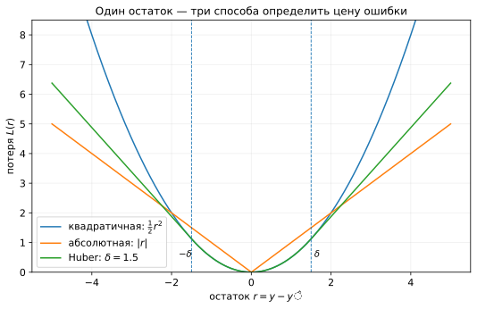

*Рисунок 7. Три разных правила преобразования одного и того же остатка в значение функции потерь.*

Параметр $\delta$ определяет, где заканчивается квадратичная область и начинается линейная.

- Большое $\delta$ делает поведение ближе к MSE.
- Малое $\delta$ раньше переводит крупные остатки в линейный режим.

Посмотрим, что это означает для обученной модели.

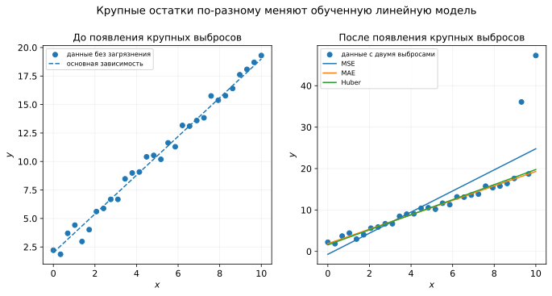

*Рисунок 8. Крупные остатки сильнее сдвигают решение, полученное при минимизации MSE. MAE и Huber слабее реагируют на их величину.*

Здесь важно аккуратно интерпретировать слово «устойчивость». MAE и Huber уменьшают влияние **большой величины остатка**, но это не означает автоматической устойчивости к любому необычному наблюдению. Например, объект с экстремальным значением признака может существенно влиять на линейную модель даже при умеренном остатке.

Выбор функции потерь поэтому связан не с абстрактным вопросом «какая функция лучше», а с содержательным вопросом:

> Какое влияние должны иметь разные типы ошибок при выборе параметров модели?

### 7.4. Одна модель, разные функции потерь

Соберём три варианта для одной и той же модели $f_\theta$:

```math
R_{\mathrm{MSE}}(\theta)
=
\frac1n
\sum_i
\bigl(y_i-f_\theta(x_i)\bigr)^2,
```

```math
R_{\mathrm{MAE}}(\theta)
=
\frac1n
\sum_i
\bigl|y_i-f_\theta(x_i)\bigr|,
```

```math
R_{\mathrm{Huber}}(\theta)
=
\frac1n
\sum_i
L_\delta
\bigl(y_i-f_\theta(x_i)\bigr).
```

Во всех трёх случаях семейство функций $f_\theta$ остаётся тем же. Меняется критерий, определяющий, какие параметры считаются лучшими.

Следовательно,

```math
\boxed{
\text{одна модель}
+
\text{разные функции потерь}
\Longrightarrow
\text{в общем случае разные параметры}
}
```

Это принципиально отличается от ситуации, когда одна и та же задача МНК решается разными численными алгоритмами. Там меняется способ поиска решения, но не само определение оптимальных параметров.

### 7.5. Асимметричные ошибки и квантильная функция потерь

До сих пор все рассмотренные функции одинаково оценивали ошибки противоположных знаков:

```math
L(r)=L(-r).
```

Но в прикладной задаче недопрогноз и перепрогноз могут иметь разные последствия.

Представим, что заранее выбирается запас товара.

- Если спрос оказался выше запаса, часть спроса не удовлетворена.
- Если запас оказался выше спроса, часть товара остаётся непроданной.

Если первая ситуация заметно дороже второй, симметричная функция потерь этого различия не выражает.

Один из способов задать различную цену двум направлениям ошибки — **квантильная функция потерь**. Для $\tau\in(0,1)$ и остатка

```math
r=y-\hat y
```

она записывается как

```math
\rho_\tau(r)
=
\tau\max(r,0)
+
(1-\tau)\max(-r,0).
\qquad\text{(30)}
```

Эквивалентно,

```math
\rho_\tau(r)
=
\begin{cases}
\tau r,
& r\ge0,\\[4pt]
(1-\tau)(-r),
& r<0.
\end{cases}
```

При $\tau=0.5$ обе стороны имеют одинаковый наклон, и функция с точностью до постоянного множителя совпадает с MAE.

Если $\tau>0.5$, положительный остаток — то есть недопрогноз при нашем соглашении $r=y-\hat y$ — получает больший вес, чем перепрогноз такой же величины.

Например, если единица дефицита стоит в четыре раза дороже единицы излишка, можно выбрать $\tau$ из отношения

```math
\frac{\tau}{1-\tau}=4,
```

откуда

```math
\tau=0.8.
```

В этом примере функция потерь непосредственно кодирует асимметрию прикладной стоимости ошибок.

Минимизация квантильной функции потерь связана с оцениванием условных квантилей. Поэтому изменение функции потерь может менять не только чувствительность к крупным остаткам, но и сам статистический объект, который модель стремится предсказывать.

### 7.6. Что определяет выбор функции потерь

Рассмотренные примеры показывают несколько разных свойств, которые можно заложить в критерий обучения.

**MSE** быстро увеличивает цену крупных ошибок и приводит к гладкой целевой функции.

**MAE** увеличивает цену ошибки линейно и слабее реагирует на величину крупных остатков; для постоянного прогноза она выбирает медиану.

**Huber** сочетает квадратичное поведение около нуля с линейным ростом для крупных остатков.

**Квантильная функция потерь** позволяет по-разному оценивать ошибки разных направлений.

Поэтому выбор функции потерь определяет не только числовой масштаб целевой функции. Он влияет на параметры обученной модели и отражает то, какие ошибки считаются существенными в конкретной задаче.

## 8. Целевая функция задаёт задачу, но не алгоритм

После выбора модели и функции потерь задача обучения записывается как

```math
\hat\theta
\in
\arg\min_\theta R_n(\theta).
\qquad\text{(31)}
```

Эта запись определяет, **какие параметры считаются оптимальными**, но не объясняет, как их вычислить.

В методе наименьших квадратов ситуация была особенно удобной. Квадратичная целевая функция и линейная модель приводили к нормальным уравнениям, а для численного решения можно было использовать специализированные методы линейной алгебры.

Для произвольной модели и произвольной функции потерь такой специальной конструкции может не существовать. Тогда возникает общий вычислительный вопрос:

> Если параметры сейчас равны $\theta$, как небольшое изменение параметров повлияет на значение функции $R_n(\theta)$?

Для дифференцируемых функций локальный ответ на этот вопрос дают производные.

## 9. Производная, градиент и градиентный спуск

### 9.1. Одна переменная: производная как локальный наклон

Для функции одной переменной $f(w)$ производная в точке $w$ определяется как

```math
f'(w)
=
\lim_{h\to0}
\frac{f(w+h)-f(w)}{h}.
\qquad\text{(32)}
```

Она описывает локальную скорость изменения функции.

Если

```math
f'(w)>0,
```

то небольшое увеличение $w$ увеличивает $f(w)$. Если

```math
f'(w)<0,
```

то небольшое увеличение $w$ уменьшает значение функции.

Модуль производной характеризует крутизну локального наклона.

Важно, что производная содержит **локальную** информацию. По значению $f'(w)$ в одной точке нельзя автоматически восстановить положение глобального минимума функции.

Рассмотрим простой пример:

```math
f(w)=(w-3)^2.
\qquad\text{(33)}
```

Производная равна

```math
f'(w)=2(w-3).
```

В точке $w=0$

```math
f'(0)=-6.
```

Знак производной показывает, что небольшое движение вправо уменьшит значение функции.

### 9.2. Несколько параметров: частные производные и градиент

Пусть функция зависит от $d$ параметров:

```math
f:\mathbb R^d\to\mathbb R,
```

```math
\theta=
(\theta_1,\ldots,\theta_d)^\top.
```

Для каждой координаты можно рассмотреть частную производную

```math
\frac{\partial f}{\partial\theta_j},
```

которая показывает локальное изменение функции при изменении только параметра $\theta_j$, когда остальные координаты фиксированы.

Все частные производные собираются в один вектор — **градиент**:

```math
\nabla f(\theta)
=
\begin{pmatrix}
\dfrac{\partial f}{\partial\theta_1}\\[0.5em]
\dfrac{\partial f}{\partial\theta_2}\\
\vdots\\
\dfrac{\partial f}{\partial\theta_d}
\end{pmatrix}.
\qquad\text{(34)}
```

Для дифференцируемой функции ненулевой градиент указывает направление наиболее быстрого локального роста функции. Поэтому направление

```math
-\nabla f(\theta)
```

задаёт наиболее быстрое локальное убывание.

Это локальное утверждение: оно описывает поведение функции в небольшой окрестности текущей точки.

### 9.3. Градиент и линии уровня

Для функции двух параметров удобно рассматривать **линии уровня**:

```math
f(\theta_1,\theta_2)=c.
```

Каждая такая линия соединяет точки с одинаковым значением функции.

В точке, где градиент ненулевой, он перпендикулярен гладкой линии уровня. Направление градиента ведёт к локальному увеличению значения функции, а направление антиградиента — к уменьшению.

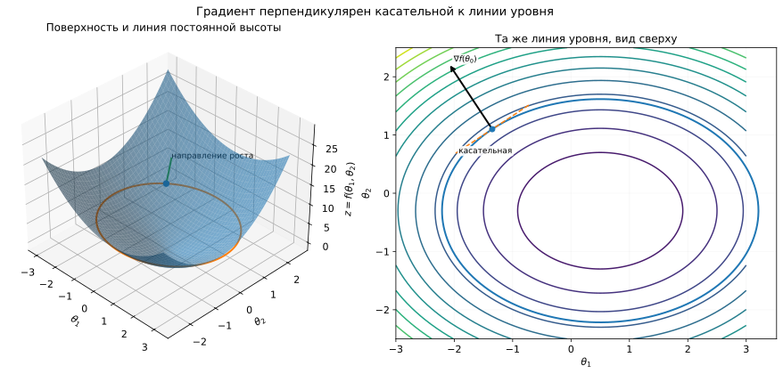

*Рисунок 9. Градиент перпендикулярен линии уровня и указывает направление локального роста функции.*

Эта геометрическая картина подсказывает простой алгоритм: в текущей точке определить направление уменьшения функции, сделать небольшой шаг и повторить вычисление уже в новой точке.

### 9.4. Первый шаг градиентного спуска

Вернёмся к параболе

```math
f(w)=(w-3)^2.
```

Начнём с

```math
w_0=0.
```

В этой точке

```math
f'(w_0)=-6.
```

Выберем положительный коэффициент шага

```math
\eta=0.1.
```

Сделаем шаг в направлении, противоположном производной:

```math
w_1
=
w_0-\eta f'(w_0)
=
0-0.1(-6)
=
0.6.
```

В новой точке производная уже другая:

```math
f'(0.6)=-4.8,
```

поэтому следующий шаг равен

```math
w_2
=
0.6-0.1(-4.8)
=
1.08.
```

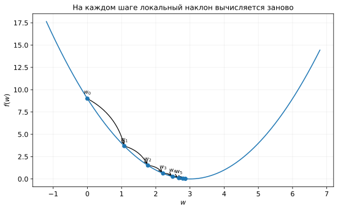

*Рисунок 10. После каждого шага производная вычисляется заново в новой точке.*

Алгоритм не получает координату минимума заранее. На каждом шаге он использует только локальную информацию о форме функции в текущей точке.

### 9.5. Градиентный спуск

Для вектора параметров правило обобщается непосредственно:

```math
\boxed{
\theta^{(t+1)}
=
\theta^{(t)}
-
\eta_t
\nabla f\bigl(\theta^{(t)}\bigr)
}.
\qquad\text{(35)}
```

Здесь

- $t$ — номер итерации;
- $\theta^{(t)}$ — текущие параметры;
- $\nabla f(\theta^{(t)})$ — градиент в текущей точке;
- $\eta_t>0$ — **темп обучения**, определяющий длину шага.

Последовательность действий выглядит так:

1. выбрать начальное значение $\theta^{(0)}$;
2. вычислить градиент в текущей точке;
3. изменить параметры в направлении антиградиента;
4. вычислить градиент уже в новой точке;
5. повторять шаги до выполнения условия остановки.

Если минимизируется целевая функция обучения $R_n(\theta)$, формула принимает вид

```math
\theta^{(t+1)}
=
\theta^{(t)}
-
\eta_t
\nabla R_n\bigl(\theta^{(t)}\bigr).
\qquad\text{(36)}
```

Таким образом, функция потерь определяет целевую функцию, а градиентный спуск задаёт один из способов искать её минимум.

### 9.6. Темп обучения

Темп обучения $\eta_t$ определяет, насколько далеко алгоритм перемещается по направлению антиградиента.

На параболе (33) при постоянном $\eta$ можно увидеть поведение алгоритма точно.

Обозначим расстояние до минимума:

```math
e_t=w_t-3.
```

Поскольку

```math
f'(w_t)=2(w_t-3)=2e_t,
```

обновление

```math
w_{t+1}=w_t-2\eta(w_t-3)
```

даёт

```math
\boxed{
e_{t+1}
=
(1-2\eta)e_t.
}
\qquad\text{(37)}
```

Один коэффициент $1-2\eta$ определяет режим движения.

Если

```math
0<\eta<0.5,
```

то

```math
0<1-2\eta<1.
```

Ошибка положения сохраняет знак и постепенно уменьшается: алгоритм приближается к минимуму с одной стороны.

При

```math
\eta=0.5
```

получаем

```math
e_{t+1}=0,
```

и для этой конкретной параболы минимум достигается за один шаг.

Если

```math
0.5<\eta<1,
```

коэффициент $1-2\eta$ отрицателен, но его модуль меньше единицы. Алгоритм перепрыгивает через минимум, однако амплитуда колебаний постепенно уменьшается.

При

```math
\eta=1
```

имеем

```math
e_{t+1}=-e_t.
```

Алгоритм бесконечно перепрыгивает между двумя равноудалёнными точками.

Наконец, при

```math
\eta>1
```

выполняется

```math
|1-2\eta|>1,
```

и расстояние до минимума растёт.

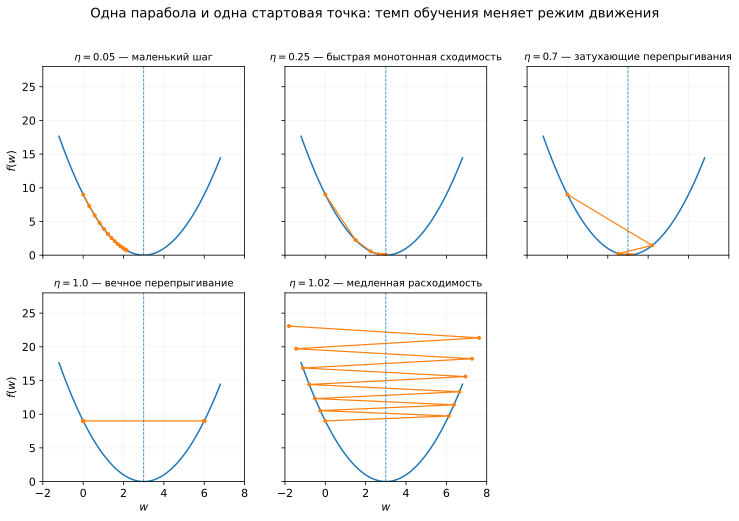

*Рисунок 11. Слишком малый темп обучения замедляет движение, а слишком большой может привести к колебаниям или расходимости.*

Точные границы выше относятся именно к функции $f(w)=(w-3)^2$. Для другой функции безопасный размер шага будет другим.

Поэтому темп обучения — не просто коэффициент, задающий скорость. Он может определять, будет ли итеративный процесс вообще приближаться к минимуму.

### 9.7. Две переменные

В нескольких измерениях траектория градиентного спуска становится особенно наглядной на карте линий уровня.

Рассмотрим функцию

```math
f(w_1,w_2)
=
(w_1-0.6)^2
+
3(w_2+0.4)^2.
\qquad\text{(38)}
```

Её минимум находится в точке

```math
(w_1^*,w_2^*)=(0.6,-0.4).
```

Градиент равен

```math
\nabla f(w_1,w_2)
=
\begin{pmatrix}
2(w_1-0.6)\\
6(w_2+0.4)
\end{pmatrix}.
\qquad\text{(39)}
```

Вторая координата влияет на функцию сильнее: одинаковое отклонение по $w_2$ увеличивает значение функции быстрее, чем такое же отклонение по $w_1$.

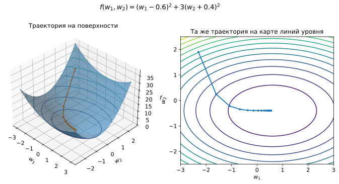

*Рисунок 12. Поверхность и карта линий уровня изображают одну и ту же функцию. Траектория градиентного спуска строится последовательностью локальных шагов.*

На карте линий уровня различие кривизны проявляется в вытянутой форме эллипсов. Градиент перпендикулярен текущей линии уровня, поэтому траектория не обязана двигаться к минимуму по прямой.

### 9.8. Локальная информация и невыпуклость

Градиентный спуск использует локальную информацию. Это особенно важно для функций с несколькими локальными минимумами.

Рассмотрим, например,

```math
\ell(w)
=
(w^2-1)^2+0.9w.
\qquad\text{(40)}
```

У этой функции несколько характерных областей притяжения. Разные начальные точки могут привести градиентный спуск к разным стационарным точкам.

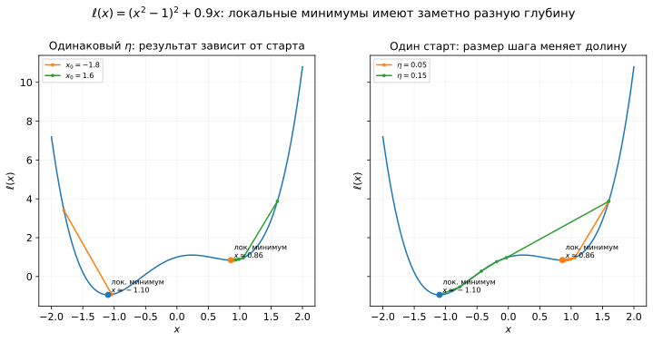

*Рисунок 13. На невыпуклой функции результат итеративного поиска может зависеть от начальной точки.*

Чтобы формально различать такие ситуации, используют понятие **выпуклости**.

Функция $f$ называется выпуклой, если для любых точек $x$, $y$ и любого $\lambda\in[0,1]$

```math
f\bigl(\lambda x+(1-\lambda)y\bigr)
\le
\lambda f(x)+(1-\lambda)f(y).
\qquad\text{(41)}
```

Геометрически график выпуклой функции лежит не выше отрезка, соединяющего две точки её графика.

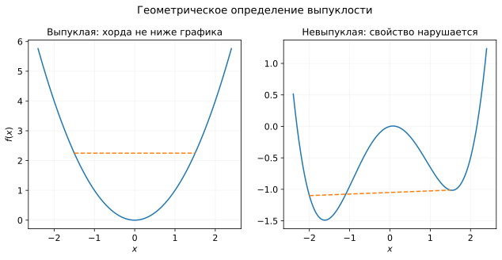

*Рисунок 14. У выпуклой функции локальный минимум одновременно является глобальным; у невыпуклой функции могут существовать разные локальные минимумы.*

Для дифференцируемой выпуклой функции точка с

```math
\nabla f(\theta)=0
```

является глобальным минимумом.

Однако выпуклость не гарантирует единственность минимизатора. Например, при линейной зависимости признаков квадратичная ошибка линейной регрессии может иметь несколько разных наборов коэффициентов с одним и тем же минимальным значением.

### 9.9. Когда остановить итерации

Градиентный спуск строит последовательность

```math
\theta^{(0)},\theta^{(1)},\theta^{(2)},\ldots
```

и на практике необходимо задать правило остановки.

Один из простых вариантов — заранее ограничить число итераций:

```math
t=T.
```

Другой вариант — остановиться, когда значение функции почти перестало меняться:

```math
\left|
f\bigl(\theta^{(t+1)}\bigr)
-
f\bigl(\theta^{(t)}\bigr)
\right|
<
\varepsilon.
\qquad\text{(42)}
```

Можно также контролировать норму градиента:

```math
\left\|
\nabla f\bigl(\theta^{(t)}\bigr)
\right\|_2
<
\varepsilon,
\qquad\text{(43)}
```

или величину изменения параметров:

```math
\left\|
\theta^{(t+1)}
-
\theta^{(t)}
\right\|_2
<
\varepsilon.
\qquad\text{(44)}
```

Эти критерии не эквивалентны. Например, малое изменение параметров может быть следствием слишком малого темпа обучения, а малая норма градиента в невыпуклой задаче сама по себе не говорит, какого типа стационарная точка достигнута.

Поэтому в вычислительных реализациях часто используют одновременно ограничение на число шагов и один или несколько критериев сходимости.

### 9.10. Масштаб и геометрия оптимизации

Поведение градиентного спуска зависит не только от положения минимума, но и от формы целевой функции вокруг него.

Сравним две квадратичные функции:

```math
f_1(w_1,w_2)
=
w_1^2+w_2^2
```

и

```math
f_2(w_1,w_2)
=
w_1^2+100w_2^2.
```

У первой функции линии уровня близки к окружностям. У второй они сильно вытянуты: изменение $w_2$ влияет на значение функции намного сильнее, чем такое же изменение $w_1$.

При одном общем темпе обучения это создаёт конфликт. Шаг, достаточно большой для быстрого движения вдоль пологого направления, может оказаться слишком большим вдоль крутого. В результате траектория начинает двигаться зигзагами поперёк узкой долины.

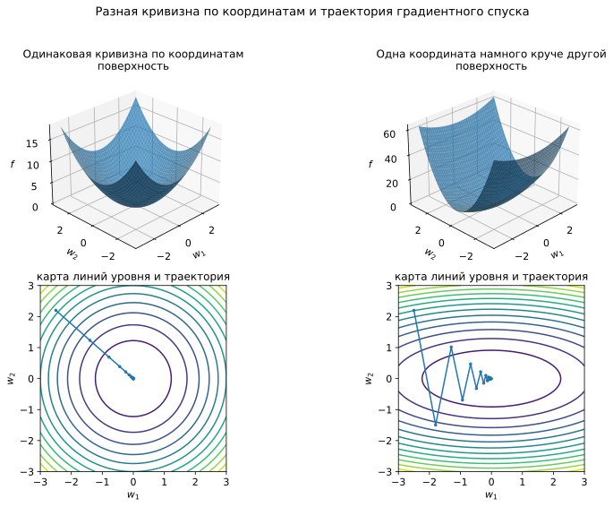

*Рисунок 15. Чем сильнее различается кривизна по направлениям, тем труднее подобрать один общий темп обучения.*

В линейной регрессии похожая ситуация возникает, когда числовые признаки имеют сильно разные масштабы. Например, один признак может изменяться примерно от $0$ до $1$, а другой — от $0$ до $10000$. Тогда одинаковое изменение соответствующих коэффициентов по-разному влияет на прогнозы и на значение квадратичной ошибки.

Стандартизация признака обычно имеет вид

```math
z_j
=
\frac{x_j-\mu_j}{s_j},
\qquad\text{(45)}
```

где $\mu_j$ — среднее значение признака, а $s_j$ — его масштаб, часто стандартное отклонение.

После такого преобразования числовые признаки оказываются в более сопоставимых масштабах, и геометрия целевой функции может стать удобнее для градиентного спуска.

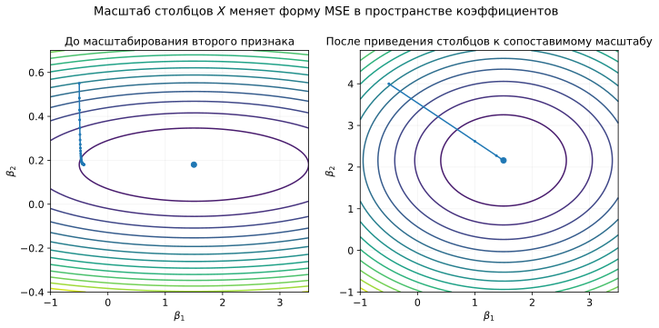

*Рисунок 16. Изменение масштаба признаков может сделать линии уровня MSE менее вытянутыми и упростить движение градиентного метода.*

При этом масштабирование не создаёт новую информацию и не устраняет линейную зависимость признаков. Если

```math
x_2=100x_1,
```

то после линейного масштабирования признаки всё равно останутся линейно зависимыми.

Поэтому две проблемы следует различать:

- **разный масштаб признаков** может ухудшать геометрию задачи для градиентного метода;
- **мультиколлинеарность** связана с тем, насколько однозначно данные определяют отдельные коэффициенты.

Мы получили общий итеративный алгоритм, который использует градиент всей целевой функции. Но если обучающая выборка велика, вычисление полного градиента на каждом шаге может быть дорогим. Это приводит к идее использовать на отдельных итерациях только часть объектов.


## 10. Полный градиент, мини-батч и SGD

Пусть целевая функция обучения записана как среднее потерь по объектам:

```math
R_n(\theta)
=
\frac1n
\sum_{i=1}^{n}
L_i(\theta),
\qquad
L_i(\theta)
=
L\bigl(y_i,f_\theta(x_i)\bigr).
\qquad\text{(46)}
```

Если все слагаемые дифференцируемы, градиент суммы равен сумме градиентов:

```math
\nabla R_n(\theta)
=
\frac1n
\sum_{i=1}^{n}
\nabla L_i(\theta).
\qquad\text{(47)}
```

Формула (47) показывает, что полный градиент целевой функции складывается из вкладов отдельных объектов.

### 10.1. Полный градиент

В обычном градиентном спуске перед каждым обновлением параметров вычисляется выражение (47) по всей обучающей выборке:

```math
\theta^{(t+1)}
=
\theta^{(t)}
-
\eta_t
\nabla R_n\bigl(\theta^{(t)}\bigr).
\qquad\text{(48)}
```

Такой вариант иногда называют **полнопакетным** (*full-batch*) градиентным спуском.

Преимущество очевидно: на каждой итерации используется точный градиент текущей целевой функции обучения.

Но стоимость одного шага растёт вместе с размером выборки. Если для вычисления градиента нужно обработать все $n$ объектов, то каждое обновление параметров требует полного прохода по данным.

При больших $n$ возникает естественная идея: оценивать направление движения не по всей выборке, а по небольшой её части.

### 10.2. Мини-батч

На итерации $t$ выберем подмножество индексов

```math
B_t\subset\lbrace 1,\ldots,n\rbrace .
```

Такое подмножество называют **мини-батчем** (*mini-batch*).

Вместо полного градиента вычислим

```math
g_t
=
\frac1{|B_t|}
\sum_{i\in B_t}
\nabla L_i\bigl(\theta^{(t)}\bigr)
\qquad\text{(49)}
```

и используем его в обновлении:

```math
\theta^{(t+1)}
=
\theta^{(t)}
-
\eta_t g_t.
\qquad\text{(50)}
```

Если мини-батч выбирается случайно и равномерно, то при стандартной схеме выборки $g_t$ является несмещённой оценкой полного градиента:

```math
\mathbb E
\left[
g_t
\mid
\theta^{(t)}
\right]
=
\nabla R_n\bigl(\theta^{(t)}\bigr).
\qquad\text{(51)}
```

Это утверждение относится к среднему по возможным случайным мини-батчам. Для одного конкретного $B_t$

```math
g_t
\neq
\nabla R_n\bigl(\theta^{(t)}\bigr)
```

в общем случае.

Поэтому направление отдельного шага становится шумным. Значение полной целевой функции также не обязано уменьшаться после каждой итерации.

Зато один шаг требует обработки лишь $|B_t|$ объектов вместо всех $n$.

Получается компромисс:

- большой батч даёт более стабильную оценку направления, но делает шаг дороже;
- маленький батч делает отдельное обновление дешевле, но увеличивает случайные колебания направления.

### 10.3. Стохастический градиентный спуск

Крайний случай возникает при

```math
|B_t|=1.
```

Тогда градиент оценивается по одному объекту:

```math
g_t
=
\nabla L_i\bigl(\theta^{(t)}\bigr),
```

а метод называют **стохастическим градиентным спуском** (*stochastic gradient descent*, SGD).

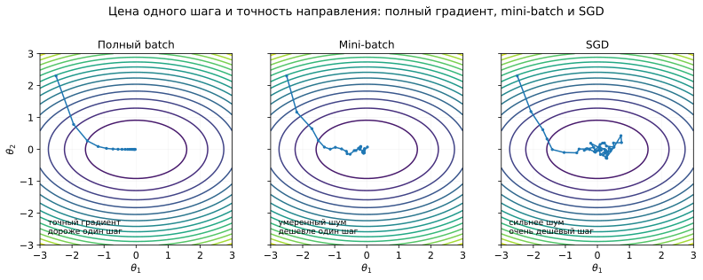

*Рисунок 17. Чем меньше объектов участвует в одном обновлении, тем дешевле отдельный шаг и тем сильнее случайные колебания направления.*

Различие между тремя вариантами удобно представить так:

| Способ | Объектов для одного обновления | Характер направления |
|---|---:|---|
| полный градиент | $n$ | точный градиент целевой функции |
| мини-батч | $1<\lvert B_t\rvert<n$ | случайная оценка градиента |
| SGD | $1$ | наиболее шумная оценка |

При этом **модель и целевая функция не меняются**. Меняется только способ вычислять направление очередного шага.

Это важное различие. Переход от полного градиента к мини-батчу не означает, что мы начали решать другую статистическую задачу. Мы изменили вычислительную процедуру поиска параметров.

## 11. Возвращение к линейной регрессии

Теперь применим общую схему к знакомой задаче.

Пусть матрица признаков вместе со столбцом единиц имеет размер

```math
X\in\mathbb R^{n\times q},
```

где $q$ — число коэффициентов, включая свободный член. Вектор параметров

```math
\beta\in\mathbb R^q.
```

Прогнозы всей выборки равны

```math
\hat y=X\beta,
```

а вектор остатков зависит от текущих коэффициентов:

```math
r(\beta)
=
y-X\beta.
\qquad\text{(52)}
```

Для MSE целевая функция имеет вид

```math
R(\beta)
=
\frac1n
\|y-X\beta\|_2^2
=
\frac1n
\sum_{i=1}^{n}
r_i(\beta)^2.
\qquad\text{(53)}
```

Ранее эту задачу мы решали средствами численной линейной алгебры. Теперь получим градиент и увидим, как те же коэффициенты можно искать итеративно.

### 11.1. Производная по одному коэффициенту

Для объекта $i$

```math
r_i(\beta)
=
y_i
-
\sum_{k=1}^{q}
x_{ik}\beta_k.
\qquad\text{(54)}
```

Зафиксируем один коэффициент $\beta_j$. Тогда

```math
\frac{\partial r_i}{\partial\beta_j}
=
-x_{ij}.
\qquad\text{(55)}
```

По правилу производной сложной функции

```math
\frac{\partial r_i^2}{\partial\beta_j}
=
2r_i
\frac{\partial r_i}{\partial\beta_j}
=
-2x_{ij}r_i.
\qquad\text{(56)}
```

Теперь суммируем вклады всех объектов:

```math
\frac{\partial R}{\partial\beta_j}
=
\frac1n
\sum_{i=1}^{n}
\frac{\partial r_i^2}{\partial\beta_j}
=
-\frac{2}{n}
\sum_{i=1}^{n}
x_{ij}r_i.
\qquad\text{(57)}
```

Каждый объект вносит в производную произведение двух величин:

- значения соответствующего признака $x_{ij}$;
- текущего остатка $r_i$.

Если для объектов с большими значениями некоторого признака модель систематически недооценивает ответы, соответствующая координата градиента будет отражать эту структуру ошибки.

### 11.2. Матричная формула градиента

Соберём все частные производные в один вектор.

Выражения

```math
\sum_i x_{ij}r_i
```

для всех $j$ одновременно записываются как

```math
X^\top r.
```

Поскольку

```math
r=y-X\beta,
```

получаем

```math
\boxed{
\nabla R(\beta)
=
-\frac{2}{n}
X^\top
(y-X\beta)
}.
\qquad\text{(58)}
```

Размерности согласованы:

```math
X^\top\in\mathbb R^{q\times n},
\qquad
y-X\beta\in\mathbb R^n,
```

поэтому

```math
X^\top(y-X\beta)\in\mathbb R^q,
```

то есть градиент имеет по одной координате на каждый коэффициент модели.

Формула (58) объединяет всю обучающую выборку в одном выражении, но её смысл остаётся тем же, что и в покоординатном выводе: градиент суммирует влияние текущих остатков на каждый коэффициент.

### 11.3. Один шаг градиентного спуска

Подставим (58) в общее правило обновления:

```math
\beta^{(t+1)}
=
\beta^{(t)}
-
\eta_t
\nabla R\bigl(\beta^{(t)}\bigr).
```

Получаем

```math
\boxed{
\beta^{(t+1)}
=
\beta^{(t)}
+
\frac{2\eta_t}{n}
X^\top
\left(
y-X\beta^{(t)}
\right)
}.
\qquad\text{(59)}
```

Один шаг можно прочитать как последовательность операций:

1. по текущим коэффициентам вычислить прогнозы
   $$
   \hat y^{(t)}=X\beta^{(t)};
   $$
2. вычислить текущие остатки
   $$
   r^{(t)}=y-\hat y^{(t)};
   $$
3. собрать влияние остатков на каждый коэффициент
   $$
   X^\top r^{(t)};
   $$
4. изменить коэффициенты;
5. повторить вычисления в новой точке.

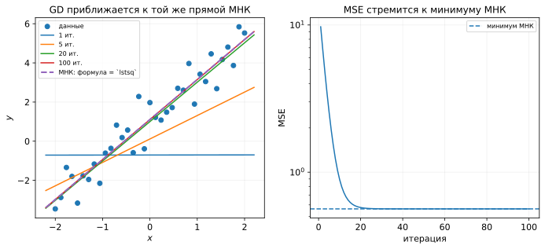

*Рисунок 18. Коэффициенты изменяются итеративно, а вместе с ними меняются прогнозы, остатки и следующий градиент.*

Здесь особенно видно различие между моделью и способом обучения. Формула прогноза остаётся

```math
\hat y=X\beta
```

независимо от того, нашли ли мы $\beta$ через `lstsq` или последовательностью градиентных шагов.

### 11.4. Нулевой градиент возвращает нормальные уравнения

Если целевая функция достигла внутреннего минимума и градиент в этой точке равен нулю, то из (58)

```math
-\frac{2}{n}
X^\top
(y-X\hat\beta)
=
0.
```

Постоянный множитель можно убрать:

```math
X^\top
(y-X\hat\beta)
=
0.
\qquad\text{(60)}
```

Раскрывая скобки, получаем

```math
X^\top y
-
X^\top X\hat\beta
=
0,
```

то есть

```math
\boxed{
X^\top X\hat\beta
=
X^\top y
}.
\qquad\text{(61)}
```

Это те же нормальные уравнения, которые возникли при аналитическом рассмотрении OLS.

Таким образом, два пути приводят к одной и той же характеристике оптимума:

- аналитический подход сразу исследует условие минимума;
- градиентный спуск строит последовательность приближений к минимуму.

Если решение OLS единственно и градиентный спуск сходится к минимуму, оба подхода нацелены на один и тот же вектор коэффициентов.

При точной мультиколлинеарности минимизаторов может быть несколько. Тогда `np.linalg.lstsq` выбирает среди них решение с наименьшей евклидовой нормой, а для итеративного метода конкретный полученный минимизатор может зависеть от начальной точки и деталей алгоритма.

### 11.5. Одна задача — разные способы поиска параметров

Для сочетания

```math
\text{линейная модель}
+
\text{MSE}
```

можно использовать разные вычислительные подходы.

| Способ | Что происходит |
|---|---|
| нормальные уравнения | описывают условие оптимума OLS |
| `np.linalg.lstsq` | напрямую решает least-squares-задачу методами численной линейной алгебры |
| градиентный спуск | использует полный градиент MSE и итеративно обновляет коэффициенты |
| мини-батч / SGD | использует случайную оценку того же градиента |

Во всех этих случаях семейство моделей и целевая функция остаются прежними. Меняется **способ поиска параметров**.

Если же оставить линейную модель, но заменить MSE на Huber, MAE или другую функцию потерь, изменится уже сама задача выбора параметров:

```math
\text{то же семейство моделей}
+
\text{другая функция потерь}
\Longrightarrow
\text{другая целевая функция}.
```

В общем случае это приводит и к другим оптимальным коэффициентам, и к другому набору подходящих методов оптимизации.

## 12. Что происходит внутри `fit`

Теперь можно собрать основные элементы обучения в одну схему.

### 12.1. Модель

Модель

```math
f_\theta(x)
```

задаёт семейство возможных прогнозов.

Для линейной регрессии

```math
f_\beta(x)
=
\beta_0+\beta_1x_1+\dots+\beta_px_p.
```

Выбор модели определяет, какие зависимости вообще могут быть представлены при некотором значении параметров.

### 12.2. Функция потерь и целевая функция

Функция потерь

```math
L(y,\hat y)
```

определяет цену ошибки отдельного прогноза.

По обучающей выборке эти значения объединяются в целевую функцию, например

```math
R_n(\theta)
=
\frac1n
\sum_i
L\bigl(y_i,f_\theta(x_i)\bigr).
```

Именно целевая функция определяет, какие параметры считаются предпочтительными на обучающих данных.

### 12.3. Оптимизатор или численный решатель

Следующий вопрос — как найти параметры, уменьшающие выбранную целевую функцию.

В OLS можно использовать специализированный численный решатель `lstsq`.

В более общем случае можно применять градиентные методы:

```math
\theta^{(t+1)}
=
\theta^{(t)}
-
\eta_t g_t,
```

где $g_t$ может быть полным градиентом, градиентом мини-батча или градиентом одного объекта.

Оптимизатор определяет **процедуру поиска**, но не задаёт саму модель и не определяет цену ошибки.

### 12.4. Метрика качества

После обучения параметры фиксированы:

```math
\hat\theta.
```

Теперь на валидационной или тестовой выборке можно вычислить метрики качества, например

```math
\mathrm{RMSE},
\qquad
\mathrm{MAE},
\qquad
R^2,
\qquad
\mathrm{MAPE}.
```

Метрика отвечает на вопрос о качестве уже полученных прогнозов. Она не обязана совпадать с функцией, которая использовалась при обучении.

Например, модель можно обучать по MSE, а оценивать сразу по RMSE, MAE и $R^2$.

Схему обучения удобно записать так:

```math
\boxed{
\text{модель}
+
\text{функция потерь}
+
\text{способ оптимизации}
\longrightarrow
\hat\theta
}
```

а этап оценки — отдельно:

```math
\boxed{
\hat\theta
+
\text{данные для оценки}
\longrightarrow
\text{метрики качества}.
}
```

### 12.5. Оптимизация на обучающей выборке и качество на новых данных

Градиентный метод непосредственно уменьшает целевую функцию, вычисленную по обучающим данным:

```math
R_{\mathrm{train}}(\theta).
```

Но практический интерес обычно связан с качеством прогнозов на объектах, которые не использовались для подбора параметров.

Поэтому

```math
R_{\mathrm{train}}\downarrow
```

само по себе не означает, что любая метрика на новых данных обязательно улучшается.

Это два разных этапа:

```math
\text{обучающие данные}
\longrightarrow
\text{подбор }\hat\theta,
```

```math
\text{новые данные}
\longrightarrow
\text{оценка качества }\hat\theta.
```

Разделение этих этапов особенно важно, когда модель достаточно гибкая и способна хорошо подстраиваться под обучающую выборку.

### 12.6. Итоговая схема

Для линейной регрессии один конкретный вариант всей конструкции выглядит так:

```math
\boxed{
\begin{array}{c}
\text{модель: } \hat y=X\beta\\[0.4em]
\text{функция потерь: } (y-\hat y)^2\\[0.4em]
\text{целевая функция: MSE на обучающих данных}\\[0.4em]
\text{поиск параметров: } \texttt{lstsq}\ \text{или градиентный метод}\\[0.4em]
\text{оценка: RMSE, MAE, }R^2,\ldots
\end{array}
}
```

Но каждая строка может изменяться независимо от других.

Можно оставить ту же линейную модель и выбрать другую функцию потерь. Можно оставить модель и функцию потерь, но заменить способ оптимизации. Можно обучить модель по одному критерию, а оценивать её несколькими метриками.

Поэтому вызов

```python
model.fit(X_train, y_train)
```

удобно воспринимать не как одну неделимую операцию, а как интерфейс, за которым скрывается задача выбора параметров модели по заданной целевой функции с помощью некоторой вычислительной процедуры.

Именно разделение

```math
\boxed{
\text{модель}
\quad+\quad
\text{функция потерь}
\quad+\quad
\text{оптимизатор}
\quad+\quad
\text{метрика качества}
}
```

позволяет понимать, что именно меняется при переходе от одного алгоритма машинного обучения к другому.

## Итоги лекции

Линейная регрессия позволила связать знакомую задачу МНК с общей схемой обучения моделей машинного обучения.

В этой лекции мы:

- задали линейную регрессию как семейство функций и напомнили аналитическое решение задачи МНК;
- отделили математическую постановку least-squares-задачи от её численного решения и познакомились с `numpy.linalg.lstsq`;
- увидели, почему при мультиколлинеарности прогнозы могут оставаться устойчивыми, а отдельные коэффициенты — быть неединственными или чувствительными к данным;
- рассмотрели MSE, RMSE, MAE, $R^2$ и MAPE как способы количественно оценивать качество прогнозов;
- дополнили числовые метрики диагностикой остатков и увидели, как систематическая структура ошибок может указывать на ограничения выбранного семейства моделей;
- разделили модель, функцию потерь, оптимизатор и метрику качества как четыре разные части ML-процесса;
- перешли от функции потерь отдельного объекта к эмпирическому риску и целевой функции обучения;
- сравнили MSE, MAE, Huber и квантильную функцию потерь и увидели, что выбор функции потерь меняет правило выбора параметров;
- ввели градиент и градиентный спуск, разобрали роль темпа обучения, выпуклости, критерия остановки и масштаба признаков;
- различили полный градиент, мини-батч и SGD как разные способы вычислять направление шага при той же целевой функции;
- вывели градиент MSE для линейной регрессии и получили нормальные уравнения из условия нулевого градиента;
- отделили уменьшение целевой функции на обучающей выборке от оценки качества модели на новых данных.

Главную конструкцию недели можно держать в голове так:

```math
\boxed{
\text{семейство моделей}
+
\text{функция потерь}
+
\text{оптимизатор}
\longrightarrow
\text{обученные параметры}
}
```

а оценку результата — как отдельный этап:

```math
\boxed{
\text{обученная модель}
+
\text{новые данные}
\longrightarrow
\text{метрики качества и диагностика}.
}
```

Такая схема не привязана к линейной регрессии. При переходе к другим алгоритмам будут меняться отдельные элементы этой конструкции, но сами вопросы — что моделируем, что минимизируем, как ищем параметры и как оцениваем результат — останутся.

## Вопросы для самопроверки

1. Чем семейство линейных моделей отличается от правила, по которому выбираются его коэффициенты?
2. Как из условия нулевых частных производных получается аналитическое решение OLS с одним признаком?
3. Почему на практике обычно не вычисляют $(X^\top X)^{-1}$ явно?
4. Что решает `numpy.linalg.lstsq` и какое решение он выбирает, если минимизаторов несколько?
5. Почему при точной мультиколлинеарности коэффициенты могут быть неединственными, а прогнозы — одинаковыми?
6. Почему приближённая мультиколлинеарность особенно важна, если интерпретируются отдельные коэффициенты?
7. Чем MSE, RMSE и MAE по-разному реагируют на крупные ошибки?
8. Что означает $R^2<0$ на отложенной выборке?
9. В каких ситуациях MAPE может быть неудобной или вводящей в заблуждение метрикой?
10. Какую дополнительную информацию даёт график остатков по сравнению с одной числовой метрикой?
11. Почему добавление признака $x^2$ меняет семейство доступных зависимостей, хотя модель остаётся линейной по коэффициентам?
12. Чем функция потерь отличается от метрики качества, если одна и та же формула MSE может использоваться в обеих ролях?
13. Что такое эмпирический риск и как он строится из потерь отдельных объектов?
14. Почему MSE среди постоянных прогнозов выбирает среднее, а MAE — медиану?
15. Как Huber ограничивает влияние больших по модулю остатков по сравнению с MSE?
16. Как квантильная функция потерь позволяет задать разную цену недопрогноза и перепрогноза?
17. Почему запись $\hat\theta\in\arg\min_\theta R_n(\theta)$ ещё не является алгоритмом обучения?
18. Почему градиентный спуск делает шаг в направлении $-\nabla R_n(\theta)$?
19. Как темп обучения влияет на сходимость градиентного спуска?
20. Почему масштаб признаков может заметно менять скорость работы градиентного метода?
21. Чем полный градиент, мини-батч и SGD отличаются друг от друга и что при переходе между ними остаётся неизменным?
22. Как из покоординатных производных MSE получается формула
    $$
    \nabla R(\beta)=-\frac{2}{n}X^\top(y-X\beta)?
    $$
23. Почему условие $\nabla R(\hat\beta)=0$ возвращает нормальные уравнения?
24. В чём различие между заменой `lstsq` на градиентный спуск и заменой MSE на Huber?
25. Какие части процесса скрываются за вызовом `fit`, а какие относятся уже к оценке обученной модели?
26. Почему уменьшение ошибки на обучающей выборке не гарантирует улучшения качества на новых данных?

## Что почитать дальше

### Если хочется глубже разобрать линейную регрессию и диагностику

James G., Witten D., Hastie T., Tibshirani R., Taylor J. *An Introduction to Statistical Learning: with Applications in Python*, Chapter 3.
<https://www.statlearning.com/>.

В этой главе подробнее разбираются множественная линейная регрессия, интерпретация коэффициентов, диагностика модели, взаимодействия признаков и ограничения линейного подхода.

### Если хочется глубже понять геометрию и численную оптимизацию

Deisenroth M. P., Faisal A. A., Ong C. S. *Mathematics for Machine Learning*, Chapter 7 “Continuous Optimization”.
<https://mml-book.github.io/>.

Полезное продолжение после введения в градиентный спуск: выпуклость, выбор размера шага, обусловленность и более общий язык оптимизации.

### Если хочется продолжить тему функций потерь и робастной регрессии

Murphy K. P. *Probabilistic Machine Learning: An Introduction*.
<https://probml.github.io/pml-book/>.

Особенно полезны разделы про robust linear regression, где сопоставляются разные предположения об ошибках и соответствующие функции потерь.

### Если хочется подробнее разобраться со стохастическими градиентными методами

Соколов Е. А. *Курс «Машинное обучение», ФКН ВШЭ*.
<https://github.com/esokolov/ml-course-hse>.

В материалах курса градиентный и стохастический градиентный спуск рассматриваются в более широком контексте методов оптимизации в машинном обучении.
